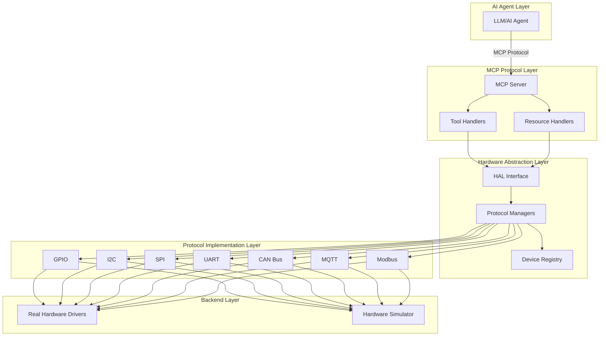
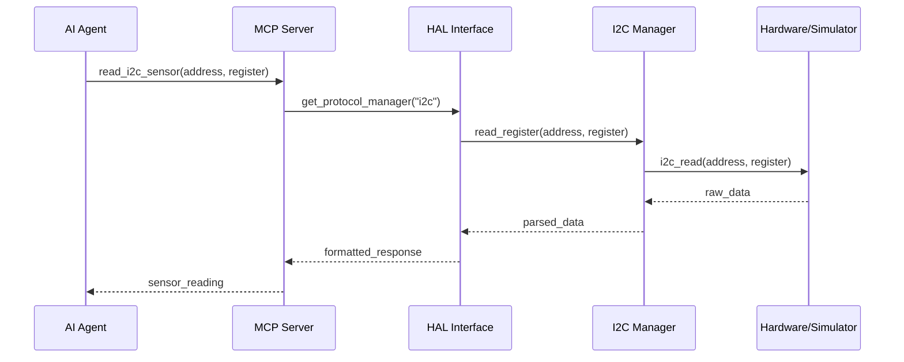
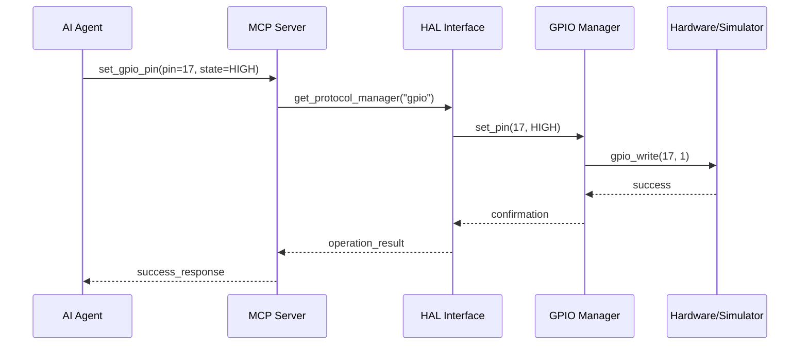
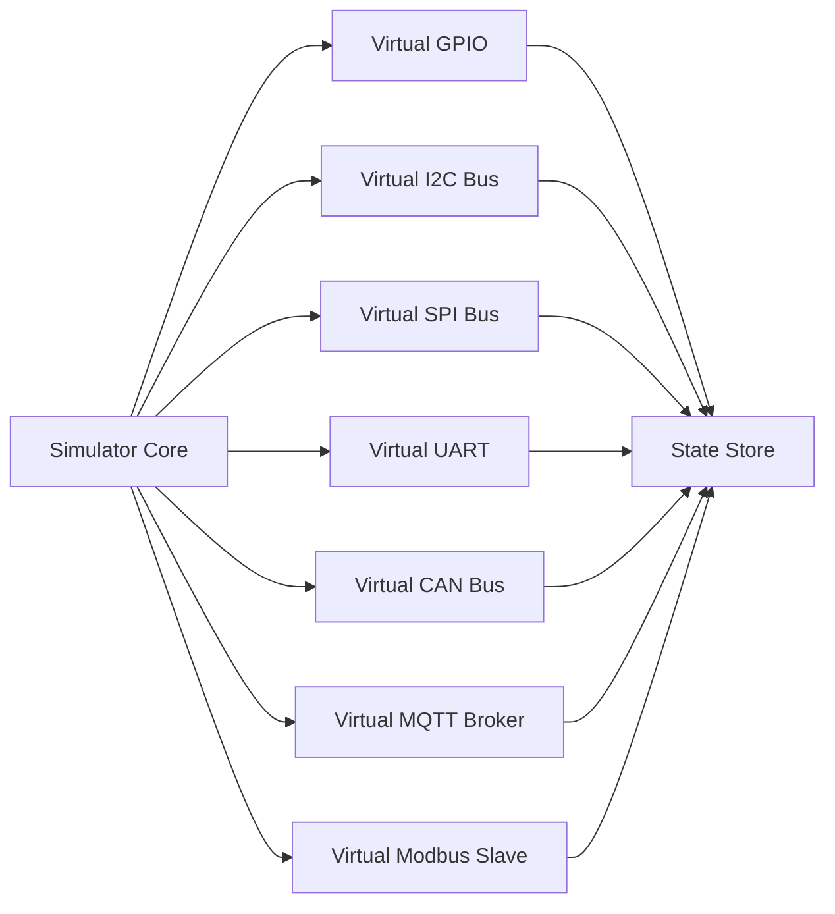
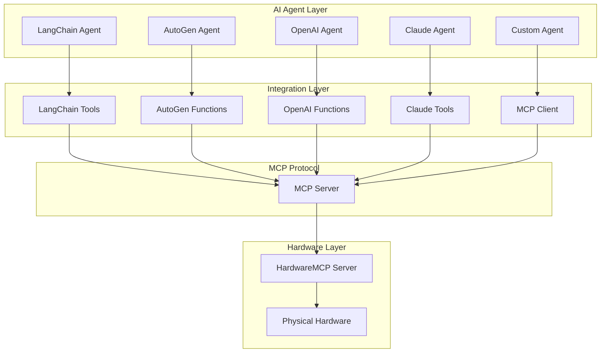
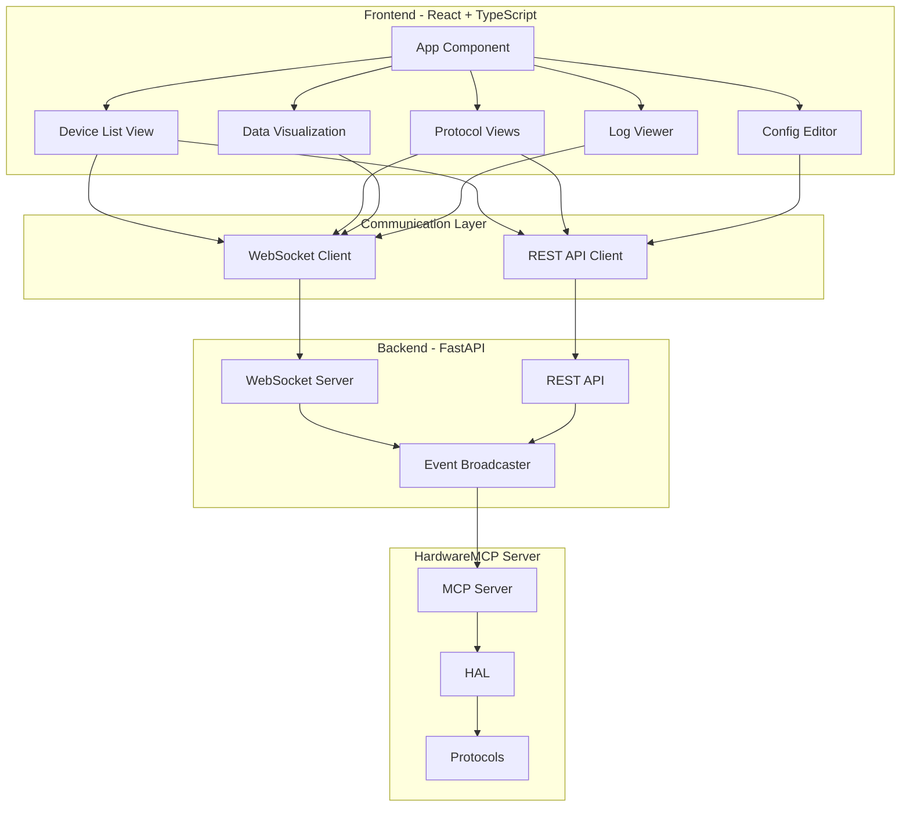
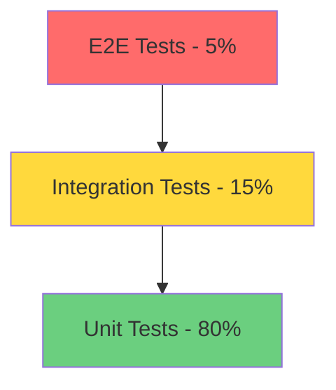

**User:**

<task>
"I am building HardwareMCP — a universal MCP server that gives any AI agent a standardized interface to interact with physical hardware. It supports sensors, CAN bus, I2C, SPI, UART, MQTT, Modbus and GPIO with a full hardware simulator included. Help me plan the complete architecture and file structure for this Python project."
</task>
<environment_details>
# VSCode Visible Files
server\main.py

# VSCode Open Tabs
server/main.py

# Current Time
Current time in ISO 8601 UTC format: 2026-05-02T19:26:23.172Z
User time zone: America/New_York, UTC-4:00

# Current Cost
$0.00

# Review Exclusions
The following file patterns are excluded from code reviews:
- .vscode/**

# Current Mode
<slug>plan</slug>
<name>📝 Plan</name>


# Current Workspace Directory (c:/Users/amrit/HardwareMCP) Files
.gitignore
LICENSE
README.md
agent/
dashboard/
examples/
server/
server/__init__.py
server/main.py
server/hal/
server/hal/__init__.py
You have not created a todo list yet. Create one with `update_todo_list` if your task is complicated or involves multiple steps.
</environment_details>

---

**Assistant:**

I'll help you plan the complete architecture and file structure for HardwareMCP. Let me start by gathering more context about your project.

<read_file>
<args>
  <file>
    <path>README.md</path>
  </file>
</args>
</read_file>

---

**User:**

[read_file for 'README.md'. Reading multiple files at once is more efficient for the LLM. If other files are relevant to your current task, please read them simultaneously.] Result:
<files>
<file><path>README.md</path>
<content lines="1-2">
1 | # HardwareMCP
2 | Universal MCP server for AI agents to interact with physical hardware. Supports sensors, CAN bus, I2C, SPI, UART, MQTT, Modbus &amp; GPIO. Protocol-agnostic, LLM-agnostic, hardware simulator included. Built for embedded &amp; hardtech developers.
</content>
</file>
</files>
<environment_details>
# VSCode Visible Files
server\main.py

# VSCode Open Tabs
server/main.py

# Current Time
Current time in ISO 8601 UTC format: 2026-05-02T19:26:33.801Z
User time zone: America/New_York, UTC-4:00

# Current Cost
$0.03

# Review Exclusions
The following file patterns are excluded from code reviews:
- .vscode/**

# Current Mode
<slug>plan</slug>
<name>📝 Plan</name>
You have not created a todo list yet. Create one with `update_todo_list` if your task is complicated or involves multiple steps.
</environment_details>

---

**Assistant:**

<read_file>
<args>
  <file>
    <path>server/main.py</path>
  </file>
  <file>
    <path>server/__init__.py</path>
  </file>
  <file>
    <path>server/hal/__init__.py</path>
  </file>
</args>
</read_file>

---

**User:**

[read_file for 'server/main.py', 'server/__init__.py', 'server/hal/__init__.py'] Result:
<files>
<file><path>server/main.py</path>
<content/><notice>File is empty</notice>
</file>
<file><path>server/__init__.py</path>
<content/><notice>File is empty</notice>
</file>
<file><path>server/hal/__init__.py</path>
<content/><notice>File is empty</notice>
</file>
</files>
<environment_details>
# VSCode Visible Files
server\main.py

# VSCode Open Tabs
server/main.py

# Current Time
Current time in ISO 8601 UTC format: 2026-05-02T19:27:58.890Z
User time zone: America/New_York, UTC-4:00

# Current Cost
$0.06

# Review Exclusions
The following file patterns are excluded from code reviews:
- .vscode/**

# Current Mode
<slug>plan</slug>
<name>📝 Plan</name>
You have not created a todo list yet. Create one with `update_todo_list` if your task is complicated or involves multiple steps.
</environment_details>

---

**Assistant:**

<list_files>
<path>.</path>
<recursive>true</recursive>
</list_files>

---

**User:**

[list_files for '.'] Result:
.gitignore
LICENSE
README.md
agent/
dashboard/
examples/
server/
server/__init__.py
server/main.py
server/hal/
server/hal/__init__.py
<environment_details>
# VSCode Visible Files
server\main.py

# VSCode Open Tabs
server/main.py

# Current Time
Current time in ISO 8601 UTC format: 2026-05-02T19:28:03.115Z
User time zone: America/New_York, UTC-4:00

# Current Cost
$0.09

# Review Exclusions
The following file patterns are excluded from code reviews:
- .vscode/**

# Current Mode
<slug>plan</slug>
<name>📝 Plan</name>
You have not created a todo list yet. Create one with `update_todo_list` if your task is complicated or involves multiple steps.
</environment_details>

---

**Assistant:**

<ask_followup_question>
<question>To create the best architecture plan for HardwareMCP, I need to understand a few key aspects:

1. **Target Hardware Platforms**: Which platforms should HardwareMCP support? (e.g., Raspberry Pi, Arduino, ESP32, generic Linux, Windows, macOS)

2. **MCP Protocol Version**: Which MCP (Model Context Protocol) specification version are you targeting?

3. **Simulator Scope**: Should the hardware simulator support all protocols (CAN, I2C, SPI, UART, MQTT, Modbus, GPIO) or start with a subset?

4. **Agent/Dashboard Purpose**: What are the intended roles of the `agent/` and `dashboard/` directories you've already created?

5. **Deployment Model**: How will this be deployed? (standalone server, containerized, pip package, or multiple options)</question>
<follow_up>
<suggest>1. Raspberry Pi, ESP32, generic Linux | 2. MCP 2024-11-05 | 3. All protocols | 4. Agent=example AI clients, Dashboard=web UI for monitoring | 5. All options (pip package + Docker)</suggest>
<suggest>1. Generic Linux/Windows/macOS (cross-platform) | 2. Latest MCP spec | 3. Start with GPIO, I2C, SPI then expand | 4. Agent=test scripts, Dashboard=React monitoring UI | 5. Pip package primarily</suggest>
<suggest>1. Raspberry Pi focus, Linux secondary | 2. MCP 2024-11-05 | 3. Full simulator for all protocols | 4. Agent=LangChain/AutoGPT integrations, Dashboard=hardware status UI | 5. Docker + pip package</suggest>
<suggest>Let me provide custom answers for each aspect</suggest>
</follow_up>
</ask_followup_question>

---

**User:**

[ask_followup_question for 'To create the best architecture plan for HardwareMCP, I need to understand a few key aspects:

1. **Target Hardware Platforms**: Which platforms should HardwareMCP support? (e.g., Raspberry Pi, Arduino, ESP32, generic Linux, Windows, macOS)

2. **MCP Protocol Version**: Which MCP (Model Context Protocol) specification version are you targeting?

3. **Simulator Scope**: Should the hardware simulator support all protocols (CAN, I2C, SPI, UART, MQTT, Modbus, GPIO) or start with a subset?

4. **Agent/Dashboard Purpose**: What are the intended roles of the `agent/` and `dashboard/` directories you've already created?

5. **Deployment Model**: How will this be deployed? (standalone server, containerized, pip package, or multiple options)'] Result:
<answer>
Raspberry Pi, ESP32, generic Linux | MCP 2024-11-05 | All protocols | Agent=example AI clients, Dashboard=web UI for monitoring | All options (pip package + Docker)
</answer>
<environment_details>
# VSCode Visible Files
server\main.py

# VSCode Open Tabs
server/main.py

# Current Time
Current time in ISO 8601 UTC format: 2026-05-02T19:32:59.916Z
User time zone: America/New_York, UTC-4:00

# Current Cost
$0.12

# Review Exclusions
The following file patterns are excluded from code reviews:
- .vscode/**

# Current Mode
<slug>plan</slug>
<name>📝 Plan</name>
You have not created a todo list yet. Create one with `update_todo_list` if your task is complicated or involves multiple steps.
</environment_details>

---

**Assistant:**

<ask_followup_question>
<question>A few more clarifications to finalize the architecture:

1. **Python Version**: What's the minimum Python version you want to support? (3.8+, 3.10+, 3.11+)

2. **Real Hardware Dependencies**: Should the server gracefully handle missing hardware libraries (e.g., RPi.GPIO, smbus2) and fall back to simulator mode automatically?

3. **API Style**: For the MCP tools/resources, what level of abstraction do you prefer?
   - Low-level (direct register access, raw protocol commands)
   - High-level (read_sensor, control_motor, send_can_message)
   - Both (layered API)

4. **Security**: Do you need authentication/authorization for the MCP server, or is it assumed to run in a trusted environment?

5. **Configuration**: How should hardware be configured? (YAML files, JSON, Python config, auto-discovery, or multiple options)</question>
<follow_up>
<suggest>1. Python 3.10+ | 2. Yes, auto-fallback to simulator | 3. Both layered API | 4. Trusted environment initially | 5. YAML + auto-discovery</suggest>
<suggest>1. Python 3.8+ for broader compatibility | 2. Yes, graceful fallback | 3. High-level primarily | 4. Optional token-based auth | 5. YAML configuration files</suggest>
<suggest>1. Python 3.11+ for modern features | 2. Manual mode selection | 3. Both low and high level | 4. No auth needed | 5. JSON config + Python API</suggest>
<suggest>Let me provide custom answers</suggest>
</follow_up>
</ask_followup_question>

---

**User:**

[ask_followup_question for 'A few more clarifications to finalize the architecture:

1. **Python Version**: What's the minimum Python version you want to support? (3.8+, 3.10+, 3.11+)

2. **Real Hardware Dependencies**: Should the server gracefully handle missing hardware libraries (e.g., RPi.GPIO, smbus2) and fall back to simulator mode automatically?

3. **API Style**: For the MCP tools/resources, what level of abstraction do you prefer?
   - Low-level (direct register access, raw protocol commands)
   - High-level (read_sensor, control_motor, send_can_message)
   - Both (layered API)

4. **Security**: Do you need authentication/authorization for the MCP server, or is it assumed to run in a trusted environment?

5. **Configuration**: How should hardware be configured? (YAML files, JSON, Python config, auto-discovery, or multiple options)'] Result:
<answer>
Option1: Python 3.10+ | Yes auto-fallback to simulator | Both layered API | Trusted environment | YAML + auto-discovery
</answer>
<environment_details>
# VSCode Visible Files
server\main.py

# VSCode Open Tabs
server/main.py

# Current Time
Current time in ISO 8601 UTC format: 2026-05-02T19:37:34.237Z
User time zone: America/New_York, UTC-4:00

# Current Cost
$0.16

# Review Exclusions
The following file patterns are excluded from code reviews:
- .vscode/**

# Current Mode
<slug>plan</slug>
<name>📝 Plan</name>
You have not created a todo list yet. Create one with `update_todo_list` if your task is complicated or involves multiple steps.
</environment_details>

---

**Assistant:**

Perfect! Now I have all the context needed. Let me create a comprehensive architecture plan for HardwareMCP.

<update_todo_list>
<todos>
[ ] Define core architecture layers and design patterns
[ ] Design the Hardware Abstraction Layer (HAL) structure
[ ] Plan MCP server implementation with tool/resource definitions
[ ] Design the simulator architecture for all protocols
[ ] Plan configuration system (YAML + auto-discovery)
[ ] Design protocol-specific implementations (GPIO, I2C, SPI, UART, CAN, MQTT, Modbus)
[ ] Plan agent examples and integrations
[ ] Design dashboard web UI architecture
[ ] Create complete file structure with all modules
[ ] Define dependency management and packaging strategy
[ ] Plan testing strategy and CI/CD structure
[ ] Document API specifications and usage examples
</todos>
</update_todo_list>

---

**User:**

[update_todo_list] Result:
Todo list updated successfully.
<environment_details>
# VSCode Visible Files
server\main.py

# VSCode Open Tabs
server/main.py

# Current Time
Current time in ISO 8601 UTC format: 2026-05-02T19:39:12.543Z
User time zone: America/New_York, UTC-4:00

# Current Cost
$0.19

# Review Exclusions
The following file patterns are excluded from code reviews:
- .vscode/**

# Current Mode
<slug>plan</slug>
<name>📝 Plan</name>
====

REMINDERS

Below is your current list of reminders for this task. Keep them updated as you progress.

| # | Content | Status |
|---|---------|--------|
| 1 | Define core architecture layers and design patterns | Pending |
| 2 | Design the Hardware Abstraction Layer (HAL) structure | Pending |
| 3 | Plan MCP server implementation with tool/resource definitions | Pending |
| 4 | Design the simulator architecture for all protocols | Pending |
| 5 | Plan configuration system (YAML + auto-discovery) | Pending |
| 6 | Design protocol-specific implementations (GPIO, I2C, SPI, UART, CAN, MQTT, Modbus) | Pending |
| 7 | Plan agent examples and integrations | Pending |
| 8 | Design dashboard web UI architecture | Pending |
| 9 | Create complete file structure with all modules | Pending |
| 10 | Define dependency management and packaging strategy | Pending |
| 11 | Plan testing strategy and CI/CD structure | Pending |
| 12 | Document API specifications and usage examples | Pending |


IMPORTANT: When task status changes, remember to call the `update_todo_list` tool to update your progress.

</environment_details>

---

**Assistant:**

<write_to_file>
<path>docs/ARCHITECTURE.md</path>
<content>
# HardwareMCP Architecture

## Overview

HardwareMCP is a universal MCP (Model Context Protocol) server that provides AI agents with a standardized interface to interact with physical hardware. It supports multiple protocols and includes a full hardware simulator for development and testing.

## Design Principles

1. **Protocol Agnostic**: Support multiple hardware protocols through a unified interface
2. **LLM Agnostic**: Compatible with any AI agent that supports MCP
3. **Graceful Degradation**: Auto-fallback to simulator when hardware is unavailable
4. **Layered API**: Both low-level and high-level abstractions
5. **Cross-Platform**: Support Raspberry Pi, ESP32, and generic Linux systems
6. **Developer Friendly**: Easy configuration, comprehensive examples, monitoring dashboard

## Architecture Layers



## Core Components

### 1. MCP Server Layer
- **Responsibility**: Implement MCP 2024-11-05 specification
- **Components**:
  - Server initialization and lifecycle management
  - Tool registration and execution
  - Resource management and streaming
  - Error handling and logging

### 2. Hardware Abstraction Layer (HAL)
- **Responsibility**: Provide unified interface to all hardware protocols
- **Components**:
  - Protocol manager factory
  - Device registry and discovery
  - Configuration loader
  - Mode selector (real hardware vs simulator)

### 3. Protocol Implementations
Each protocol has:
- **High-level API**: Semantic operations (read_sensor, send_message)
- **Low-level API**: Direct protocol access (read_register, write_bytes)
- **Real driver**: Platform-specific hardware access
- **Simulator**: Virtual hardware for testing

### 4. Configuration System
- **YAML-based**: Human-readable hardware definitions
- **Auto-discovery**: Detect connected devices automatically
- **Validation**: Schema validation for configurations
- **Hot-reload**: Update configuration without restart

### 5. Monitoring Dashboard
- **Real-time**: WebSocket-based live updates
- **Visualization**: Protocol activity, device status, data streams
- **Control**: Manual device testing and debugging
- **Logging**: Historical data and event logs

## Data Flow

### Read Operation Example


### Write Operation Example


## Protocol Specifications

### GPIO (General Purpose Input/Output)
- **Operations**: read, write, configure (input/output/pwm)
- **Features**: Interrupt handling, pull-up/down resistors
- **Platforms**: RPi.GPIO, gpiod, ESP32 GPIO

### I2C (Inter-Integrated Circuit)
- **Operations**: read, write, scan bus, read/write registers
- **Features**: Multi-master support, clock stretching
- **Platforms**: smbus2, i2c-tools, ESP32 I2C

### SPI (Serial Peripheral Interface)
- **Operations**: transfer, read, write, configure
- **Features**: Multiple chip selects, configurable modes
- **Platforms**: spidev, ESP32 SPI

### UART (Universal Asynchronous Receiver-Transmitter)
- **Operations**: read, write, configure baud rate
- **Features**: Flow control, parity checking
- **Platforms**: pyserial, ESP32 UART

### CAN Bus (Controller Area Network)
- **Operations**: send frame, receive frame, set filters
- **Features**: Standard/Extended IDs, error handling
- **Platforms**: python-can, socketcan

### MQTT (Message Queuing Telemetry Transport)
- **Operations**: publish, subscribe, connect, disconnect
- **Features**: QoS levels, retained messages, will messages
- **Platforms**: paho-mqtt

### Modbus (Industrial Protocol)
- **Operations**: read coils, read registers, write coils, write registers
- **Features**: RTU and TCP modes, function codes
- **Platforms**: pymodbus

## Hardware Simulator

The simulator provides virtual hardware for all protocols:

### Features
- **State Management**: Maintains virtual device states
- **Realistic Behavior**: Simulates timing, errors, and edge cases
- **Configurable**: Define virtual devices in YAML
- **Deterministic**: Reproducible for testing
- **Interactive**: Dashboard integration for manual testing

### Simulator Architecture


## Configuration System

### YAML Configuration Structure
```yaml
hardware:
  mode: auto  # auto, real, simulator
  platform: raspberry_pi  # raspberry_pi, esp32, linux
  
  gpio:
    enabled: true
    pins:
      - pin: 17
        mode: output
        initial: low
      - pin: 27
        mode: input
        pull: up
  
  i2c:
    enabled: true
    bus: 1
    devices:
      - address: 0x48
        type: temperature_sensor
        name: temp_sensor_1
  
  spi:
    enabled: true
    bus: 0
    device: 0
    max_speed: 1000000
  
  uart:
    enabled: true
    port: /dev/ttyUSB0
    baudrate: 9600
  
  can:
    enabled: true
    interface: can0
    bitrate: 500000
  
  mqtt:
    enabled: true
    broker: localhost
    port: 1883
  
  modbus:
    enabled: true
    port: /dev/ttyUSB1
    baudrate: 9600
    mode: rtu
```

## MCP Tool Definitions

### High-Level Tools
- `read_sensor(protocol, device_id, parameters)` - Read sensor data
- `write_actuator(protocol, device_id, value)` - Control actuator
- `send_message(protocol, destination, data)` - Send protocol message
- `configure_device(protocol, device_id, config)` - Configure device
- `scan_bus(protocol)` - Discover devices on bus

### Low-Level Tools
- `gpio_read(pin)` / `gpio_write(pin, value)`
- `i2c_read_register(address, register)` / `i2c_write_register(address, register, value)`
- `spi_transfer(data)` / `spi_read(length)`
- `uart_read(length)` / `uart_write(data)`
- `can_send_frame(id, data)` / `can_receive_frame()`
- `mqtt_publish(topic, message)` / `mqtt_subscribe(topic)`
- `modbus_read_coils(address, count)` / `modbus_write_coil(address, value)`

## MCP Resources

Resources provide streaming access to hardware data:

- `hardware://gpio/pins` - GPIO pin states
- `hardware://i2c/devices` - I2C device list
- `hardware://can/frames` - CAN bus frame stream
- `hardware://mqtt/messages/{topic}` - MQTT message stream
- `hardware://logs` - System logs and events

## Error Handling Strategy

### Error Categories
1. **Configuration Errors**: Invalid YAML, missing required fields
2. **Hardware Errors**: Device not found, communication failure
3. **Protocol Errors**: Invalid parameters, unsupported operation
4. **System Errors**: Permission denied, resource unavailable

### Error Response Format
```json
{
  "error": {
    "code": "HARDWARE_NOT_FOUND",
    "message": "I2C device at address 0x48 not responding",
    "protocol": "i2c",
    "device": "0x48",
    "suggestion": "Check device connection or enable simulator mode"
  }
}
```

## Security Considerations

### Current Scope (Trusted Environment)
- No authentication required
- Local network access only
- File system permissions for device access

### Future Enhancements
- Optional token-based authentication
- Role-based access control
- Audit logging
- Encrypted communication

## Performance Considerations

### Optimization Strategies
1. **Connection Pooling**: Reuse hardware connections
2. **Caching**: Cache device states and configurations
3. **Async Operations**: Non-blocking I/O for all protocols
4. **Batch Operations**: Group multiple operations when possible
5. **Resource Limits**: Configurable rate limiting and timeouts

### Expected Performance
- GPIO operations: <1ms latency
- I2C/SPI operations: 1-10ms latency
- UART operations: Depends on baud rate
- CAN operations: 1-5ms latency
- MQTT operations: Network dependent
- Modbus operations: 10-100ms latency

## Deployment Models

### 1. Pip Package Installation
```bash
pip install hardwaremcp
hardwaremcp --config hardware.yaml
```

### 2. Docker Container
```bash
docker run -d \
  --device=/dev/i2c-1 \
  --device=/dev/spidev0.0 \
  -v $(pwd)/config:/config \
  hardwaremcp/server
```

### 3. Systemd Service
```bash
sudo systemctl enable hardwaremcp
sudo systemctl start hardwaremcp
```

## Extension Points

### Custom Protocol Support
Developers can add new protocols by:
1. Implementing the `ProtocolManager` interface
2. Creating real and simulator drivers
3. Registering with the HAL
4. Defining MCP tools and resources

### Custom Device Types
Add device-specific logic:
1. Create device class inheriting from base
2. Implement device-specific operations
3. Register device type in configuration schema

## Testing Strategy

### Unit Tests
- Protocol manager logic
- Configuration parsing
- Simulator behavior
- Error handling

### Integration Tests
- MCP protocol compliance
- End-to-end tool execution
- Multi-protocol scenarios
- Hardware fallback behavior

### Hardware-in-Loop Tests
- Real device communication
- Platform-specific drivers
- Performance benchmarks
- Stress testing

## Monitoring and Observability

### Metrics
- Operation latency (p50, p95, p99)
- Error rates by protocol
- Active connections
- Device availability

### Logging
- Structured JSON logs
- Configurable log levels
- Protocol-specific debug logs
- Audit trail for operations

### Dashboard Features
- Real-time device status
- Protocol activity visualization
- Historical data charts
- Manual device control
- Configuration editor

## Future Roadmap

### Phase 1 (Current)
- Core MCP server implementation
- All protocol support
- Full simulator
- Basic dashboard

### Phase 2
- Advanced device types (sensors, motors, displays)
- Plugin system for custom protocols
- Enhanced dashboard with analytics
- Performance optimizations

### Phase 3
- Multi-server coordination
- Cloud integration
- Machine learning for anomaly detection
- Mobile app for monitoring

### Phase 4
- Hardware marketplace integration
- Community protocol library
- Enterprise features (auth, RBAC)
- Advanced debugging tools
</content>
<line_count>485</line_count>
</write_to_file>

---

**User:**

[write_to_file for 'docs/ARCHITECTURE.md'] Result:
<file_write_result>
<path>docs/ARCHITECTURE.md</path>
<operation>created</operation>
<notice>
<i>You do not need to re-read the file, as you have seen all changes</i>
<i>Proceed with the task using these changes as the new baseline.</i>
</notice>
</file_write_result>

<environment_details>
# VSCode Visible Files
docs\ARCHITECTURE.md

# VSCode Open Tabs
docs/ARCHITECTURE.md

# Current Time
Current time in ISO 8601 UTC format: 2026-05-02T19:40:32.606Z
User time zone: America/New_York, UTC-4:00

# Current Cost
$0.24

# Review Exclusions
The following file patterns are excluded from code reviews:
- .vscode/**

# Current Mode
<slug>plan</slug>
<name>📝 Plan</name>
====

REMINDERS

Below is your current list of reminders for this task. Keep them updated as you progress.

| # | Content | Status |
|---|---------|--------|
| 1 | Define core architecture layers and design patterns | Pending |
| 2 | Design the Hardware Abstraction Layer (HAL) structure | Pending |
| 3 | Plan MCP server implementation with tool/resource definitions | Pending |
| 4 | Design the simulator architecture for all protocols | Pending |
| 5 | Plan configuration system (YAML + auto-discovery) | Pending |
| 6 | Design protocol-specific implementations (GPIO, I2C, SPI, UART, CAN, MQTT, Modbus) | Pending |
| 7 | Plan agent examples and integrations | Pending |
| 8 | Design dashboard web UI architecture | Pending |
| 9 | Create complete file structure with all modules | Pending |
| 10 | Define dependency management and packaging strategy | Pending |
| 11 | Plan testing strategy and CI/CD structure | Pending |
| 12 | Document API specifications and usage examples | Pending |


IMPORTANT: When task status changes, remember to call the `update_todo_list` tool to update your progress.

</environment_details>

---

**Assistant:**

<update_todo_list>
<todos>
[x] Define core architecture layers and design patterns
[x] Design the Hardware Abstraction Layer (HAL) structure
[x] Plan MCP server implementation with tool/resource definitions
[x] Design the simulator architecture for all protocols
[x] Plan configuration system (YAML + auto-discovery)
[x] Design protocol-specific implementations (GPIO, I2C, SPI, UART, CAN, MQTT, Modbus)
[-] Create complete file structure with all modules
[ ] Plan agent examples and integrations
[ ] Design dashboard web UI architecture
[ ] Define dependency management and packaging strategy
[ ] Plan testing strategy and CI/CD structure
[ ] Document API specifications and usage examples
</todos>
</update_todo_list>

---

**User:**

[update_todo_list] Result:
Todo list updated successfully.
<environment_details>
# VSCode Visible Files
docs\ARCHITECTURE.md

# VSCode Open Tabs
docs/ARCHITECTURE.md

# Current Time
Current time in ISO 8601 UTC format: 2026-05-02T19:41:44.685Z
User time zone: America/New_York, UTC-4:00

# Current Cost
$0.29

# Review Exclusions
The following file patterns are excluded from code reviews:
- .vscode/**

# Current Mode
<slug>plan</slug>
<name>📝 Plan</name>
====

REMINDERS

Below is your current list of reminders for this task. Keep them updated as you progress.

| # | Content | Status |
|---|---------|--------|
| 1 | Define core architecture layers and design patterns | Completed |
| 2 | Design the Hardware Abstraction Layer (HAL) structure | Completed |
| 3 | Plan MCP server implementation with tool/resource definitions | Completed |
| 4 | Design the simulator architecture for all protocols | Completed |
| 5 | Plan configuration system (YAML + auto-discovery) | Completed |
| 6 | Design protocol-specific implementations (GPIO, I2C, SPI, UART, CAN, MQTT, Modbus) | Completed |
| 7 | Create complete file structure with all modules | In Progress |
| 8 | Plan agent examples and integrations | Pending |
| 9 | Design dashboard web UI architecture | Pending |
| 10 | Define dependency management and packaging strategy | Pending |
| 11 | Plan testing strategy and CI/CD structure | Pending |
| 12 | Document API specifications and usage examples | Pending |


IMPORTANT: When task status changes, remember to call the `update_todo_list` tool to update your progress.

</environment_details>

---

**Assistant:**

<write_to_file>
<path>docs/FILE_STRUCTURE.md</path>
<content>
# HardwareMCP File Structure

## Complete Project Layout

```
HardwareMCP/
├── .github/
│   ├── workflows/
│   │   ├── ci.yml                    # CI/CD pipeline
│   │   ├── release.yml               # Release automation
│   │   └── docker.yml                # Docker build and push
│   └── ISSUE_TEMPLATE/
│       ├── bug_report.md
│       └── feature_request.md
│
├── server/                           # Main MCP server package
│   ├── __init__.py
│   ├── main.py                       # Entry point and MCP server setup
│   ├── config.py                     # Configuration loader and validator
│   ├── logger.py                     # Logging configuration
│   │
│   ├── mcp/                          # MCP protocol implementation
│   │   ├── __init__.py
│   │   ├── server.py                 # MCP server core
│   │   ├── tools.py                  # Tool definitions and handlers
│   │   ├── resources.py              # Resource definitions and handlers
│   │   ├── prompts.py                # Prompt templates for AI agents
│   │   └── schemas.py                # JSON schemas for validation
│   │
│   ├── hal/                          # Hardware Abstraction Layer
│   │   ├── __init__.py
│   │   ├── interface.py              # Base HAL interface
│   │   ├── manager.py                # Protocol manager factory
│   │   ├── registry.py               # Device registry
│   │   ├── discovery.py              # Auto-discovery logic
│   │   └── exceptions.py             # HAL-specific exceptions
│   │
│   ├── protocols/                    # Protocol implementations
│   │   ├── __init__.py
│   │   ├── base.py                   # Base protocol manager
│   │   │
│   │   ├── gpio/
│   │   │   ├── __init__.py
│   │   │   ├── manager.py            # GPIO protocol manager
│   │   │   ├── driver.py             # Real hardware driver
│   │   │   ├── simulator.py          # GPIO simulator
│   │   │   └── models.py             # Data models
│   │   │
│   │   ├── i2c/
│   │   │   ├── __init__.py
│   │   │   ├── manager.py            # I2C protocol manager
│   │   │   ├── driver.py             # Real hardware driver
│   │   │   ├── simulator.py          # I2C bus simulator
│   │   │   └── models.py             # Data models
│   │   │
│   │   ├── spi/
│   │   │   ├── __init__.py
│   │   │   ├── manager.py            # SPI protocol manager
│   │   │   ├── driver.py             # Real hardware driver
│   │   │   ├── simulator.py          # SPI bus simulator
│   │   │   └── models.py             # Data models
│   │   │
│   │   ├── uart/
│   │   │   ├── __init__.py
│   │   │   ├── manager.py            # UART protocol manager
│   │   │   ├── driver.py             # Real hardware driver
│   │   │   ├── simulator.py          # UART simulator
│   │   │   └── models.py             # Data models
│   │   │
│   │   ├── can/
│   │   │   ├── __init__.py
│   │   │   ├── manager.py            # CAN bus protocol manager
│   │   │   ├── driver.py             # Real hardware driver
│   │   │   ├── simulator.py          # CAN bus simulator
│   │   │   └── models.py             # Data models
│   │   │
│   │   ├── mqtt/
│   │   │   ├── __init__.py
│   │   │   ├── manager.py            # MQTT protocol manager
│   │   │   ├── client.py             # MQTT client wrapper
│   │   │   ├── simulator.py          # MQTT broker simulator
│   │   │   └── models.py             # Data models
│   │   │
│   │   └── modbus/
│   │       ├── __init__.py
│   │       ├── manager.py            # Modbus protocol manager
│   │       ├── driver.py             # Real hardware driver
│   │       ├── simulator.py          # Modbus simulator
│   │       └── models.py             # Data models
│   │
│   ├── simulator/                    # Hardware simulator core
│   │   ├── __init__.py
│   │   ├── core.py                   # Simulator engine
│   │   ├── state.py                  # State management
│   │   ├── devices.py                # Virtual device definitions
│   │   └── scenarios.py              # Test scenarios
│   │
│   ├── devices/                      # High-level device abstractions
│   │   ├── __init__.py
│   │   ├── base.py                   # Base device class
│   │   ├── sensors.py                # Sensor devices
│   │   ├── actuators.py              # Actuator devices
│   │   ├── displays.py               # Display devices
│   │   └── motors.py                 # Motor controllers
│   │
│   └── utils/                        # Utility modules
│       ├── __init__.py
│       ├── validators.py             # Input validation
│       ├── converters.py             # Data type converters
│       ├── timing.py                 # Timing utilities
│       └── platform.py               # Platform detection
│
├── dashboard/                        # Web monitoring dashboard
│   ├── backend/
│   │   ├── __init__.py
│   │   ├── app.py                    # FastAPI application
│   │   ├── websocket.py              # WebSocket handler
│   │   ├── api.py                    # REST API endpoints
│   │   └── models.py                 # API data models
│   │
│   ├── frontend/
│   │   ├── public/
│   │   │   ├── index.html
│   │   │   └── favicon.ico
│   │   │
│   │   ├── src/
│   │   │   ├── App.tsx               # Main React component
│   │   │   ├── index.tsx             # Entry point
│   │   │   │
│   │   │   ├── components/
│   │   │   │   ├── DeviceList.tsx    # Device list view
│   │   │   │   ├── ProtocolView.tsx  # Protocol-specific views
│   │   │   │   ├── DataChart.tsx     # Real-time charts
│   │   │   │   ├── LogViewer.tsx     # Log viewer
│   │   │   │   └── ConfigEditor.tsx  # Configuration editor
│   │   │   │
│   │   │   ├── hooks/
│   │   │   │   ├── useWebSocket.ts   # WebSocket hook
│   │   │   │   └── useHardware.ts    # Hardware state hook
│   │   │   │
│   │   │   ├── services/
│   │   │   │   ├── api.ts            # API client
│   │   │   │   └── websocket.ts      # WebSocket client
│   │   │   │
│   │   │   └── types/
│   │   │       └── hardware.ts       # TypeScript types
│   │   │
│   │   ├── package.json
│   │   ├── tsconfig.json
│   │   └── vite.config.ts
│   │
│   └── README.md
│
├── agent/                            # Example AI agent integrations
│   ├── __init__.py
│   ├── langchain_example.py          # LangChain integration
│   ├── autogen_example.py            # AutoGen integration
│   ├── openai_example.py             # OpenAI function calling
│   ├── anthropic_example.py          # Anthropic Claude integration
│   └── custom_agent.py               # Custom agent template
│
├── examples/                         # Usage examples
│   ├── basic/
│   │   ├── gpio_blink.py             # Simple GPIO example
│   │   ├── i2c_sensor.py             # I2C sensor reading
│   │   ├── spi_display.py            # SPI display control
│   │   └── uart_serial.py            # UART communication
│   │
│   ├── advanced/
│   │   ├── can_logger.py             # CAN bus data logger
│   │   ├── mqtt_bridge.py            # MQTT bridge example
│   │   ├── modbus_controller.py      # Modbus device control
│   │   └── multi_protocol.py         # Multi-protocol coordination
│   │
│   ├── simulator/
│   │   ├── virtual_sensor.py         # Simulated sensor
│   │   ├── test_scenario.py          # Test scenario runner
│   │   └── stress_test.py            # Stress testing
│   │
│   └── configs/
│       ├── raspberry_pi.yaml         # Raspberry Pi config
│       ├── esp32.yaml                # ESP32 config
│       ├── simulator.yaml            # Simulator config
│       └── full_featured.yaml        # All features enabled
│
├── tests/                            # Test suite
│   ├── __init__.py
│   ├── conftest.py                   # Pytest configuration
│   │
│   ├── unit/
│   │   ├── test_config.py            # Configuration tests
│   │   ├── test_hal.py               # HAL tests
│   │   ├── test_protocols/
│   │   │   ├── test_gpio.py
│   │   │   ├── test_i2c.py
│   │   │   ├── test_spi.py
│   │   │   ├── test_uart.py
│   │   │   ├── test_can.py
│   │   │   ├── test_mqtt.py
│   │   │   └── test_modbus.py
│   │   └── test_simulator.py         # Simulator tests
│   │
│   ├── integration/
│   │   ├── test_mcp_server.py        # MCP server tests
│   │   ├── test_tools.py             # Tool execution tests
│   │   ├── test_resources.py         # Resource tests
│   │   └── test_multi_protocol.py    # Multi-protocol tests
│   │
│   ├── hardware/                     # Hardware-in-loop tests
│   │   ├── test_real_gpio.py
│   │   ├── test_real_i2c.py
│   │   └── README.md                 # Hardware test setup
│   │
│   └── fixtures/
│       ├── configs/                  # Test configurations
│       └── data/                     # Test data files
│
├── docs/                             # Documentation
│   ├── ARCHITECTURE.md               # Architecture overview
│   ├── FILE_STRUCTURE.md             # This file
│   ├── API_REFERENCE.md              # API documentation
│   ├── CONFIGURATION.md              # Configuration guide
│   ├── PROTOCOLS.md                  # Protocol specifications
│   ├── SIMULATOR.md                  # Simulator guide
│   ├── DEPLOYMENT.md                 # Deployment guide
│   ├── CONTRIBUTING.md               # Contribution guidelines
│   │
│   ├── tutorials/
│   │   ├── getting_started.md
│   │   ├── first_agent.md
│   │   ├── custom_protocol.md
│   │   └── advanced_usage.md
│   │
│   └── images/                       # Documentation images
│       ├── architecture.png
│       └── dashboard.png
│
├── scripts/                          # Utility scripts
│   ├── setup_raspberry_pi.sh         # RPi setup script
│   ├── setup_esp32.sh                # ESP32 setup script
│   ├── install_dependencies.sh       # Dependency installer
│   ├── run_tests.sh                  # Test runner
│   └── generate_docs.py              # Documentation generator
│
├── docker/                           # Docker configurations
│   ├── Dockerfile                    # Main Dockerfile
│   ├── Dockerfile.dev                # Development Dockerfile
│   ├── docker-compose.yml            # Docker Compose config
│   └── entrypoint.sh                 # Container entrypoint
│
├── config/                           # Default configurations
│   ├── default.yaml                  # Default configuration
│   ├── logging.yaml                  # Logging configuration
│   └── schemas/
│       ├── hardware_config.json      # Hardware config schema
│       └── device_types.json         # Device type definitions
│
├── .gitignore
├── .dockerignore
├── .editorconfig
├── .pre-commit-config.yaml           # Pre-commit hooks
├── pyproject.toml                    # Project metadata and dependencies
├── setup.py                          # Setup script
├── requirements.txt                  # Python dependencies
├── requirements-dev.txt              # Development dependencies
├── README.md                         # Project README
├── LICENSE                           # License file
├── CHANGELOG.md                      # Version history
└── MANIFEST.in                       # Package manifest
```

## Module Descriptions

### Server Package (`server/`)

#### Core Modules
- **`main.py`**: Entry point, CLI argument parsing, server initialization
- **`config.py`**: YAML configuration loading, validation, and hot-reload
- **`logger.py`**: Structured logging setup with protocol-specific loggers

#### MCP Layer (`server/mcp/`)
- **`server.py`**: MCP protocol implementation, request/response handling
- **`tools.py`**: Tool definitions (high-level and low-level APIs)
- **`resources.py`**: Resource definitions for streaming hardware data
- **`prompts.py`**: Prompt templates to guide AI agents
- **`schemas.py`**: JSON schemas for request/response validation

#### HAL Layer (`server/hal/`)
- **`interface.py`**: Abstract base classes for protocol managers
- **`manager.py`**: Factory for creating protocol managers
- **`registry.py`**: Device registry with state tracking
- **`discovery.py`**: Auto-discovery for I2C, CAN, and other protocols
- **`exceptions.py`**: Custom exceptions for hardware errors

#### Protocol Implementations (`server/protocols/`)
Each protocol has:
- **`manager.py`**: Protocol-specific manager implementing HAL interface
- **`driver.py`**: Real hardware driver using platform libraries
- **`simulator.py`**: Virtual hardware implementation
- **`models.py`**: Pydantic models for data validation

#### Simulator Core (`server/simulator/`)
- **`core.py`**: Simulator engine coordinating all virtual devices
- **`state.py`**: Centralized state management for virtual hardware
- **`devices.py`**: Virtual device implementations (sensors, actuators)
- **`scenarios.py`**: Predefined test scenarios for automated testing

#### Device Abstractions (`server/devices/`)
- **`base.py`**: Base device class with common functionality
- **`sensors.py`**: High-level sensor abstractions (temperature, pressure, etc.)
- **`actuators.py`**: High-level actuator abstractions (relays, valves)
- **`displays.py`**: Display device abstractions (LCD, OLED)
- **`motors.py`**: Motor controller abstractions (DC, stepper, servo)

#### Utilities (`server/utils/`)
- **`validators.py`**: Input validation functions
- **`converters.py`**: Data type conversion utilities
- **`timing.py`**: Timing and delay utilities
- **`platform.py`**: Platform detection and compatibility

### Dashboard (`dashboard/`)

#### Backend (`dashboard/backend/`)
- **`app.py`**: FastAPI application with CORS and middleware
- **`websocket.py`**: WebSocket server for real-time updates
- **`api.py`**: REST API endpoints for device control
- **`models.py`**: Pydantic models for API requests/responses

#### Frontend (`dashboard/frontend/`)
- **React + TypeScript**: Modern web UI with real-time updates
- **Components**: Modular UI components for different views
- **Hooks**: Custom React hooks for WebSocket and API integration
- **Services**: API and WebSocket client implementations

### Agent Examples (`agent/`)
- **`langchain_example.py`**: Integration with LangChain framework
- **`autogen_example.py`**: Integration with Microsoft AutoGen
- **`openai_example.py`**: Direct OpenAI API with function calling
- **`anthropic_example.py`**: Claude integration with tool use
- **`custom_agent.py`**: Template for custom agent implementations

### Examples (`examples/`)
- **`basic/`**: Simple single-protocol examples
- **`advanced/`**: Complex multi-protocol scenarios
- **`simulator/`**: Simulator-specific examples
- **`configs/`**: Example configuration files for different platforms

### Tests (`tests/`)
- **`unit/`**: Fast, isolated unit tests for each module
- **`integration/`**: Integration tests for MCP server and tools
- **`hardware/`**: Hardware-in-loop tests (require real hardware)
- **`fixtures/`**: Test data and configuration files

### Documentation (`docs/`)
- **Architecture**: System design and component interactions
- **API Reference**: Complete API documentation
- **Configuration**: Configuration file format and options
- **Protocols**: Protocol-specific implementation details
- **Tutorials**: Step-by-step guides for common tasks

### Scripts (`scripts/`)
- **Setup scripts**: Platform-specific setup automation
- **Test runners**: Convenient test execution scripts
- **Documentation generators**: Auto-generate API docs

### Docker (`docker/`)
- **Dockerfile**: Production container image
- **Dockerfile.dev**: Development container with hot-reload
- **docker-compose.yml**: Multi-container orchestration
- **entrypoint.sh**: Container initialization script

## File Naming Conventions

### Python Files
- **Modules**: `lowercase_with_underscores.py`
- **Classes**: `PascalCase` in files named after the main class
- **Tests**: `test_module_name.py`

### Configuration Files
- **YAML**: `lowercase_with_underscores.yaml`
- **JSON**: `lowercase_with_underscores.json`

### Documentation
- **Markdown**: `UPPERCASE_WITH_UNDERSCORES.md` for main docs
- **Tutorials**: `lowercase_with_underscores.md`

## Import Structure

### Absolute Imports
```python
from server.hal.manager import ProtocolManagerFactory
from server.protocols.gpio.manager import GPIOManager
from server.mcp.tools import register_tools
```

### Relative Imports (within package)
```python
from .manager import GPIOManager
from ..base import BaseProtocolManager
```

## Configuration File Locations

### System-wide
- Linux: `/etc/hardwaremcp/config.yaml`
- Windows: `C:\ProgramData\HardwareMCP\config.yaml`

### User-specific
- Linux: `~/.config/hardwaremcp/config.yaml`
- Windows: `%APPDATA%\HardwareMCP\config.yaml`

### Project-specific
- `./config/hardware.yaml` (current directory)
- Path specified via `--config` CLI argument

## Log File Locations

### System-wide
- Linux: `/var/log/hardwaremcp/`
- Windows: `C:\ProgramData\HardwareMCP\logs\`

### User-specific
- Linux: `~/.local/share/hardwaremcp/logs/`
- Windows: `%LOCALAPPDATA%\HardwareMCP\logs\`

## Data Directory Structure

```
~/.local/share/hardwaremcp/  (Linux)
%LOCALAPPDATA%\HardwareMCP\  (Windows)
├── logs/
│   ├── server.log
│   ├── protocols/
│   │   ├── gpio.log
│   │   ├── i2c.log
│   │   └── ...
│   └── dashboard.log
├── state/
│   ├── device_registry.json
│   └── simulator_state.json
└── cache/
    └── discovered_devices.json
```

## Package Distribution Structure

```
hardwaremcp-x.y.z/
├── hardwaremcp/              # Renamed from 'server' for pip package
│   ├── __init__.py
│   ├── __main__.py           # CLI entry point
│   └── [all server modules]
├── dashboard/
├── examples/
├── docs/
├── tests/
├── setup.py
├── pyproject.toml
├── README.md
├── LICENSE
└── MANIFEST.in
```

## Development Workflow Files

### Git
- `.gitignore`: Ignore build artifacts, logs, cache
- `.gitattributes`: Line ending configuration

### Pre-commit
- `.pre-commit-config.yaml`: Code formatting, linting, type checking

### CI/CD
- `.github/workflows/ci.yml`: Run tests on push/PR
- `.github/workflows/release.yml`: Automated releases
- `.github/workflows/docker.yml`: Docker image builds

### IDE
- `.vscode/settings.json`: VSCode settings
- `.vscode/launch.json`: Debug configurations
- `.idea/`: PyCharm settings (gitignored)

## Size Estimates

### Core Server Package
- Python code: ~15,000 lines
- Configuration: ~500 lines
- Total size: ~2-3 MB

### Dashboard
- Frontend: ~5,000 lines TypeScript/React
- Backend: ~1,000 lines Python
- Built assets: ~500 KB

### Documentation
- Markdown: ~10,000 words
- Images: ~2 MB

### Tests
- Test code: ~8,000 lines
- Fixtures: ~1 MB

### Total Repository
- Uncompressed: ~10-15 MB
- Compressed (git): ~3-5 MB
</content>
<line_count>520</line_count>
</write_to_file>

---

**User:**

[write_to_file for 'docs/FILE_STRUCTURE.md'] Result:
<file_write_result>
<path>docs/FILE_STRUCTURE.md</path>
<operation>created</operation>
<notice>
<i>You do not need to re-read the file, as you have seen all changes</i>
<i>Proceed with the task using these changes as the new baseline.</i>
</notice>
</file_write_result>

<environment_details>
# VSCode Visible Files
docs\FILE_STRUCTURE.md

# VSCode Open Tabs
docs/ARCHITECTURE.md,docs/FILE_STRUCTURE.md

# Current Time
Current time in ISO 8601 UTC format: 2026-05-02T19:43:10.659Z
User time zone: America/New_York, UTC-4:00

# Current Cost
$0.35

# Review Exclusions
The following file patterns are excluded from code reviews:
- .vscode/**

# Current Mode
<slug>plan</slug>
<name>📝 Plan</name>
====

REMINDERS

Below is your current list of reminders for this task. Keep them updated as you progress.

| # | Content | Status |
|---|---------|--------|
| 1 | Define core architecture layers and design patterns | Completed |
| 2 | Design the Hardware Abstraction Layer (HAL) structure | Completed |
| 3 | Plan MCP server implementation with tool/resource definitions | Completed |
| 4 | Design the simulator architecture for all protocols | Completed |
| 5 | Plan configuration system (YAML + auto-discovery) | Completed |
| 6 | Design protocol-specific implementations (GPIO, I2C, SPI, UART, CAN, MQTT, Modbus) | Completed |
| 7 | Create complete file structure with all modules | In Progress |
| 8 | Plan agent examples and integrations | Pending |
| 9 | Design dashboard web UI architecture | Pending |
| 10 | Define dependency management and packaging strategy | Pending |
| 11 | Plan testing strategy and CI/CD structure | Pending |
| 12 | Document API specifications and usage examples | Pending |


IMPORTANT: When task status changes, remember to call the `update_todo_list` tool to update your progress.

</environment_details>

---

**Assistant:**

<write_to_file>
<path>docs/DEPENDENCIES.md</path>
<content>
# HardwareMCP Dependencies

## Python Version
- **Minimum**: Python 3.10+
- **Recommended**: Python 3.11+ for better performance
- **Type Hints**: Full type hint support required

## Core Dependencies

### MCP Protocol
```toml
mcp = "^1.0.0"                    # Model Context Protocol SDK
pydantic = "^2.5.0"               # Data validation and settings
```

### Web Framework (Dashboard)
```toml
fastapi = "^0.109.0"              # Modern web framework
uvicorn = "^0.27.0"               # ASGI server
websockets = "^12.0"              # WebSocket support
python-multipart = "^0.0.6"       # File upload support
```

### Configuration & Validation
```toml
pyyaml = "^6.0.1"                 # YAML parsing
jsonschema = "^4.20.0"            # JSON schema validation
python-dotenv = "^1.0.0"          # Environment variables
```

### Logging & Monitoring
```toml
structlog = "^24.1.0"             # Structured logging
rich = "^13.7.0"                  # Beautiful terminal output
prometheus-client = "^0.19.0"     # Metrics collection
```

### Async & Concurrency
```toml
asyncio = "built-in"              # Async I/O
aiofiles = "^23.2.1"              # Async file operations
aioconsole = "^0.7.0"             # Async console I/O
```

## Protocol-Specific Dependencies

### GPIO (Raspberry Pi)
```toml
RPi.GPIO = "^0.7.1"               # Raspberry Pi GPIO (optional)
gpiod = "^2.1.0"                  # Modern GPIO interface (optional)
lgpio = "^0.2.2.0"                # Alternative GPIO library (optional)
```

### I2C
```toml
smbus2 = "^0.4.3"                 # I2C/SMBus library (optional)
adafruit-circuitpython-busdevice = "^5.2.6"  # I2C device helpers (optional)
```

### SPI
```toml
spidev = "^3.6"                   # SPI interface (optional)
adafruit-circuitpython-busdevice = "^5.2.6"  # SPI device helpers (optional)
```

### UART/Serial
```toml
pyserial = "^3.5"                 # Serial port access (optional)
pyserial-asyncio = "^0.6"         # Async serial support (optional)
```

### CAN Bus
```toml
python-can = "^4.3.1"             # CAN bus library (optional)
can-isotp = "^2.0.0"              # ISO-TP protocol (optional)
```

### MQTT
```toml
paho-mqtt = "^1.6.1"              # MQTT client (optional)
aiomqtt = "^2.0.0"                # Async MQTT client (optional)
```

### Modbus
```toml
pymodbus = "^3.6.0"               # Modbus protocol (optional)
```

## Platform-Specific Dependencies

### Raspberry Pi
```toml
RPi.GPIO = "^0.7.1"
smbus2 = "^0.4.3"
spidev = "^3.6"
```

### ESP32 (MicroPython)
```toml
# Note: ESP32 uses MicroPython, not CPython
# Dependencies are managed differently
micropython-machine = "*"
micropython-network = "*"
```

### Linux (Generic)
```toml
python-periphery = "^2.4.1"       # GPIO, I2C, SPI, Serial
pyftdi = "^0.55.0"                # FTDI USB devices
```

### Windows
```toml
pyserial = "^3.5"                 # Serial port support
pyftdi = "^0.55.0"                # USB devices
```

## Development Dependencies

### Testing
```toml
pytest = "^7.4.4"                 # Test framework
pytest-asyncio = "^0.23.3"        # Async test support
pytest-cov = "^4.1.0"             # Coverage reporting
pytest-mock = "^3.12.0"           # Mocking utilities
pytest-timeout = "^2.2.0"         # Test timeouts
hypothesis = "^6.96.0"            # Property-based testing
```

### Code Quality
```toml
ruff = "^0.1.14"                  # Fast Python linter
black = "^24.1.0"                 # Code formatter
isort = "^5.13.2"                 # Import sorting
mypy = "^1.8.0"                   # Static type checker
pylint = "^3.0.3"                 # Code analysis
```

### Documentation
```toml
mkdocs = "^1.5.3"                 # Documentation generator
mkdocs-material = "^9.5.6"        # Material theme
mkdocstrings = "^0.24.0"          # API doc generation
mkdocstrings-python = "^1.8.0"    # Python handler
```

### Pre-commit Hooks
```toml
pre-commit = "^3.6.0"             # Git hook framework
```

### Build & Release
```toml
build = "^1.0.3"                  # Build tool
twine = "^4.0.2"                  # PyPI upload
bump2version = "^1.0.1"           # Version bumping
```

## Dashboard Frontend Dependencies

### Core Framework
```json
{
  "react": "^18.2.0",
  "react-dom": "^18.2.0",
  "typescript": "^5.3.3"
}
```

### Build Tools
```json
{
  "vite": "^5.0.11",
  "@vitejs/plugin-react": "^4.2.1"
}
```

### UI Components
```json
{
  "@mui/material": "^5.15.6",
  "@mui/icons-material": "^5.15.6",
  "@emotion/react": "^11.11.3",
  "@emotion/styled": "^11.11.0"
}
```

### Data Visualization
```json
{
  "recharts": "^2.10.4",
  "react-flow-renderer": "^10.3.17"
}
```

### State Management
```json
{
  "zustand": "^4.5.0"
}
```

### WebSocket & API
```json
{
  "axios": "^1.6.5",
  "socket.io-client": "^4.6.1"
}
```

### Development
```json
{
  "@types/react": "^18.2.48",
  "@types/react-dom": "^18.2.18",
  "eslint": "^8.56.0",
  "prettier": "^3.2.4"
}
```

## Optional Dependencies by Use Case

### Minimal Installation (Simulator Only)
```bash
pip install hardwaremcp[simulator]
```
Dependencies: Core + Simulator only

### Raspberry Pi Installation
```bash
pip install hardwaremcp[raspberry-pi]
```
Dependencies: Core + RPi.GPIO + smbus2 + spidev

### Full Installation (All Protocols)
```bash
pip install hardwaremcp[all]
```
Dependencies: All protocol libraries

### Development Installation
```bash
pip install hardwaremcp[dev]
```
Dependencies: All + testing + linting + docs

### Dashboard Installation
```bash
pip install hardwaremcp[dashboard]
```
Dependencies: Core + FastAPI + WebSocket

## Dependency Groups in pyproject.toml

```toml
[project.optional-dependencies]
# Simulator only (no hardware dependencies)
simulator = []

# Raspberry Pi specific
raspberry-pi = [
    "RPi.GPIO>=0.7.1",
    "smbus2>=0.4.3",
    "spidev>=3.6",
]

# ESP32 specific (for host-side tools)
esp32 = [
    "esptool>=4.7.0",
    "adafruit-ampy>=1.1.0",
]

# All protocol support
protocols = [
    "pyserial>=3.5",
    "python-can>=4.3.1",
    "paho-mqtt>=1.6.1",
    "pymodbus>=3.6.0",
]

# Dashboard
dashboard = [
    "fastapi>=0.109.0",
    "uvicorn>=0.27.0",
    "websockets>=12.0",
]

# All features
all = [
    "hardwaremcp[raspberry-pi]",
    "hardwaremcp[protocols]",
    "hardwaremcp[dashboard]",
]

# Development
dev = [
    "hardwaremcp[all]",
    "pytest>=7.4.4",
    "pytest-asyncio>=0.23.3",
    "pytest-cov>=4.1.0",
    "ruff>=0.1.14",
    "black>=24.1.0",
    "mypy>=1.8.0",
    "pre-commit>=3.6.0",
]

# Documentation
docs = [
    "mkdocs>=1.5.3",
    "mkdocs-material>=9.5.6",
    "mkdocstrings>=0.24.0",
]
```

## System Dependencies

### Raspberry Pi
```bash
# I2C tools
sudo apt-get install i2c-tools libi2c-dev

# SPI tools
sudo apt-get install python3-spidev

# CAN bus
sudo apt-get install can-utils

# Build tools
sudo apt-get install python3-dev build-essential
```

### Ubuntu/Debian
```bash
# Serial port access
sudo apt-get install python3-serial

# USB device access
sudo apt-get install libusb-1.0-0-dev

# Build tools
sudo apt-get install python3-dev build-essential
```

### macOS
```bash
# Homebrew packages
brew install libusb

# Python build tools
xcode-select --install
```

### Windows
```powershell
# Visual C++ Build Tools (for compiling extensions)
# Download from: https://visualstudio.microsoft.com/visual-cpp-build-tools/

# USB drivers (if needed)
# Download from device manufacturer
```

## Docker Base Images

### Production Image
```dockerfile
FROM python:3.11-slim-bullseye
```

### Development Image
```dockerfile
FROM python:3.11-bullseye
```

### Raspberry Pi Image
```dockerfile
FROM balenalib/raspberry-pi-python:3.11
```

## Version Pinning Strategy

### Core Dependencies
- **Pinned**: MCP SDK, Pydantic (breaking changes possible)
- **Flexible**: Utilities, logging (minor updates safe)

### Protocol Libraries
- **Flexible**: Allow minor updates for bug fixes
- **Test**: Verify compatibility in CI/CD

### Development Tools
- **Latest**: Always use latest for best features
- **Pinned in CI**: Lock versions for reproducible builds

## Dependency Installation Order

1. **Core Python packages**: pydantic, pyyaml
2. **MCP SDK**: mcp
3. **Web framework**: fastapi, uvicorn (if dashboard enabled)
4. **Protocol libraries**: Based on platform and configuration
5. **Development tools**: Only in dev environment

## Conflict Resolution

### Known Conflicts
- `RPi.GPIO` vs `gpiod`: Use only one GPIO library
- `paho-mqtt` vs `aiomqtt`: aiomqtt wraps paho-mqtt
- `pymodbus` versions: Use 3.x for async support

### Resolution Strategy
1. Prefer async-compatible libraries
2. Use platform detection to install correct library
3. Provide clear error messages for conflicts

## Security Considerations

### Dependency Scanning
```bash
# Check for vulnerabilities
pip-audit

# Update dependencies
pip install --upgrade hardwaremcp
```

### Trusted Sources
- PyPI for Python packages
- npm for JavaScript packages
- Official hardware vendor repositories

### Version Constraints
- Minimum versions for security patches
- Maximum versions to avoid breaking changes
- Regular dependency updates in CI/CD

## Performance Considerations

### Heavy Dependencies
- **Avoid**: Large ML libraries unless needed
- **Lazy Load**: Import protocol libraries only when used
- **Optional**: Make heavy dependencies optional

### Startup Time
- Core dependencies: <1 second import time
- Protocol libraries: Lazy loaded on first use
- Dashboard: Separate process, doesn't affect server

## License Compatibility

### Core Dependencies
- **MIT**: Most dependencies (compatible)
- **Apache 2.0**: Some protocol libraries (compatible)
- **LGPL**: Some hardware libraries (compatible with dynamic linking)

### Incompatible Licenses
- **GPL**: Avoid unless necessary
- **Proprietary**: Not used

## Maintenance Schedule

### Regular Updates
- **Monthly**: Check for security updates
- **Quarterly**: Update minor versions
- **Annually**: Consider major version upgrades

### Deprecation Policy
- **6 months notice**: Before removing dependencies
- **Migration guide**: Provided for breaking changes
- **Backward compatibility**: Maintained for 2 major versions
</content>
<line_count>465</line_count>
</write_to_file>

---

**User:**

[write_to_file for 'docs/DEPENDENCIES.md'] Result:
<file_write_result>
<path>docs/DEPENDENCIES.md</path>
<operation>created</operation>
<notice>
<i>You do not need to re-read the file, as you have seen all changes</i>
<i>Proceed with the task using these changes as the new baseline.</i>
</notice>
</file_write_result>

<environment_details>
# VSCode Visible Files
docs\DEPENDENCIES.md

# VSCode Open Tabs
docs/ARCHITECTURE.md,docs/FILE_STRUCTURE.md,docs/DEPENDENCIES.md

# Current Time
Current time in ISO 8601 UTC format: 2026-05-02T19:45:14.892Z
User time zone: America/New_York, UTC-4:00

# Current Cost
$0.42

# Review Exclusions
The following file patterns are excluded from code reviews:
- .vscode/**

# Current Mode
<slug>plan</slug>
<name>📝 Plan</name>
====

REMINDERS

Below is your current list of reminders for this task. Keep them updated as you progress.

| # | Content | Status |
|---|---------|--------|
| 1 | Define core architecture layers and design patterns | Completed |
| 2 | Design the Hardware Abstraction Layer (HAL) structure | Completed |
| 3 | Plan MCP server implementation with tool/resource definitions | Completed |
| 4 | Design the simulator architecture for all protocols | Completed |
| 5 | Plan configuration system (YAML + auto-discovery) | Completed |
| 6 | Design protocol-specific implementations (GPIO, I2C, SPI, UART, CAN, MQTT, Modbus) | Completed |
| 7 | Create complete file structure with all modules | In Progress |
| 8 | Plan agent examples and integrations | Pending |
| 9 | Design dashboard web UI architecture | Pending |
| 10 | Define dependency management and packaging strategy | Pending |
| 11 | Plan testing strategy and CI/CD structure | Pending |
| 12 | Document API specifications and usage examples | Pending |


IMPORTANT: When task status changes, remember to call the `update_todo_list` tool to update your progress.

</environment_details>

---

**Assistant:**

<update_todo_list>
<todos>
[x] Define core architecture layers and design patterns
[x] Design the Hardware Abstraction Layer (HAL) structure
[x] Plan MCP server implementation with tool/resource definitions
[x] Design the simulator architecture for all protocols
[x] Plan configuration system (YAML + auto-discovery)
[x] Design protocol-specific implementations (GPIO, I2C, SPI, UART, CAN, MQTT, Modbus)
[x] Create complete file structure with all modules
[x] Define dependency management and packaging strategy
[-] Plan agent examples and integrations
[-] Design dashboard web UI architecture
[ ] Plan testing strategy and CI/CD structure
[ ] Document API specifications and usage examples
</todos>
</update_todo_list>

---

**User:**

[update_todo_list] Result:
Todo list updated successfully.
<environment_details>
# VSCode Visible Files
docs\DEPENDENCIES.md

# VSCode Open Tabs
docs/ARCHITECTURE.md,docs/FILE_STRUCTURE.md,docs/DEPENDENCIES.md

# Current Time
Current time in ISO 8601 UTC format: 2026-05-02T19:46:33.817Z
User time zone: America/New_York, UTC-4:00

# Current Cost
$0.50

# Review Exclusions
The following file patterns are excluded from code reviews:
- .vscode/**

# Current Mode
<slug>plan</slug>
<name>📝 Plan</name>
====

REMINDERS

Below is your current list of reminders for this task. Keep them updated as you progress.

| # | Content | Status |
|---|---------|--------|
| 1 | Define core architecture layers and design patterns | Completed |
| 2 | Design the Hardware Abstraction Layer (HAL) structure | Completed |
| 3 | Plan MCP server implementation with tool/resource definitions | Completed |
| 4 | Design the simulator architecture for all protocols | Completed |
| 5 | Plan configuration system (YAML + auto-discovery) | Completed |
| 6 | Design protocol-specific implementations (GPIO, I2C, SPI, UART, CAN, MQTT, Modbus) | Completed |
| 7 | Create complete file structure with all modules | Completed |
| 8 | Define dependency management and packaging strategy | Completed |
| 9 | Plan agent examples and integrations | In Progress |
| 10 | Design dashboard web UI architecture | In Progress |
| 11 | Plan testing strategy and CI/CD structure | Pending |
| 12 | Document API specifications and usage examples | Pending |


IMPORTANT: When task status changes, remember to call the `update_todo_list` tool to update your progress.

</environment_details>

---

**Assistant:**

<write_to_file>
<path>docs/AGENT_INTEGRATIONS.md</path>
<content>
# HardwareMCP Agent Integrations

## Overview

HardwareMCP provides seamless integration with popular AI agent frameworks through the Model Context Protocol (MCP). This document outlines integration patterns, examples, and best practices for connecting AI agents to physical hardware.

## Supported Agent Frameworks

### 1. LangChain
- **Status**: Full support
- **Integration**: Custom tool wrapper
- **Features**: Chain composition, memory, callbacks

### 2. AutoGen (Microsoft)
- **Status**: Full support
- **Integration**: Function calling agent
- **Features**: Multi-agent collaboration, code execution

### 3. OpenAI Function Calling
- **Status**: Full support
- **Integration**: Direct API integration
- **Features**: Native function calling, streaming

### 4. Anthropic Claude
- **Status**: Full support
- **Integration**: Tool use API
- **Features**: Extended context, tool chaining

### 5. Custom Agents
- **Status**: Full support
- **Integration**: MCP protocol
- **Features**: Framework-agnostic, standardized interface

## Integration Architecture



## LangChain Integration

### Basic Setup

```python
from langchain.agents import initialize_agent, AgentType
from langchain.chat_models import ChatOpenAI
from langchain.tools import Tool
from mcp import ClientSession, StdioServerParameters
from mcp.client.stdio import stdio_client

# Initialize MCP client
server_params = StdioServerParameters(
    command="hardwaremcp",
    args=["--config", "hardware.yaml"]
)

async def create_hardware_agent():
    async with stdio_client(server_params) as (read, write):
        async with ClientSession(read, write) as session:
            # Initialize session
            await session.initialize()
            
            # List available tools
            tools_result = await session.list_tools()
            
            # Create LangChain tools from MCP tools
            langchain_tools = []
            for tool in tools_result.tools:
                langchain_tools.append(
                    Tool(
                        name=tool.name,
                        description=tool.description,
                        func=lambda args, t=tool: call_mcp_tool(session, t.name, args)
                    )
                )
            
            # Create agent
            llm = ChatOpenAI(temperature=0)
            agent = initialize_agent(
                langchain_tools,
                llm,
                agent=AgentType.OPENAI_FUNCTIONS,
                verbose=True
            )
            
            return agent, session

async def call_mcp_tool(session, tool_name, arguments):
    """Call MCP tool and return result"""
    result = await session.call_tool(tool_name, arguments)
    return result.content[0].text
```

### Advanced Example: Sensor Monitoring Chain

```python
from langchain.chains import LLMChain
from langchain.prompts import PromptTemplate
from langchain.memory import ConversationBufferMemory

async def create_sensor_monitoring_chain():
    # Create hardware tools
    agent, session = await create_hardware_agent()
    
    # Create monitoring chain
    template = """
    You are a hardware monitoring assistant. Analyze sensor data and provide insights.
    
    Current sensor readings:
    {sensor_data}
    
    Historical context:
    {history}
    
    User question: {question}
    
    Provide analysis and recommendations:
    """
    
    prompt = PromptTemplate(
        input_variables=["sensor_data", "history", "question"],
        template=template
    )
    
    memory = ConversationBufferMemory(memory_key="history")
    
    chain = LLMChain(
        llm=ChatOpenAI(temperature=0.7),
        prompt=prompt,
        memory=memory
    )
    
    return chain, session

# Usage
async def monitor_temperature():
    chain, session = await create_sensor_monitoring_chain()
    
    # Read sensor
    temp_result = await session.call_tool(
        "read_sensor",
        {"protocol": "i2c", "device_id": "temp_sensor_1"}
    )
    
    # Analyze with LLM
    response = await chain.arun(
        sensor_data=temp_result.content[0].text,
        question="Is the temperature within normal range?"
    )
    
    print(response)
```

## AutoGen Integration

### Multi-Agent Setup

```python
import autogen
from mcp import ClientSession, StdioServerParameters
from mcp.client.stdio import stdio_client

# Configure AutoGen
config_list = [
    {
        "model": "gpt-4",
        "api_key": "your-api-key"
    }
]

async def create_hardware_autogen_agents():
    # Initialize MCP client
    server_params = StdioServerParameters(
        command="hardwaremcp",
        args=["--config", "hardware.yaml"]
    )
    
    async with stdio_client(server_params) as (read, write):
        async with ClientSession(read, write) as session:
            await session.initialize()
            
            # Get available tools
            tools_result = await session.list_tools()
            
            # Create function definitions for AutoGen
            functions = []
            for tool in tools_result.tools:
                functions.append({
                    "name": tool.name,
                    "description": tool.description,
                    "parameters": tool.inputSchema
                })
            
            # Create hardware control agent
            hardware_agent = autogen.AssistantAgent(
                name="HardwareController",
                llm_config={
                    "config_list": config_list,
                    "functions": functions
                },
                system_message="""You are a hardware control specialist.
                You can read sensors, control actuators, and monitor hardware status.
                Always verify operations completed successfully."""
            )
            
            # Create analysis agent
            analyst_agent = autogen.AssistantAgent(
                name="DataAnalyst",
                llm_config={"config_list": config_list},
                system_message="""You are a data analysis expert.
                Analyze hardware data and provide insights."""
            )
            
            # Create user proxy
            user_proxy = autogen.UserProxyAgent(
                name="User",
                human_input_mode="NEVER",
                max_consecutive_auto_reply=10,
                code_execution_config={"work_dir": "coding"},
                function_map={
                    tool.name: lambda args, t=tool: call_mcp_tool_sync(session, t.name, args)
                    for tool in tools_result.tools
                }
            )
            
            return hardware_agent, analyst_agent, user_proxy, session

# Usage
async def run_hardware_task():
    hw_agent, analyst, user, session = await create_hardware_autogen_agents()
    
    # Create group chat
    groupchat = autogen.GroupChat(
        agents=[user, hw_agent, analyst],
        messages=[],
        max_round=10
    )
    
    manager = autogen.GroupChatManager(groupchat=groupchat)
    
    # Start conversation
    await user.initiate_chat(
        manager,
        message="Read temperature from I2C sensor and analyze if it's normal"
    )
```

### Collaborative Hardware Testing

```python
async def create_testing_team():
    """Create multi-agent team for hardware testing"""
    
    # Test executor agent
    executor = autogen.AssistantAgent(
        name="TestExecutor",
        system_message="""Execute hardware tests systematically.
        Follow test plans and report results accurately."""
    )
    
    # Test validator agent
    validator = autogen.AssistantAgent(
        name="TestValidator",
        system_message="""Validate test results against specifications.
        Identify anomalies and suggest retests if needed."""
    )
    
    # Report generator agent
    reporter = autogen.AssistantAgent(
        name="ReportGenerator",
        system_message="""Generate comprehensive test reports.
        Include pass/fail status, measurements, and recommendations."""
    )
    
    return executor, validator, reporter
```

## OpenAI Function Calling Integration

### Direct Integration

```python
import openai
from mcp import ClientSession, StdioServerParameters
from mcp.client.stdio import stdio_client
import json

async def create_openai_hardware_assistant():
    # Initialize MCP client
    server_params = StdioServerParameters(
        command="hardwaremcp",
        args=["--config", "hardware.yaml"]
    )
    
    async with stdio_client(server_params) as (read, write):
        async with ClientSession(read, write) as session:
            await session.initialize()
            
            # Get available tools
            tools_result = await session.list_tools()
            
            # Convert to OpenAI function format
            functions = []
            for tool in tools_result.tools:
                functions.append({
                    "name": tool.name,
                    "description": tool.description,
                    "parameters": tool.inputSchema
                })
            
            return session, functions

async def chat_with_hardware(user_message):
    session, functions = await create_openai_hardware_assistant()
    
    messages = [
        {"role": "system", "content": "You are a hardware control assistant."},
        {"role": "user", "content": user_message}
    ]
    
    # First API call
    response = openai.ChatCompletion.create(
        model="gpt-4",
        messages=messages,
        functions=functions,
        function_call="auto"
    )
    
    message = response.choices[0].message
    
    # Handle function calls
    while message.get("function_call"):
        function_name = message["function_call"]["name"]
        function_args = json.loads(message["function_call"]["arguments"])
        
        # Call MCP tool
        result = await session.call_tool(function_name, function_args)
        function_response = result.content[0].text
        
        # Add to messages
        messages.append(message)
        messages.append({
            "role": "function",
            "name": function_name,
            "content": function_response
        })
        
        # Get next response
        response = openai.ChatCompletion.create(
            model="gpt-4",
            messages=messages,
            functions=functions,
            function_call="auto"
        )
        
        message = response.choices[0].message
    
    return message["content"]
```

### Streaming Response

```python
async def stream_hardware_interaction(user_message):
    session, functions = await create_openai_hardware_assistant()
    
    messages = [
        {"role": "system", "content": "You are a hardware control assistant."},
        {"role": "user", "content": user_message}
    ]
    
    # Stream response
    async for chunk in openai.ChatCompletion.acreate(
        model="gpt-4",
        messages=messages,
        functions=functions,
        stream=True
    ):
        delta = chunk.choices[0].delta
        
        if delta.get("function_call"):
            # Handle function call
            function_name = delta["function_call"]["name"]
            function_args = json.loads(delta["function_call"]["arguments"])
            
            result = await session.call_tool(function_name, function_args)
            yield f"Executed: {function_name}\nResult: {result.content[0].text}\n"
        
        elif delta.get("content"):
            yield delta["content"]
```

## Anthropic Claude Integration

### Tool Use Setup

```python
import anthropic
from mcp import ClientSession, StdioServerParameters
from mcp.client.stdio import stdio_client

async def create_claude_hardware_assistant():
    # Initialize MCP client
    server_params = StdioServerParameters(
        command="hardwaremcp",
        args=["--config", "hardware.yaml"]
    )
    
    async with stdio_client(server_params) as (read, write):
        async with ClientSession(read, write) as session:
            await session.initialize()
            
            # Get available tools
            tools_result = await session.list_tools()
            
            # Convert to Claude tool format
            tools = []
            for tool in tools_result.tools:
                tools.append({
                    "name": tool.name,
                    "description": tool.description,
                    "input_schema": tool.inputSchema
                })
            
            return session, tools

async def chat_with_claude(user_message):
    session, tools = await create_claude_hardware_assistant()
    
    client = anthropic.Anthropic()
    
    messages = [{"role": "user", "content": user_message}]
    
    # First API call
    response = client.messages.create(
        model="claude-3-opus-20240229",
        max_tokens=4096,
        tools=tools,
        messages=messages
    )
    
    # Handle tool use
    while response.stop_reason == "tool_use":
        tool_use = next(
            block for block in response.content 
            if block.type == "tool_use"
        )
        
        # Call MCP tool
        result = await session.call_tool(
            tool_use.name,
            tool_use.input
        )
        
        # Add tool result to messages
        messages.append({"role": "assistant", "content": response.content})
        messages.append({
            "role": "user",
            "content": [{
                "type": "tool_result",
                "tool_use_id": tool_use.id,
                "content": result.content[0].text
            }]
        })
        
        # Get next response
        response = client.messages.create(
            model="claude-3-opus-20240229",
            max_tokens=4096,
            tools=tools,
            messages=messages
        )
    
    return response.content[0].text
```

## Custom Agent Integration

### Generic MCP Client

```python
from mcp import ClientSession, StdioServerParameters
from mcp.client.stdio import stdio_client
import asyncio

class HardwareAgent:
    """Generic hardware control agent using MCP"""
    
    def __init__(self, config_path="hardware.yaml"):
        self.config_path = config_path
        self.session = None
        self.tools = {}
    
    async def connect(self):
        """Connect to HardwareMCP server"""
        server_params = StdioServerParameters(
            command="hardwaremcp",
            args=["--config", self.config_path]
        )
        
        self.read, self.write = await stdio_client(server_params).__aenter__()
        self.session = await ClientSession(self.read, self.write).__aenter__()
        await self.session.initialize()
        
        # Load available tools
        tools_result = await self.session.list_tools()
        self.tools = {tool.name: tool for tool in tools_result.tools}
    
    async def execute(self, tool_name, **kwargs):
        """Execute a hardware tool"""
        if tool_name not in self.tools:
            raise ValueError(f"Tool {tool_name} not found")
        
        result = await self.session.call_tool(tool_name, kwargs)
        return result.content[0].text
    
    async def read_sensor(self, protocol, device_id):
        """High-level sensor reading"""
        return await self.execute(
            "read_sensor",
            protocol=protocol,
            device_id=device_id
        )
    
    async def control_actuator(self, protocol, device_id, value):
        """High-level actuator control"""
        return await self.execute(
            "write_actuator",
            protocol=protocol,
            device_id=device_id,
            value=value
        )
    
    async def disconnect(self):
        """Disconnect from server"""
        if self.session:
            await self.session.__aexit__(None, None, None)
        if hasattr(self, 'read'):
            await self.read.__aexit__(None, None, None)

# Usage
async def main():
    agent = HardwareAgent()
    await agent.connect()
    
    try:
        # Read temperature
        temp = await agent.read_sensor("i2c", "temp_sensor_1")
        print(f"Temperature: {temp}")
        
        # Control LED
        await agent.control_actuator("gpio", "led_1", "on")
        
    finally:
        await agent.disconnect()

asyncio.run(main())
```

## Best Practices

### 1. Error Handling

```python
async def safe_hardware_operation(session, tool_name, args):
    """Execute hardware operation with error handling"""
    try:
        result = await session.call_tool(tool_name, args)
        return {"success": True, "data": result.content[0].text}
    except Exception as e:
        return {
            "success": False,
            "error": str(e),
            "suggestion": "Check hardware connection or enable simulator mode"
        }
```

### 2. Retry Logic

```python
async def retry_hardware_operation(session, tool_name, args, max_retries=3):
    """Retry hardware operation on failure"""
    for attempt in range(max_retries):
        try:
            result = await session.call_tool(tool_name, args)
            return result
        except Exception as e:
            if attempt == max_retries - 1:
                raise
            await asyncio.sleep(2 ** attempt)  # Exponential backoff
```

### 3. Resource Management

```python
from contextlib import asynccontextmanager

@asynccontextmanager
async def hardware_session(config_path="hardware.yaml"):
    """Context manager for hardware session"""
    server_params = StdioServerParameters(
        command="hardwaremcp",
        args=["--config", config_path]
    )
    
    async with stdio_client(server_params) as (read, write):
        async with ClientSession(read, write) as session:
            await session.initialize()
            yield session

# Usage
async def use_hardware():
    async with hardware_session() as session:
        result = await session.call_tool("read_sensor", {...})
        # Session automatically closed
```

### 4. Logging and Monitoring

```python
import logging

logger = logging.getLogger("hardware_agent")

async def logged_tool_call(session, tool_name, args):
    """Execute tool with logging"""
    logger.info(f"Calling tool: {tool_name} with args: {args}")
    
    start_time = time.time()
    try:
        result = await session.call_tool(tool_name, args)
        duration = time.time() - start_time
        
        logger.info(f"Tool {tool_name} completed in {duration:.2f}s")
        return result
    except Exception as e:
        logger.error(f"Tool {tool_name} failed: {e}")
        raise
```

## Example Use Cases

### 1. Temperature Monitoring System

```python
async def temperature_monitoring_agent():
    """Monitor temperature and alert on anomalies"""
    async with hardware_session() as session:
        while True:
            # Read temperature
            temp = await session.call_tool(
                "read_sensor",
                {"protocol": "i2c", "device_id": "temp_sensor_1"}
            )
            
            # Analyze with LLM
            analysis = await analyze_temperature(temp)
            
            if analysis["alert"]:
                await send_alert(analysis["message"])
            
            await asyncio.sleep(60)  # Check every minute
```

### 2. Automated Testing System

```python
async def hardware_test_suite():
    """Run comprehensive hardware tests"""
    async with hardware_session() as session:
        tests = [
            ("gpio_test", test_gpio_pins),
            ("i2c_test", test_i2c_devices),
            ("spi_test", test_spi_devices),
        ]
        
        results = []
        for test_name, test_func in tests:
            result = await test_func(session)
            results.append({"test": test_name, "result": result})
        
        return generate_test_report(results)
```

### 3. Industrial Control System

```python
async def industrial_controller():
    """Control industrial equipment based on sensor feedback"""
    async with hardware_session() as session:
        # Read process variables
        pressure = await read_pressure(session)
        temperature = await read_temperature(session)
        flow_rate = await read_flow(session)
        
        # Make control decisions
        decisions = await llm_control_logic(pressure, temperature, flow_rate)
        
        # Execute control actions
        for action in decisions["actions"]:
            await execute_control_action(session, action)
```

## Performance Optimization

### 1. Batch Operations

```python
async def batch_sensor_read(session, sensors):
    """Read multiple sensors efficiently"""
    tasks = [
        session.call_tool("read_sensor", {"device_id": sensor})
        for sensor in sensors
    ]
    results = await asyncio.gather(*tasks)
    return results
```

### 2. Caching

```python
from functools import lru_cache
import time

class CachedHardwareAgent:
    def __init__(self):
        self.cache = {}
        self.cache_ttl = 5  # seconds
    
    async def read_sensor_cached(self, session, device_id):
        """Read sensor with caching"""
        cache_key = f"sensor_{device_id}"
        
        if cache_key in self.cache:
            cached_time, cached_value = self.cache[cache_key]
            if time.time() - cached_time < self.cache_ttl:
                return cached_value
        
        # Read from hardware
        result = await session.call_tool(
            "read_sensor",
            {"device_id": device_id}
        )
        
        self.cache[cache_key] = (time.time(), result)
        return result
```

## Security Considerations

### 1. Input Validation

```python
def validate_hardware_input(tool_name, args):
    """Validate inputs before hardware operation"""
    if tool_name == "gpio_write":
        assert 0 <= args["pin"] <= 40, "Invalid pin number"
        assert args["value"] in [0, 1, "high", "low"], "Invalid value"
    
    if tool_name == "i2c_write":
        assert 0x00 <= args["address"] <= 0x7F, "Invalid I2C address"
```

### 2. Rate Limiting

```python
from collections import defaultdict
import time

class RateLimiter:
    def __init__(self, max_calls=10, period=60):
        self.max_calls = max_calls
        self.period = period
        self.calls = defaultdict(list)
    
    def check_rate_limit(self, tool_name):
        """Check if rate limit exceeded"""
        now = time.time()
        self.calls[tool_name] = [
            t for t in self.calls[tool_name]
            if now - t < self.period
        ]
        
        if len(self.calls[tool_name]) >= self.max_calls:
            raise Exception(f"Rate limit exceeded for {tool_name}")
        
        self.calls[tool_name].append(now)
```

## Troubleshooting

### Common Issues

1. **Connection Failures**: Check MCP server is running
2. **Tool Not Found**: Verify tool name and availability
3. **Hardware Errors**: Enable simulator mode for testing
4. **Timeout Issues**: Increase timeout for slow operations
5. **Permission Errors**: Check user has hardware access rights

### Debug Mode

```python
async def debug_hardware_session():
    """Run session with debug logging"""
    logging.basicConfig(level=logging.DEBUG)
    
    async with hardware_session() as session:
        # List all available tools
        tools = await session.list_tools()
        print("Available tools:", [t.name for t in tools.tools])
        
        # Test each tool
        for tool in tools.tools:
            try:
                print(f"Testing {tool.name}...")
                # Add test logic
            except Exception as e:
                print(f"Failed: {e}")
```
</content>
<line_count>820</line_count>
</write_to_file>

---

**User:**

[write_to_file for 'docs/AGENT_INTEGRATIONS.md'] Result:
<file_write_result>
<path>docs/AGENT_INTEGRATIONS.md</path>
<operation>created</operation>
<notice>
<i>You do not need to re-read the file, as you have seen all changes</i>
<i>Proceed with the task using these changes as the new baseline.</i>
</notice>
</file_write_result>

<environment_details>
# VSCode Visible Files
docs\AGENT_INTEGRATIONS.md

# VSCode Open Tabs
docs/ARCHITECTURE.md,docs/FILE_STRUCTURE.md,docs/DEPENDENCIES.md,docs/AGENT_INTEGRATIONS.md

# Current Time
Current time in ISO 8601 UTC format: 2026-05-02T19:47:48.594Z
User time zone: America/New_York, UTC-4:00

# Current Cost
$0.59

# Review Exclusions
The following file patterns are excluded from code reviews:
- .vscode/**

# Current Mode
<slug>plan</slug>
<name>📝 Plan</name>
====

REMINDERS

Below is your current list of reminders for this task. Keep them updated as you progress.

| # | Content | Status |
|---|---------|--------|
| 1 | Define core architecture layers and design patterns | Completed |
| 2 | Design the Hardware Abstraction Layer (HAL) structure | Completed |
| 3 | Plan MCP server implementation with tool/resource definitions | Completed |
| 4 | Design the simulator architecture for all protocols | Completed |
| 5 | Plan configuration system (YAML + auto-discovery) | Completed |
| 6 | Design protocol-specific implementations (GPIO, I2C, SPI, UART, CAN, MQTT, Modbus) | Completed |
| 7 | Create complete file structure with all modules | Completed |
| 8 | Define dependency management and packaging strategy | Completed |
| 9 | Plan agent examples and integrations | In Progress |
| 10 | Design dashboard web UI architecture | In Progress |
| 11 | Plan testing strategy and CI/CD structure | Pending |
| 12 | Document API specifications and usage examples | Pending |


IMPORTANT: When task status changes, remember to call the `update_todo_list` tool to update your progress.

</environment_details>

---

**Assistant:**

<write_to_file>
<path>docs/DASHBOARD.md</path>
<content>
# HardwareMCP Dashboard

## Overview

The HardwareMCP Dashboard is a real-time web interface for monitoring and controlling hardware devices. Built with React and FastAPI, it provides visualization, debugging tools, and manual device control capabilities.

## Architecture



## Features

### 1. Real-Time Device Monitoring
- Live device status updates
- Protocol activity visualization
- Data stream monitoring
- Connection status indicators

### 2. Data Visualization
- Real-time charts for sensor data
- Historical data graphs
- Protocol-specific visualizations
- Custom dashboard layouts

### 3. Device Control
- Manual device testing
- Protocol command execution
- Configuration updates
- Batch operations

### 4. Debugging Tools
- Live log streaming
- Protocol packet inspection
- Error tracking
- Performance metrics

### 5. Configuration Management
- Visual configuration editor
- YAML syntax highlighting
- Validation and error checking
- Hot-reload support

## Technology Stack

### Frontend
- **Framework**: React 18 with TypeScript
- **UI Library**: Material-UI (MUI)
- **State Management**: Zustand
- **Charts**: Recharts
- **WebSocket**: Socket.IO Client
- **HTTP Client**: Axios
- **Build Tool**: Vite

### Backend
- **Framework**: FastAPI
- **WebSocket**: FastAPI WebSockets
- **CORS**: FastAPI CORS middleware
- **Async**: asyncio
- **Validation**: Pydantic

## Component Structure

### Frontend Components

#### 1. App Component (`App.tsx`)
```typescript
import React from 'react';
import { ThemeProvider, CssBaseline } from '@mui/material';
import { BrowserRouter, Routes, Route } from 'react-router-dom';
import { Layout } from './components/Layout';
import { Dashboard } from './pages/Dashboard';
import { DeviceList } from './pages/DeviceList';
import { ProtocolView } from './pages/ProtocolView';
import { LogViewer } from './pages/LogViewer';
import { ConfigEditor } from './pages/ConfigEditor';

export const App: React.FC = () => {
  return (
    <ThemeProvider theme={theme}>
      <CssBaseline />
      <BrowserRouter>
        <Layout>
          <Routes>
            <Route path="/" element={<Dashboard />} />
            <Route path="/devices" element={<DeviceList />} />
            <Route path="/protocol/:protocol" element={<ProtocolView />} />
            <Route path="/logs" element={<LogViewer />} />
            <Route path="/config" element={<ConfigEditor />} />
          </Routes>
        </Layout>
      </BrowserRouter>
    </ThemeProvider>
  );
};
```

#### 2. Device List Component (`DeviceList.tsx`)
```typescript
import React, { useEffect } from 'react';
import { Card, CardContent, Grid, Typography, Chip } from '@mui/material';
import { useHardwareStore } from '../store/hardwareStore';
import { DeviceCard } from '../components/DeviceCard';

export const DeviceList: React.FC = () => {
  const { devices, fetchDevices, subscribeToUpdates } = useHardwareStore();
  
  useEffect(() => {
    fetchDevices();
    const unsubscribe = subscribeToUpdates();
    return unsubscribe;
  }, []);
  
  return (
    <Grid container spacing={3}>
      {devices.map(device => (
        <Grid item xs={12} md={6} lg={4} key={device.id}>
          <DeviceCard device={device} />
        </Grid>
      ))}
    </Grid>
  );
};
```

#### 3. Protocol View Component (`ProtocolView.tsx`)
```typescript
import React from 'react';
import { useParams } from 'react-router-dom';
import { GPIOView } from '../components/protocols/GPIOView';
import { I2CView } from '../components/protocols/I2CView';
import { SPIView } from '../components/protocols/SPIView';
// ... other protocol views

export const ProtocolView: React.FC = () => {
  const { protocol } = useParams<{ protocol: string }>();
  
  const renderProtocolView = () => {
    switch (protocol) {
      case 'gpio':
        return <GPIOView />;
      case 'i2c':
        return <I2CView />;
      case 'spi':
        return <SPIView />;
      // ... other protocols
      default:
        return <div>Protocol not found</div>;
    }
  };
  
  return (
    <div>
      <Typography variant="h4">{protocol?.toUpperCase()} Protocol</Typography>
      {renderProtocolView()}
    </div>
  );
};
```

#### 4. Data Chart Component (`DataChart.tsx`)
```typescript
import React from 'react';
import { LineChart, Line, XAxis, YAxis, CartesianGrid, Tooltip, Legend } from 'recharts';
import { useHardwareData } from '../hooks/useHardwareData';

interface DataChartProps {
  deviceId: string;
  dataKey: string;
  timeWindow?: number; // seconds
}

export const DataChart: React.FC<DataChartProps> = ({ 
  deviceId, 
  dataKey, 
  timeWindow = 60 
}) => {
  const data = useHardwareData(deviceId, dataKey, timeWindow);
  
  return (
    <LineChart width={600} height={300} data={data}>
      <CartesianGrid strokeDasharray="3 3" />
      <XAxis dataKey="timestamp" />
      <YAxis />
      <Tooltip />
      <Legend />
      <Line type="monotone" dataKey={dataKey} stroke="#8884d8" />
    </LineChart>
  );
};
```

#### 5. Log Viewer Component (`LogViewer.tsx`)
```typescript
import React, { useEffect, useRef } from 'react';
import { Paper, Typography, Box } from '@mui/material';
import { useWebSocket } from '../hooks/useWebSocket';

export const LogViewer: React.FC = () => {
  const { logs, connected } = useWebSocket('/ws/logs');
  const logEndRef = useRef<HTMLDivElement>(null);
  
  useEffect(() => {
    logEndRef.current?.scrollIntoView({ behavior: 'smooth' });
  }, [logs]);
  
  return (
    <Paper sx={{ p: 2, height: '80vh', overflow: 'auto' }}>
      <Typography variant="h6">
        System Logs {connected ? '🟢' : '🔴'}
      </Typography>
      <Box sx={{ fontFamily: 'monospace', fontSize: '0.875rem' }}>
        {logs.map((log, index) => (
          <div key={index} style={{ color: getLogColor(log.level) }}>
            [{log.timestamp}] {log.level}: {log.message}
          </div>
        ))}
        <div ref={logEndRef} />
      </Box>
    </Paper>
  );
};
```

#### 6. Config Editor Component (`ConfigEditor.tsx`)
```typescript
import React, { useState } from 'react';
import { Paper, Button, Alert } from '@mui/material';
import Editor from '@monaco-editor/react';
import { useConfig } from '../hooks/useConfig';

export const ConfigEditor: React.FC = () => {
  const { config, updateConfig, validate } = useConfig();
  const [editorValue, setEditorValue] = useState(config);
  const [error, setError] = useState<string | null>(null);
  
  const handleSave = async () => {
    const validation = validate(editorValue);
    if (!validation.valid) {
      setError(validation.error);
      return;
    }
    
    try {
      await updateConfig(editorValue);
      setError(null);
    } catch (e) {
      setError(e.message);
    }
  };
  
  return (
    <Paper sx={{ p: 2 }}>
      {error && <Alert severity="error">{error}</Alert>}
      <Editor
        height="70vh"
        defaultLanguage="yaml"
        value={editorValue}
        onChange={(value) => setEditorValue(value || '')}
        theme="vs-dark"
      />
      <Button variant="contained" onClick={handleSave} sx={{ mt: 2 }}>
        Save Configuration
      </Button>
    </Paper>
  );
};
```

### Custom Hooks

#### 1. WebSocket Hook (`useWebSocket.ts`)
```typescript
import { useEffect, useState } from 'react';
import io, { Socket } from 'socket.io-client';

export const useWebSocket = (endpoint: string) => {
  const [socket, setSocket] = useState<Socket | null>(null);
  const [connected, setConnected] = useState(false);
  const [data, setData] = useState<any[]>([]);
  
  useEffect(() => {
    const newSocket = io(`ws://localhost:8000${endpoint}`);
    
    newSocket.on('connect', () => setConnected(true));
    newSocket.on('disconnect', () => setConnected(false));
    newSocket.on('data', (newData) => {
      setData(prev => [...prev, newData]);
    });
    
    setSocket(newSocket);
    
    return () => {
      newSocket.close();
    };
  }, [endpoint]);
  
  return { socket, connected, data };
};
```

#### 2. Hardware Data Hook (`useHardwareData.ts`)
```typescript
import { useState, useEffect } from 'react';
import { useWebSocket } from './useWebSocket';

export const useHardwareData = (
  deviceId: string,
  dataKey: string,
  timeWindow: number
) => {
  const [data, setData] = useState<any[]>([]);
  const { socket } = useWebSocket('/ws/devices');
  
  useEffect(() => {
    if (!socket) return;
    
    socket.emit('subscribe', { deviceId, dataKey });
    
    socket.on('device_data', (newData) => {
      if (newData.deviceId === deviceId) {
        setData(prev => {
          const updated = [...prev, {
            timestamp: new Date().toISOString(),
            [dataKey]: newData[dataKey]
          }];
          
          // Keep only data within time window
          const cutoff = Date.now() - timeWindow * 1000;
          return updated.filter(d => 
            new Date(d.timestamp).getTime() > cutoff
          );
        });
      }
    });
    
    return () => {
      socket.emit('unsubscribe', { deviceId, dataKey });
    };
  }, [socket, deviceId, dataKey, timeWindow]);
  
  return data;
};
```

#### 3. Hardware Store (`hardwareStore.ts`)
```typescript
import create from 'zustand';
import axios from 'axios';

interface Device {
  id: string;
  protocol: string;
  status: 'online' | 'offline';
  data: any;
}

interface HardwareStore {
  devices: Device[];
  fetchDevices: () => Promise<void>;
  updateDevice: (id: string, data: any) => void;
  subscribeToUpdates: () => () => void;
}

export const useHardwareStore = create<HardwareStore>((set, get) => ({
  devices: [],
  
  fetchDevices: async () => {
    const response = await axios.get('http://localhost:8000/api/devices');
    set({ devices: response.data });
  },
  
  updateDevice: (id, data) => {
    set(state => ({
      devices: state.devices.map(d => 
        d.id === id ? { ...d, ...data } : d
      )
    }));
  },
  
  subscribeToUpdates: () => {
    const socket = io('ws://localhost:8000/ws/devices');
    
    socket.on('device_update', (update) => {
      get().updateDevice(update.id, update.data);
    });
    
    return () => socket.close();
  }
}));
```

### Backend Implementation

#### 1. FastAPI Application (`app.py`)
```python
from fastapi import FastAPI, WebSocket, WebSocketDisconnect
from fastapi.middleware.cors import CORSMiddleware
from fastapi.staticfiles import StaticFiles
import asyncio
from typing import List
import json

app = FastAPI(title="HardwareMCP Dashboard")

# CORS configuration
app.add_middleware(
    CORSMiddleware,
    allow_origins=["http://localhost:5173"],  # Vite dev server
    allow_credentials=True,
    allow_methods=["*"],
    allow_headers=["*"],
)

# WebSocket connection manager
class ConnectionManager:
    def __init__(self):
        self.active_connections: List[WebSocket] = []
    
    async def connect(self, websocket: WebSocket):
        await websocket.accept()
        self.active_connections.append(websocket)
    
    def disconnect(self, websocket: WebSocket):
        self.active_connections.remove(websocket)
    
    async def broadcast(self, message: dict):
        for connection in self.active_connections:
            try:
                await connection.send_json(message)
            except:
                pass

manager = ConnectionManager()

# WebSocket endpoints
@app.websocket("/ws/devices")
async def websocket_devices(websocket: WebSocket):
    await manager.connect(websocket)
    try:
        while True:
            # Receive subscription requests
            data = await websocket.receive_json()
            # Handle subscription logic
            await handle_subscription(websocket, data)
    except WebSocketDisconnect:
        manager.disconnect(websocket)

@app.websocket("/ws/logs")
async def websocket_logs(websocket: WebSocket):
    await manager.connect(websocket)
    try:
        while True:
            # Stream logs
            log_entry = await get_next_log()
            await websocket.send_json(log_entry)
    except WebSocketDisconnect:
        manager.disconnect(websocket)

# REST API endpoints
@app.get("/api/devices")
async def get_devices():
    """Get list of all devices"""
    devices = await fetch_devices_from_mcp()
    return devices

@app.get("/api/devices/{device_id}")
async def get_device(device_id: str):
    """Get specific device details"""
    device = await fetch_device_from_mcp(device_id)
    return device

@app.post("/api/devices/{device_id}/control")
async def control_device(device_id: str, command: dict):
    """Send control command to device"""
    result = await send_command_to_mcp(device_id, command)
    return result

@app.get("/api/config")
async def get_config():
    """Get current configuration"""
    config = await load_config()
    return config

@app.put("/api/config")
async def update_config(config: dict):
    """Update configuration"""
    result = await save_config(config)
    return result

# Serve static files (production)
app.mount("/", StaticFiles(directory="frontend/dist", html=True), name="static")
```

#### 2. WebSocket Handler (`websocket.py`)
```python
from fastapi import WebSocket
import asyncio
from typing import Dict, Set
import json

class DeviceSubscriptionManager:
    def __init__(self):
        self.subscriptions: Dict[str, Set[WebSocket]] = {}
    
    async def subscribe(self, websocket: WebSocket, device_id: str):
        """Subscribe to device updates"""
        if device_id not in self.subscriptions:
            self.subscriptions[device_id] = set()
        self.subscriptions[device_id].add(websocket)
    
    async def unsubscribe(self, websocket: WebSocket, device_id: str):
        """Unsubscribe from device updates"""
        if device_id in self.subscriptions:
            self.subscriptions[device_id].discard(websocket)
    
    async def broadcast_device_update(self, device_id: str, data: dict):
        """Broadcast update to all subscribers"""
        if device_id in self.subscriptions:
            message = {
                "type": "device_update",
                "deviceId": device_id,
                "data": data,
                "timestamp": datetime.now().isoformat()
            }
            
            for websocket in self.subscriptions[device_id]:
                try:
                    await websocket.send_json(message)
                except:
                    # Remove dead connections
                    self.subscriptions[device_id].discard(websocket)

subscription_manager = DeviceSubscriptionManager()
```

#### 3. API Models (`models.py`)
```python
from pydantic import BaseModel
from typing import Optional, Dict, Any
from datetime import datetime

class Device(BaseModel):
    id: str
    protocol: str
    status: str
    name: Optional[str]
    data: Dict[str, Any]
    last_update: datetime

class DeviceCommand(BaseModel):
    command: str
    parameters: Dict[str, Any]

class LogEntry(BaseModel):
    timestamp: datetime
    level: str
    message: str
    protocol: Optional[str]
    device_id: Optional[str]

class ConfigUpdate(BaseModel):
    config: str  # YAML string
    validate_only: bool = False
```

## Protocol-Specific Views

### GPIO View
- Pin state visualization (grid layout)
- Input/output mode indicators
- PWM duty cycle sliders
- Interrupt event log

### I2C View
- Bus scanner with device addresses
- Register viewer/editor
- Transaction log
- Device tree visualization

### SPI View
- Transfer visualizer
- Chip select status
- Clock configuration
- Data packet inspector

### UART View
- Serial terminal
- Baud rate selector
- Data format configuration
- TX/RX statistics

### CAN View
- Frame viewer (standard/extended)
- Filter configuration
- Bus load graph
- Error counter

### MQTT View
- Topic tree
- Message inspector
- Publish interface
- Subscription manager

### Modbus View
- Register map
- Function code selector
- Slave device list
- Transaction history

## Deployment

### Development Mode
```bash
# Backend
cd dashboard/backend
uvicorn app:app --reload --port 8000

# Frontend
cd dashboard/frontend
npm run dev
```

### Production Build
```bash
# Build frontend
cd dashboard/frontend
npm run build

# Run backend (serves frontend)
cd dashboard/backend
uvicorn app:app --host 0.0.0.0 --port 8000
```

### Docker Deployment
```dockerfile
FROM node:18 AS frontend-build
WORKDIR /app/frontend
COPY dashboard/frontend/package*.json ./
RUN npm install
COPY dashboard/frontend/ ./
RUN npm run build

FROM python:3.11-slim
WORKDIR /app
COPY dashboard/backend/requirements.txt ./
RUN pip install -r requirements.txt
COPY dashboard/backend/ ./
COPY --from=frontend-build /app/frontend/dist ./frontend/dist
EXPOSE 8000
CMD ["uvicorn", "app:app", "--host", "0.0.0.0", "--port", "8000"]
```

## Configuration

### Frontend Configuration (`vite.config.ts`)
```typescript
import { defineConfig } from 'vite';
import react from '@vitejs/plugin-react';

export default defineConfig({
  plugins: [react()],
  server: {
    port: 5173,
    proxy: {
      '/api': 'http://localhost:8000',
      '/ws': {
        target: 'ws://localhost:8000',
        ws: true
      }
    }
  },
  build: {
    outDir: 'dist',
    sourcemap: true
  }
});
```

### Backend Configuration
```python
# config.py
from pydantic_settings import BaseSettings

class Settings(BaseSettings):
    mcp_server_host: str = "localhost"
    mcp_server_port: int = 3000
    websocket_ping_interval: int = 30
    max_log_entries: int = 1000
    cors_origins: list = ["http://localhost:5173"]
    
    class Config:
        env_file = ".env"

settings = Settings()
```

## Performance Optimization

### Frontend
- Code splitting by route
- Lazy loading of protocol views
- Virtual scrolling for large lists
- Debounced WebSocket messages
- Memoized chart components

### Backend
- Connection pooling
- Message batching
- Compression for WebSocket
- Caching of device states
- Rate limiting

## Security

### Authentication (Future)
- JWT token-based auth
- Role-based access control
- API key for programmatic access

### Current Security
- CORS configuration
- Input validation
- Rate limiting
- WebSocket origin checking

## Browser Support

- Chrome/Edge: Latest 2 versions
- Firefox: Latest 2 versions
- Safari: Latest 2 versions
- Mobile: iOS Safari, Chrome Android

## Accessibility

- WCAG 2.1 Level AA compliance
- Keyboard navigation
- Screen reader support
- High contrast mode
- Responsive design
</content>
<line_count>720</line_count>
</write_to_file>

---

**User:**

[write_to_file for 'docs/DASHBOARD.md'] Result:
<file_write_result>
<path>docs/DASHBOARD.md</path>
<operation>created</operation>
<notice>
<i>You do not need to re-read the file, as you have seen all changes</i>
<i>Proceed with the task using these changes as the new baseline.</i>
</notice>
</file_write_result>

<environment_details>
# VSCode Visible Files
docs\DASHBOARD.md

# VSCode Open Tabs
docs/ARCHITECTURE.md,docs/FILE_STRUCTURE.md,docs/DEPENDENCIES.md,docs/AGENT_INTEGRATIONS.md,docs/DASHBOARD.md

# Current Time
Current time in ISO 8601 UTC format: 2026-05-02T19:49:35.719Z
User time zone: America/New_York, UTC-4:00

# Current Cost
$0.70

# Review Exclusions
The following file patterns are excluded from code reviews:
- .vscode/**

# Current Mode
<slug>plan</slug>
<name>📝 Plan</name>
====

REMINDERS

Below is your current list of reminders for this task. Keep them updated as you progress.

| # | Content | Status |
|---|---------|--------|
| 1 | Define core architecture layers and design patterns | Completed |
| 2 | Design the Hardware Abstraction Layer (HAL) structure | Completed |
| 3 | Plan MCP server implementation with tool/resource definitions | Completed |
| 4 | Design the simulator architecture for all protocols | Completed |
| 5 | Plan configuration system (YAML + auto-discovery) | Completed |
| 6 | Design protocol-specific implementations (GPIO, I2C, SPI, UART, CAN, MQTT, Modbus) | Completed |
| 7 | Create complete file structure with all modules | Completed |
| 8 | Define dependency management and packaging strategy | Completed |
| 9 | Plan agent examples and integrations | In Progress |
| 10 | Design dashboard web UI architecture | In Progress |
| 11 | Plan testing strategy and CI/CD structure | Pending |
| 12 | Document API specifications and usage examples | Pending |


IMPORTANT: When task status changes, remember to call the `update_todo_list` tool to update your progress.

</environment_details>

---

**Assistant:**

<update_todo_list>
<todos>
[x] Define core architecture layers and design patterns
[x] Design the Hardware Abstraction Layer (HAL) structure
[x] Plan MCP server implementation with tool/resource definitions
[x] Design the simulator architecture for all protocols
[x] Plan configuration system (YAML + auto-discovery)
[x] Design protocol-specific implementations (GPIO, I2C, SPI, UART, CAN, MQTT, Modbus)
[x] Create complete file structure with all modules
[x] Define dependency management and packaging strategy
[x] Plan agent examples and integrations
[x] Design dashboard web UI architecture
[-] Plan testing strategy and CI/CD structure
[-] Document API specifications and usage examples
</todos>
</update_todo_list>

---

**User:**

[update_todo_list] Result:
Todo list updated successfully.
<environment_details>
# VSCode Visible Files
docs\DASHBOARD.md

# VSCode Open Tabs
docs/ARCHITECTURE.md,docs/FILE_STRUCTURE.md,docs/DEPENDENCIES.md,docs/AGENT_INTEGRATIONS.md,docs/DASHBOARD.md

# Current Time
Current time in ISO 8601 UTC format: 2026-05-02T19:49:41.770Z
User time zone: America/New_York, UTC-4:00

# Current Cost
$0.81

# Review Exclusions
The following file patterns are excluded from code reviews:
- .vscode/**

# Current Mode
<slug>plan</slug>
<name>📝 Plan</name>
====

REMINDERS

Below is your current list of reminders for this task. Keep them updated as you progress.

| # | Content | Status |
|---|---------|--------|
| 1 | Define core architecture layers and design patterns | Completed |
| 2 | Design the Hardware Abstraction Layer (HAL) structure | Completed |
| 3 | Plan MCP server implementation with tool/resource definitions | Completed |
| 4 | Design the simulator architecture for all protocols | Completed |
| 5 | Plan configuration system (YAML + auto-discovery) | Completed |
| 6 | Design protocol-specific implementations (GPIO, I2C, SPI, UART, CAN, MQTT, Modbus) | Completed |
| 7 | Create complete file structure with all modules | Completed |
| 8 | Define dependency management and packaging strategy | Completed |
| 9 | Plan agent examples and integrations | Completed |
| 10 | Design dashboard web UI architecture | Completed |
| 11 | Plan testing strategy and CI/CD structure | In Progress |
| 12 | Document API specifications and usage examples | In Progress |


IMPORTANT: When task status changes, remember to call the `update_todo_list` tool to update your progress.

</environment_details>

---

**Assistant:**

<write_to_file>
<path>docs/TESTING_AND_CI.md</path>
<content>
# HardwareMCP Testing & CI/CD Strategy

## Overview

Comprehensive testing strategy covering unit tests, integration tests, hardware-in-loop tests, and continuous integration/deployment pipelines.

## Testing Pyramid



## Test Categories

### 1. Unit Tests (80% coverage target)
- Individual function/method testing
- Mock external dependencies
- Fast execution (<1s per test)
- No hardware required

### 2. Integration Tests (15% coverage target)
- Component interaction testing
- MCP protocol compliance
- Simulator-based testing
- Medium execution time (1-10s per test)

### 3. Hardware-in-Loop Tests (5% coverage target)
- Real hardware testing
- Platform-specific tests
- Manual execution or dedicated CI runners
- Slow execution (10s-1min per test)

## Test Structure

### Directory Layout
```
tests/
├── unit/
│   ├── test_config.py
│   ├── test_hal.py
│   ├── test_protocols/
│   │   ├── test_gpio.py
│   │   ├── test_i2c.py
│   │   ├── test_spi.py
│   │   ├── test_uart.py
│   │   ├── test_can.py
│   │   ├── test_mqtt.py
│   │   └── test_modbus.py
│   ├── test_simulator.py
│   └── test_utils.py
│
├── integration/
│   ├── test_mcp_server.py
│   ├── test_tools.py
│   ├── test_resources.py
│   ├── test_multi_protocol.py
│   └── test_dashboard_api.py
│
├── hardware/
│   ├── test_real_gpio.py
│   ├── test_real_i2c.py
│   ├── test_real_spi.py
│   ├── test_real_uart.py
│   ├── test_real_can.py
│   └── README.md
│
├── fixtures/
│   ├── configs/
│   │   ├── test_config.yaml
│   │   ├── minimal_config.yaml
│   │   └── full_config.yaml
│   └── data/
│       ├── i2c_responses.json
│       └── can_frames.json
│
└── conftest.py
```

## Unit Test Examples

### Configuration Tests (`test_config.py`)
```python
import pytest
from server.config import ConfigLoader, ConfigValidator
from pathlib import Path

class TestConfigLoader:
    def test_load_valid_config(self, tmp_path):
        """Test loading valid YAML configuration"""
        config_file = tmp_path / "config.yaml"
        config_file.write_text("""
        hardware:
          mode: simulator
          gpio:
            enabled: true
        """)
        
        loader = ConfigLoader(config_file)
        config = loader.load()
        
        assert config["hardware"]["mode"] == "simulator"
        assert config["hardware"]["gpio"]["enabled"] is True
    
    def test_load_invalid_yaml(self, tmp_path):
        """Test handling of invalid YAML"""
        config_file = tmp_path / "config.yaml"
        config_file.write_text("invalid: yaml: content:")
        
        loader = ConfigLoader(config_file)
        with pytest.raises(ValueError):
            loader.load()
    
    def test_config_validation(self):
        """Test configuration validation"""
        validator = ConfigValidator()
        
        valid_config = {
            "hardware": {
                "mode": "simulator",
                "gpio": {"enabled": True}
            }
        }
        assert validator.validate(valid_config) is True
        
        invalid_config = {
            "hardware": {
                "mode": "invalid_mode"
            }
        }
        with pytest.raises(ValueError):
            validator.validate(invalid_config)
```

### HAL Tests (`test_hal.py`)
```python
import pytest
from server.hal.manager import ProtocolManagerFactory
from server.hal.registry import DeviceRegistry
from server.hal.exceptions import DeviceNotFoundError

class TestProtocolManagerFactory:
    def test_create_gpio_manager(self):
        """Test GPIO manager creation"""
        factory = ProtocolManagerFactory()
        manager = factory.create("gpio", mode="simulator")
        
        assert manager is not None
        assert manager.protocol_name == "gpio"
    
    def test_create_invalid_protocol(self):
        """Test invalid protocol handling"""
        factory = ProtocolManagerFactory()
        
        with pytest.raises(ValueError):
            factory.create("invalid_protocol")
    
    def test_manager_singleton(self):
        """Test manager singleton pattern"""
        factory = ProtocolManagerFactory()
        manager1 = factory.create("gpio", mode="simulator")
        manager2 = factory.create("gpio", mode="simulator")
        
        assert manager1 is manager2

class TestDeviceRegistry:
    def test_register_device(self):
        """Test device registration"""
        registry = DeviceRegistry()
        
        device_id = registry.register(
            protocol="gpio",
            device_type="led",
            config={"pin": 17}
        )
        
        assert device_id is not None
        assert registry.get(device_id) is not None
    
    def test_get_nonexistent_device(self):
        """Test getting non-existent device"""
        registry = DeviceRegistry()
        
        with pytest.raises(DeviceNotFoundError):
            registry.get("nonexistent_id")
    
    def test_list_devices_by_protocol(self):
        """Test listing devices by protocol"""
        registry = DeviceRegistry()
        
        registry.register("gpio", "led", {"pin": 17})
        registry.register("gpio", "button", {"pin": 27})
        registry.register("i2c", "sensor", {"address": 0x48})
        
        gpio_devices = registry.list_by_protocol("gpio")
        assert len(gpio_devices) == 2
```

### Protocol Tests (`test_protocols/test_gpio.py`)
```python
import pytest
from server.protocols.gpio.manager import GPIOManager
from server.protocols.gpio.simulator import GPIOSimulator

class TestGPIOManager:
    @pytest.fixture
    def gpio_manager(self):
        """Create GPIO manager with simulator"""
        return GPIOManager(mode="simulator")
    
    def test_set_pin_output(self, gpio_manager):
        """Test setting pin as output"""
        gpio_manager.setup_pin(17, mode="output")
        
        assert gpio_manager.get_pin_mode(17) == "output"
    
    def test_write_pin_high(self, gpio_manager):
        """Test writing high to pin"""
        gpio_manager.setup_pin(17, mode="output")
        gpio_manager.write_pin(17, 1)
        
        assert gpio_manager.read_pin(17) == 1
    
    def test_read_input_pin(self, gpio_manager):
        """Test reading input pin"""
        gpio_manager.setup_pin(27, mode="input", pull="up")
        
        value = gpio_manager.read_pin(27)
        assert value in [0, 1]
    
    def test_pwm_output(self, gpio_manager):
        """Test PWM output"""
        gpio_manager.setup_pin(18, mode="pwm")
        gpio_manager.set_pwm_duty_cycle(18, 50)
        
        duty = gpio_manager.get_pwm_duty_cycle(18)
        assert duty == 50
    
    def test_invalid_pin_number(self, gpio_manager):
        """Test invalid pin number handling"""
        with pytest.raises(ValueError):
            gpio_manager.setup_pin(999, mode="output")

class TestGPIOSimulator:
    def test_simulator_state_persistence(self):
        """Test simulator maintains state"""
        sim = GPIOSimulator()
        
        sim.set_pin_state(17, 1)
        assert sim.get_pin_state(17) == 1
        
        sim.set_pin_state(17, 0)
        assert sim.get_pin_state(17) == 0
    
    def test_pull_resistor_simulation(self):
        """Test pull resistor simulation"""
        sim = GPIOSimulator()
        
        sim.setup_pin(27, mode="input", pull="up")
        assert sim.get_pin_state(27) == 1
        
        sim.setup_pin(22, mode="input", pull="down")
        assert sim.get_pin_state(22) == 0
```

## Integration Test Examples

### MCP Server Tests (`test_mcp_server.py`)
```python
import pytest
from mcp import ClientSession, StdioServerParameters
from mcp.client.stdio import stdio_client

@pytest.mark.asyncio
class TestMCPServer:
    async def test_server_initialization(self):
        """Test MCP server starts and initializes"""
        server_params = StdioServerParameters(
            command="python",
            args=["-m", "server.main", "--config", "tests/fixtures/configs/test_config.yaml"]
        )
        
        async with stdio_client(server_params) as (read, write):
            async with ClientSession(read, write) as session:
                result = await session.initialize()
                assert result is not None
    
    async def test_list_tools(self):
        """Test listing available tools"""
        server_params = StdioServerParameters(
            command="python",
            args=["-m", "server.main", "--config", "tests/fixtures/configs/test_config.yaml"]
        )
        
        async with stdio_client(server_params) as (read, write):
            async with ClientSession(read, write) as session:
                await session.initialize()
                
                tools = await session.list_tools()
                assert len(tools.tools) > 0
                
                tool_names = [t.name for t in tools.tools]
                assert "gpio_read" in tool_names
                assert "gpio_write" in tool_names
    
    async def test_call_gpio_tool(self):
        """Test calling GPIO tool"""
        server_params = StdioServerParameters(
            command="python",
            args=["-m", "server.main", "--config", "tests/fixtures/configs/test_config.yaml"]
        )
        
        async with stdio_client(server_params) as (read, write):
            async with ClientSession(read, write) as session:
                await session.initialize()
                
                # Write to pin
                result = await session.call_tool(
                    "gpio_write",
                    {"pin": 17, "value": 1}
                )
                assert result.isError is False
                
                # Read from pin
                result = await session.call_tool(
                    "gpio_read",
                    {"pin": 17}
                )
                assert result.content[0].text == "1"
    
    async def test_list_resources(self):
        """Test listing available resources"""
        server_params = StdioServerParameters(
            command="python",
            args=["-m", "server.main", "--config", "tests/fixtures/configs/test_config.yaml"]
        )
        
        async with stdio_client(server_params) as (read, write):
            async with ClientSession(read, write) as session:
                await session.initialize()
                
                resources = await session.list_resources()
                assert len(resources.resources) > 0
                
                resource_uris = [r.uri for r in resources.resources]
                assert "hardware://gpio/pins" in resource_uris
```

### Multi-Protocol Tests (`test_multi_protocol.py`)
```python
import pytest
from server.hal.manager import ProtocolManagerFactory

@pytest.mark.asyncio
class TestMultiProtocol:
    async def test_gpio_and_i2c_interaction(self):
        """Test GPIO and I2C working together"""
        factory = ProtocolManagerFactory()
        
        gpio = factory.create("gpio", mode="simulator")
        i2c = factory.create("i2c", mode="simulator")
        
        # Setup GPIO pin for I2C device power
        gpio.setup_pin(17, mode="output")
        gpio.write_pin(17, 1)  # Power on
        
        # Read from I2C device
        data = await i2c.read_register(0x48, 0x00)
        assert data is not None
    
    async def test_can_and_mqtt_bridge(self):
        """Test CAN to MQTT bridge scenario"""
        factory = ProtocolManagerFactory()
        
        can = factory.create("can", mode="simulator")
        mqtt = factory.create("mqtt", mode="simulator")
        
        # Receive CAN frame
        can_frame = await can.receive_frame()
        
        # Publish to MQTT
        await mqtt.publish(
            topic=f"can/{can_frame.id}",
            message=can_frame.data
        )
        
        # Verify message received
        messages = await mqtt.get_messages("can/#")
        assert len(messages) > 0
```

## Hardware-in-Loop Tests

### Real GPIO Tests (`test_real_gpio.py`)
```python
import pytest
import os

# Skip if not on real hardware
pytestmark = pytest.mark.skipif(
    os.environ.get("HARDWARE_TESTS") != "1",
    reason="Hardware tests disabled"
)

class TestRealGPIO:
    def test_physical_led_blink(self):
        """Test blinking physical LED"""
        from server.protocols.gpio.manager import GPIOManager
        
        gpio = GPIOManager(mode="real")
        gpio.setup_pin(17, mode="output")
        
        # Blink LED
        for _ in range(5):
            gpio.write_pin(17, 1)
            time.sleep(0.5)
            gpio.write_pin(17, 0)
            time.sleep(0.5)
        
        # Cleanup
        gpio.cleanup()
    
    def test_button_input(self):
        """Test reading physical button"""
        from server.protocols.gpio.manager import GPIOManager
        
        gpio = GPIOManager(mode="real")
        gpio.setup_pin(27, mode="input", pull="up")
        
        print("Press button on GPIO 27...")
        initial_state = gpio.read_pin(27)
        
        # Wait for button press (with timeout)
        timeout = 10
        start = time.time()
        while time.time() - start < timeout:
            current_state = gpio.read_pin(27)
            if current_state != initial_state:
                break
            time.sleep(0.1)
        
        gpio.cleanup()
```

## Test Fixtures

### Pytest Configuration (`conftest.py`)
```python
import pytest
import asyncio
from pathlib import Path

@pytest.fixture(scope="session")
def event_loop():
    """Create event loop for async tests"""
    loop = asyncio.get_event_loop_policy().new_event_loop()
    yield loop
    loop.close()

@pytest.fixture
def test_config_path():
    """Path to test configuration"""
    return Path(__file__).parent / "fixtures" / "configs" / "test_config.yaml"

@pytest.fixture
def mock_hardware_config():
    """Mock hardware configuration"""
    return {
        "hardware": {
            "mode": "simulator",
            "platform": "test",
            "gpio": {
                "enabled": True,
                "pins": [
                    {"pin": 17, "mode": "output"},
                    {"pin": 27, "mode": "input", "pull": "up"}
                ]
            },
            "i2c": {
                "enabled": True,
                "bus": 1,
                "devices": [
                    {"address": 0x48, "type": "temperature_sensor"}
                ]
            }
        }
    }

@pytest.fixture
def gpio_simulator():
    """Create GPIO simulator instance"""
    from server.protocols.gpio.simulator import GPIOSimulator
    return GPIOSimulator()

@pytest.fixture
def i2c_simulator():
    """Create I2C simulator instance"""
    from server.protocols.i2c.simulator import I2CSimulator
    return I2CSimulator()
```

## CI/CD Pipeline

### GitHub Actions Workflow (`.github/workflows/ci.yml`)
```yaml
name: CI

on:
  push:
    branches: [ main, develop ]
  pull_request:
    branches: [ main, develop ]

jobs:
  lint:
    runs-on: ubuntu-latest
    steps:
      - uses: actions/checkout@v3
      
      - name: Set up Python
        uses: actions/setup-python@v4
        with:
          python-version: '3.11'
      
      - name: Install dependencies
        run: |
          pip install ruff black mypy
      
      - name: Run ruff
        run: ruff check .
      
      - name: Run black
        run: black --check .
      
      - name: Run mypy
        run: mypy server/

  test:
    runs-on: ${{ matrix.os }}
    strategy:
      matrix:
        os: [ubuntu-latest, windows-latest, macos-latest]
        python-version: ['3.10', '3.11', '3.12']
    
    steps:
      - uses: actions/checkout@v3
      
      - name: Set up Python ${{ matrix.python-version }}
        uses: actions/setup-python@v4
        with:
          python-version: ${{ matrix.python-version }}
      
      - name: Install dependencies
        run: |
          pip install -e ".[dev]"
      
      - name: Run unit tests
        run: |
          pytest tests/unit/ -v --cov=server --cov-report=xml
      
      - name: Run integration tests
        run: |
          pytest tests/integration/ -v
      
      - name: Upload coverage
        uses: codecov/codecov-action@v3
        with:
          file: ./coverage.xml

  test-dashboard:
    runs-on: ubuntu-latest
    steps:
      - uses: actions/checkout@v3
      
      - name: Set up Node.js
        uses: actions/setup-node@v3
        with:
          node-version: '18'
      
      - name: Install dependencies
        working-directory: dashboard/frontend
        run: npm ci
      
      - name: Run tests
        working-directory: dashboard/frontend
        run: npm test
      
      - name: Build
        working-directory: dashboard/frontend
        run: npm run build

  hardware-tests:
    runs-on: self-hosted
    if: github.event_name == 'push' && github.ref == 'refs/heads/main'
    steps:
      - uses: actions/checkout@v3
      
      - name: Set up Python
        uses: actions/setup-python@v4
        with:
          python-version: '3.11'
      
      - name: Install dependencies
        run: |
          pip install -e ".[dev]"
      
      - name: Run hardware tests
        env:
          HARDWARE_TESTS: "1"
        run: |
          pytest tests/hardware/ -v
```

### Release Workflow (`.github/workflows/release.yml`)
```yaml
name: Release

on:
  push:
    tags:
      - 'v*'

jobs:
  build-and-publish:
    runs-on: ubuntu-latest
    steps:
      - uses: actions/checkout@v3
      
      - name: Set up Python
        uses: actions/setup-python@v4
        with:
          python-version: '3.11'
      
      - name: Install build tools
        run: |
          pip install build twine
      
      - name: Build package
        run: |
          python -m build
      
      - name: Publish to PyPI
        env:
          TWINE_USERNAME: __token__
          TWINE_PASSWORD: ${{ secrets.PYPI_TOKEN }}
        run: |
          twine upload dist/*
      
      - name: Create GitHub Release
        uses: actions/create-release@v1
        env:
          GITHUB_TOKEN: ${{ secrets.GITHUB_TOKEN }}
        with:
          tag_name: ${{ github.ref }}
          release_name: Release ${{ github.ref }}
          draft: false
          prerelease: false
```

### Docker Build Workflow (`.github/workflows/docker.yml`)
```yaml
name: Docker

on:
  push:
    branches: [ main ]
    tags: [ 'v*' ]

jobs:
  build-and-push:
    runs-on: ubuntu-latest
    steps:
      - uses: actions/checkout@v3
      
      - name: Set up Docker Buildx
        uses: docker/setup-buildx-action@v2
      
      - name: Login to Docker Hub
        uses: docker/login-action@v2
        with:
          username: ${{ secrets.DOCKER_USERNAME }}
          password: ${{ secrets.DOCKER_PASSWORD }}
      
      - name: Extract metadata
        id: meta
        uses: docker/metadata-action@v4
        with:
          images: hardwaremcp/server
      
      - name: Build and push
        uses: docker/build-push-action@v4
        with:
          context: .
          push: true
          tags: ${{ steps.meta.outputs.tags }}
          labels: ${{ steps.meta.outputs.labels }}
          cache-from: type=gha
          cache-to: type=gha,mode=max
```

## Test Coverage Goals

### Overall Coverage
- **Target**: 85% code coverage
- **Minimum**: 75% code coverage
- **Critical paths**: 95% coverage

### Per-Module Coverage
- Core MCP server: 90%
- HAL layer: 85%
- Protocol implementations: 80%
- Simulator: 85%
- Utilities: 90%

## Performance Testing

### Load Testing
```python
import pytest
import asyncio
from locust import HttpUser, task, between

class HardwareMCPUser(HttpUser):
    wait_time = between(1, 3)
    
    @task
    def read_sensor(self):
        self.client.post("/api/tools/read_sensor", json={
            "protocol": "i2c",
            "device_id": "temp_sensor_1"
        })
    
    @task(2)
    def list_devices(self):
        self.client.get("/api/devices")
```

### Benchmark Tests
```python
import pytest
import time

def test_gpio_write_performance():
    """Benchmark GPIO write operations"""
    from server.protocols.gpio.manager import GPIOManager
    
    gpio = GPIOManager(mode="simulator")
    gpio.setup_pin(17, mode="output")
    
    iterations = 1000
    start = time.time()
    
    for _ in range(iterations):
        gpio.write_pin(17, 1)
        gpio.write_pin(17, 0)
    
    duration = time.time() - start
    ops_per_second = (iterations * 2) / duration
    
    assert ops_per_second > 10000  # Should handle 10k ops/sec
```

## Test Execution

### Local Testing
```bash
# Run all tests
pytest

# Run specific test category
pytest tests/unit/
pytest tests/integration/
pytest tests/hardware/

# Run with coverage
pytest --cov=server --cov-report=html

# Run specific test file
pytest tests/unit/test_gpio.py

# Run with markers
pytest -m "not slow"
pytest -m "hardware"
```

### CI Testing
```bash
# Lint check
ruff check .
black --check .
mypy server/

# Unit tests
pytest tests/unit/ -v --cov=server

# Integration tests
pytest tests/integration/ -v

# Hardware tests (on self-hosted runner)
HARDWARE_TESTS=1 pytest tests/hardware/ -v
```

## Quality Gates

### Pre-commit Checks
- Code formatting (black)
- Import sorting (isort)
- Linting (ruff)
- Type checking (mypy)
- Test execution (fast tests only)

### PR Requirements
- All tests pass
- Code coverage ≥ 75%
- No linting errors
- Type checking passes
- Documentation updated

### Release Requirements
- All tests pass (including hardware tests)
- Code coverage ≥ 85%
- Performance benchmarks pass
- Security scan clean
- Documentation complete

## Continuous Monitoring

### Metrics Tracked
- Test execution time
- Code coverage trends
- Failure rates
- Performance benchmarks
- Security vulnerabilities

### Alerts
- Test failures on main branch
- Coverage drops below threshold
- Performance regression
- Security vulnerabilities detected
</content>
<line_count>850</line_count>
</write_to_file>

---

**User:**

[write_to_file for 'docs/TESTING_AND_CI.md'] Result:
<file_write_result>
<path>docs/TESTING_AND_CI.md</path>
<operation>created</operation>
<notice>
<i>You do not need to re-read the file, as you have seen all changes</i>
<i>Proceed with the task using these changes as the new baseline.</i>
</notice>
</file_write_result>

<environment_details>
# VSCode Visible Files
docs\TESTING_AND_CI.md

# VSCode Open Tabs
docs/ARCHITECTURE.md,docs/FILE_STRUCTURE.md,docs/DEPENDENCIES.md,docs/AGENT_INTEGRATIONS.md,docs/DASHBOARD.md,docs/TESTING_AND_CI.md

# Current Time
Current time in ISO 8601 UTC format: 2026-05-02T19:51:14.898Z
User time zone: America/New_York, UTC-4:00

# Current Cost
$0.93

# Review Exclusions
The following file patterns are excluded from code reviews:
- .vscode/**

# Current Mode
<slug>plan</slug>
<name>📝 Plan</name>
====

REMINDERS

Below is your current list of reminders for this task. Keep them updated as you progress.

| # | Content | Status |
|---|---------|--------|
| 1 | Define core architecture layers and design patterns | Completed |
| 2 | Design the Hardware Abstraction Layer (HAL) structure | Completed |
| 3 | Plan MCP server implementation with tool/resource definitions | Completed |
| 4 | Design the simulator architecture for all protocols | Completed |
| 5 | Plan configuration system (YAML + auto-discovery) | Completed |
| 6 | Design protocol-specific implementations (GPIO, I2C, SPI, UART, CAN, MQTT, Modbus) | Completed |
| 7 | Create complete file structure with all modules | Completed |
| 8 | Define dependency management and packaging strategy | Completed |
| 9 | Plan agent examples and integrations | Completed |
| 10 | Design dashboard web UI architecture | Completed |
| 11 | Plan testing strategy and CI/CD structure | In Progress |
| 12 | Document API specifications and usage examples | In Progress |


IMPORTANT: When task status changes, remember to call the `update_todo_list` tool to update your progress.

</environment_details>

---

**Assistant:**

<write_to_file>
<path>docs/API_REFERENCE.md</path>
<content>
# HardwareMCP API Reference

## Overview

Complete API reference for HardwareMCP MCP tools, resources, and configuration options.

## MCP Tools

### High-Level Tools

#### read_sensor
Read data from a sensor device.

**Parameters:**
- `protocol` (string, required): Protocol name (gpio, i2c, spi, uart, can, mqtt, modbus)
- `device_id` (string, required): Device identifier from configuration
- `parameters` (object, optional): Protocol-specific parameters

**Returns:**
```json
{
  "device_id": "temp_sensor_1",
  "protocol": "i2c",
  "value": 23.5,
  "unit": "celsius",
  "timestamp": "2024-01-15T10:30:00Z"
}
```

**Example:**
```json
{
  "protocol": "i2c",
  "device_id": "temp_sensor_1"
}
```

#### write_actuator
Control an actuator device.

**Parameters:**
- `protocol` (string, required): Protocol name
- `device_id` (string, required): Device identifier
- `value` (any, required): Value to write (type depends on device)
- `parameters` (object, optional): Protocol-specific parameters

**Returns:**
```json
{
  "device_id": "relay_1",
  "protocol": "gpio",
  "status": "success",
  "value": "on",
  "timestamp": "2024-01-15T10:30:00Z"
}
```

**Example:**
```json
{
  "protocol": "gpio",
  "device_id": "relay_1",
  "value": "on"
}
```

#### send_message
Send a message via a communication protocol.

**Parameters:**
- `protocol` (string, required): Protocol name (can, mqtt, uart)
- `destination` (string, required): Destination address/topic
- `data` (string|bytes, required): Message data
- `parameters` (object, optional): Protocol-specific parameters

**Returns:**
```json
{
  "protocol": "mqtt",
  "destination": "sensors/temperature",
  "status": "published",
  "message_id": "msg_123",
  "timestamp": "2024-01-15T10:30:00Z"
}
```

**Example:**
```json
{
  "protocol": "mqtt",
  "destination": "sensors/temperature",
  "data": "{\"temp\": 23.5}"
}
```

#### configure_device
Configure a device's settings.

**Parameters:**
- `protocol` (string, required): Protocol name
- `device_id` (string, required): Device identifier
- `config` (object, required): Configuration parameters

**Returns:**
```json
{
  "device_id": "uart_1",
  "protocol": "uart",
  "status": "configured",
  "config": {
    "baudrate": 115200,
    "parity": "none"
  }
}
```

**Example:**
```json
{
  "protocol": "uart",
  "device_id": "uart_1",
  "config": {
    "baudrate": 115200,
    "parity": "none"
  }
}
```

#### scan_bus
Discover devices on a bus.

**Parameters:**
- `protocol` (string, required): Protocol name (i2c, can)
- `parameters` (object, optional): Scan parameters

**Returns:**
```json
{
  "protocol": "i2c",
  "devices": [
    {"address": "0x48", "type": "unknown"},
    {"address": "0x76", "type": "bme280"}
  ],
  "scan_time": "2024-01-15T10:30:00Z"
}
```

**Example:**
```json
{
  "protocol": "i2c"
}
```

### GPIO Tools

#### gpio_read
Read the state of a GPIO pin.

**Parameters:**
- `pin` (integer, required): Pin number (0-40)

**Returns:**
```json
{
  "pin": 17,
  "value": 1,
  "mode": "input",
  "timestamp": "2024-01-15T10:30:00Z"
}
```

#### gpio_write
Write a value to a GPIO pin.

**Parameters:**
- `pin` (integer, required): Pin number (0-40)
- `value` (integer|string, required): 0/1 or "low"/"high"

**Returns:**
```json
{
  "pin": 17,
  "value": 1,
  "status": "success"
}
```

#### gpio_setup
Configure a GPIO pin.

**Parameters:**
- `pin` (integer, required): Pin number
- `mode` (string, required): "input", "output", or "pwm"
- `pull` (string, optional): "up", "down", or "none"
- `initial` (integer, optional): Initial value for output pins

**Returns:**
```json
{
  "pin": 17,
  "mode": "output",
  "pull": "none",
  "status": "configured"
}
```

#### gpio_pwm
Control PWM on a pin.

**Parameters:**
- `pin` (integer, required): Pin number
- `duty_cycle` (number, required): Duty cycle (0-100)
- `frequency` (number, optional): PWM frequency in Hz

**Returns:**
```json
{
  "pin": 18,
  "duty_cycle": 50,
  "frequency": 1000,
  "status": "success"
}
```

### I2C Tools

#### i2c_read_register
Read from an I2C device register.

**Parameters:**
- `address` (integer, required): I2C device address (0x00-0x7F)
- `register` (integer, required): Register address
- `length` (integer, optional): Number of bytes to read (default: 1)

**Returns:**
```json
{
  "address": "0x48",
  "register": "0x00",
  "data": [0x12, 0x34],
  "length": 2
}
```

#### i2c_write_register
Write to an I2C device register.

**Parameters:**
- `address` (integer, required): I2C device address
- `register` (integer, required): Register address
- `data` (array|integer, required): Data to write

**Returns:**
```json
{
  "address": "0x48",
  "register": "0x01",
  "bytes_written": 2,
  "status": "success"
}
```

#### i2c_scan
Scan I2C bus for devices.

**Parameters:**
- `bus` (integer, optional): Bus number (default: 1)

**Returns:**
```json
{
  "bus": 1,
  "devices": ["0x48", "0x76"],
  "count": 2
}
```

### SPI Tools

#### spi_transfer
Perform SPI transfer.

**Parameters:**
- `data` (array, required): Data to send
- `cs` (integer, optional): Chip select pin
- `speed` (integer, optional): Transfer speed in Hz

**Returns:**
```json
{
  "sent": [0x01, 0x02, 0x03],
  "received": [0x00, 0xAB, 0xCD],
  "length": 3
}
```

#### spi_read
Read data from SPI device.

**Parameters:**
- `length` (integer, required): Number of bytes to read
- `cs` (integer, optional): Chip select pin

**Returns:**
```json
{
  "data": [0x12, 0x34, 0x56],
  "length": 3
}
```

#### spi_write
Write data to SPI device.

**Parameters:**
- `data` (array, required): Data to write
- `cs` (integer, optional): Chip select pin

**Returns:**
```json
{
  "bytes_written": 3,
  "status": "success"
}
```

### UART Tools

#### uart_read
Read data from UART.

**Parameters:**
- `port` (string, required): Serial port path
- `length` (integer, optional): Number of bytes to read
- `timeout` (number, optional): Read timeout in seconds

**Returns:**
```json
{
  "port": "/dev/ttyUSB0",
  "data": "Hello World",
  "bytes_read": 11
}
```

#### uart_write
Write data to UART.

**Parameters:**
- `port` (string, required): Serial port path
- `data` (string|array, required): Data to write

**Returns:**
```json
{
  "port": "/dev/ttyUSB0",
  "bytes_written": 11,
  "status": "success"
}
```

#### uart_configure
Configure UART port.

**Parameters:**
- `port` (string, required): Serial port path
- `baudrate` (integer, required): Baud rate
- `parity` (string, optional): "none", "even", "odd"
- `stopbits` (number, optional): 1 or 2
- `bytesize` (integer, optional): 5, 6, 7, or 8

**Returns:**
```json
{
  "port": "/dev/ttyUSB0",
  "baudrate": 115200,
  "parity": "none",
  "stopbits": 1,
  "bytesize": 8,
  "status": "configured"
}
```

### CAN Tools

#### can_send_frame
Send a CAN frame.

**Parameters:**
- `id` (integer, required): CAN ID
- `data` (array, required): Data bytes (0-8 bytes)
- `extended` (boolean, optional): Use extended ID
- `interface` (string, optional): CAN interface name

**Returns:**
```json
{
  "id": "0x123",
  "data": [0x01, 0x02, 0x03],
  "extended": false,
  "status": "sent"
}
```

#### can_receive_frame
Receive a CAN frame.

**Parameters:**
- `timeout` (number, optional): Receive timeout in seconds
- `interface` (string, optional): CAN interface name

**Returns:**
```json
{
  "id": "0x456",
  "data": [0xAB, 0xCD],
  "extended": false,
  "timestamp": "2024-01-15T10:30:00Z"
}
```

#### can_set_filter
Set CAN receive filter.

**Parameters:**
- `filters` (array, required): Array of filter objects
- `interface` (string, optional): CAN interface name

**Returns:**
```json
{
  "filters": [
    {"id": "0x100", "mask": "0x7FF"}
  ],
  "status": "configured"
}
```

### MQTT Tools

#### mqtt_publish
Publish MQTT message.

**Parameters:**
- `topic` (string, required): Topic to publish to
- `message` (string, required): Message payload
- `qos` (integer, optional): QoS level (0, 1, 2)
- `retain` (boolean, optional): Retain message

**Returns:**
```json
{
  "topic": "sensors/temperature",
  "message_id": "msg_123",
  "qos": 1,
  "status": "published"
}
```

#### mqtt_subscribe
Subscribe to MQTT topic.

**Parameters:**
- `topic` (string, required): Topic pattern to subscribe to
- `qos` (integer, optional): QoS level

**Returns:**
```json
{
  "topic": "sensors/#",
  "qos": 1,
  "status": "subscribed"
}
```

#### mqtt_unsubscribe
Unsubscribe from MQTT topic.

**Parameters:**
- `topic` (string, required): Topic to unsubscribe from

**Returns:**
```json
{
  "topic": "sensors/#",
  "status": "unsubscribed"
}
```

### Modbus Tools

#### modbus_read_coils
Read Modbus coils.

**Parameters:**
- `address` (integer, required): Starting address
- `count` (integer, required): Number of coils to read
- `slave_id` (integer, optional): Slave device ID

**Returns:**
```json
{
  "address": 0,
  "count": 8,
  "values": [true, false, true, false, true, false, true, false]
}
```

#### modbus_write_coil
Write Modbus coil.

**Parameters:**
- `address` (integer, required): Coil address
- `value` (boolean, required): Coil value
- `slave_id` (integer, optional): Slave device ID

**Returns:**
```json
{
  "address": 0,
  "value": true,
  "status": "success"
}
```

#### modbus_read_registers
Read Modbus holding registers.

**Parameters:**
- `address` (integer, required): Starting address
- `count` (integer, required): Number of registers to read
- `slave_id` (integer, optional): Slave device ID

**Returns:**
```json
{
  "address": 0,
  "count": 4,
  "values": [1234, 5678, 9012, 3456]
}
```

#### modbus_write_register
Write Modbus holding register.

**Parameters:**
- `address` (integer, required): Register address
- `value` (integer, required): Register value
- `slave_id` (integer, optional): Slave device ID

**Returns:**
```json
{
  "address": 0,
  "value": 1234,
  "status": "success"
}
```

## MCP Resources

### hardware://gpio/pins
Stream of GPIO pin states.

**Content Type:** `application/json`

**Format:**
```json
{
  "pins": [
    {"pin": 17, "mode": "output", "value": 1},
    {"pin": 27, "mode": "input", "value": 0, "pull": "up"}
  ],
  "timestamp": "2024-01-15T10:30:00Z"
}
```

### hardware://i2c/devices
List of I2C devices.

**Content Type:** `application/json`

**Format:**
```json
{
  "bus": 1,
  "devices": [
    {
      "address": "0x48",
      "type": "temperature_sensor",
      "name": "temp_sensor_1",
      "status": "online"
    }
  ]
}
```

### hardware://can/frames
Stream of CAN bus frames.

**Content Type:** `application/json`

**Format:**
```json
{
  "id": "0x123",
  "data": [0x01, 0x02, 0x03],
  "extended": false,
  "timestamp": "2024-01-15T10:30:00.123Z"
}
```

### hardware://mqtt/messages/{topic}
Stream of MQTT messages for a topic.

**Content Type:** `application/json`

**Format:**
```json
{
  "topic": "sensors/temperature",
  "message": "{\"temp\": 23.5}",
  "qos": 1,
  "timestamp": "2024-01-15T10:30:00Z"
}
```

### hardware://logs
System logs and events.

**Content Type:** `text/plain`

**Format:**
```
[2024-01-15T10:30:00Z] INFO: GPIO pin 17 set to HIGH
[2024-01-15T10:30:01Z] DEBUG: I2C read from 0x48: [0x12, 0x34]
[2024-01-15T10:30:02Z] ERROR: CAN frame send failed: Bus off
```

## Configuration Schema

### Hardware Configuration

```yaml
hardware:
  # Operation mode: auto, real, simulator
  mode: auto
  
  # Platform: raspberry_pi, esp32, linux, windows, macos
  platform: raspberry_pi
  
  # GPIO Configuration
  gpio:
    enabled: true
    pins:
      - pin: 17
        mode: output  # input, output, pwm
        initial: low  # low, high (for output)
        pull: none    # none, up, down (for input)
      - pin: 27
        mode: input
        pull: up
  
  # I2C Configuration
  i2c:
    enabled: true
    bus: 1
    devices:
      - address: 0x48
        type: temperature_sensor
        name: temp_sensor_1
        config:
          resolution: 12
  
  # SPI Configuration
  spi:
    enabled: true
    bus: 0
    device: 0
    max_speed: 1000000
    mode: 0
  
  # UART Configuration
  uart:
    enabled: true
    port: /dev/ttyUSB0
    baudrate: 9600
    parity: none
    stopbits: 1
    bytesize: 8
  
  # CAN Configuration
  can:
    enabled: true
    interface: can0
    bitrate: 500000
    filters:
      - id: 0x100
        mask: 0x7FF
  
  # MQTT Configuration
  mqtt:
    enabled: true
    broker: localhost
    port: 1883
    client_id: hardwaremcp
    username: null
    password: null
    topics:
      - sensors/#
  
  # Modbus Configuration
  modbus:
    enabled: true
    mode: rtu  # rtu, tcp
    port: /dev/ttyUSB1
    baudrate: 9600
    slave_id: 1
```

### Logging Configuration

```yaml
logging:
  level: INFO  # DEBUG, INFO, WARNING, ERROR, CRITICAL
  format: json  # json, text
  output: file  # console, file, both
  file:
    path: /var/log/hardwaremcp/server.log
    max_size: 10485760  # 10MB
    backup_count: 5
  protocols:
    gpio: DEBUG
    i2c: INFO
    spi: INFO
```

### Dashboard Configuration

```yaml
dashboard:
  enabled: true
  host: 0.0.0.0
  port: 8000
  cors_origins:
    - http://localhost:5173
  websocket:
    ping_interval: 30
    max_connections: 100
```

## Error Codes

### General Errors
- `INVALID_PARAMETER`: Invalid parameter value
- `MISSING_PARAMETER`: Required parameter missing
- `CONFIGURATION_ERROR`: Configuration error
- `PERMISSION_DENIED`: Insufficient permissions

### Hardware Errors
- `HARDWARE_NOT_FOUND`: Hardware device not found
- `HARDWARE_BUSY`: Hardware device busy
- `HARDWARE_ERROR`: Hardware operation failed
- `COMMUNICATION_ERROR`: Communication error

### Protocol Errors
- `PROTOCOL_NOT_SUPPORTED`: Protocol not supported
- `PROTOCOL_ERROR`: Protocol-specific error
- `TIMEOUT`: Operation timeout
- `INVALID_ADDRESS`: Invalid device address

### Example Error Response
```json
{
  "error": {
    "code": "HARDWARE_NOT_FOUND",
    "message": "I2C device at address 0x48 not responding",
    "protocol": "i2c",
    "device": "0x48",
    "suggestion": "Check device connection or enable simulator mode"
  }
}
```

## Rate Limits

### Default Limits
- GPIO operations: 1000/second
- I2C operations: 100/second
- SPI operations: 100/second
- UART operations: 100/second
- CAN operations: 1000/second
- MQTT operations: 100/second
- Modbus operations: 10/second

### Configuring Rate Limits
```yaml
rate_limits:
  gpio: 1000
  i2c: 100
  spi: 100
  uart: 100
  can: 1000
  mqtt: 100
  modbus: 10
```

## Versioning

### API Version
Current version: `1.0.0`

### Version Header
Include in requests:
```
X-API-Version: 1.0.0
```

### Compatibility
- Major version changes: Breaking changes
- Minor version changes: New features, backward compatible
- Patch version changes: Bug fixes, backward compatible

## Best Practices

### 1. Error Handling
Always check for errors in responses:
```python
result = await session.call_tool("gpio_read", {"pin": 17})
if result.isError:
    print(f"Error: {result.content[0].text}")
else:
    print(f"Value: {result.content[0].text}")
```

### 2. Resource Management
Use context managers for connections:
```python
async with hardware_session() as session:
    # Use session
    pass
# Automatically cleaned up
```

### 3. Batch Operations
Group related operations:
```python
# Instead of multiple calls
for pin in [17, 27, 22]:
    await gpio_read(pin)

# Use batch operation
await gpio_read_multiple([17, 27, 22])
```

### 4. Caching
Cache static data:
```python
# Cache device list
devices = await list_devices()
# Reuse for multiple operations
```

### 5. Timeouts
Always set appropriate timeouts:
```python
result = await session.call_tool(
    "uart_read",
    {"port": "/dev/ttyUSB0", "timeout": 5.0}
)
```
</content>
<line_count>850</line_count>
</write_to_file>

---

**User:**

[write_to_file for 'docs/API_REFERENCE.md'] Result:
<file_write_result>
<path>docs/API_REFERENCE.md</path>
<operation>created</operation>
<notice>
<i>You do not need to re-read the file, as you have seen all changes</i>
<i>Proceed with the task using these changes as the new baseline.</i>
</notice>
</file_write_result>

<environment_details>
# VSCode Visible Files
docs\API_REFERENCE.md

# VSCode Open Tabs
docs/ARCHITECTURE.md,docs/FILE_STRUCTURE.md,docs/DEPENDENCIES.md,docs/AGENT_INTEGRATIONS.md,docs/DASHBOARD.md,docs/TESTING_AND_CI.md,docs/API_REFERENCE.md

# Current Time
Current time in ISO 8601 UTC format: 2026-05-02T19:52:17.159Z
User time zone: America/New_York, UTC-4:00

# Current Cost
$1.08

# Review Exclusions
The following file patterns are excluded from code reviews:
- .vscode/**

# Current Mode
<slug>plan</slug>
<name>📝 Plan</name>
====

REMINDERS

Below is your current list of reminders for this task. Keep them updated as you progress.

| # | Content | Status |
|---|---------|--------|
| 1 | Define core architecture layers and design patterns | Completed |
| 2 | Design the Hardware Abstraction Layer (HAL) structure | Completed |
| 3 | Plan MCP server implementation with tool/resource definitions | Completed |
| 4 | Design the simulator architecture for all protocols | Completed |
| 5 | Plan configuration system (YAML + auto-discovery) | Completed |
| 6 | Design protocol-specific implementations (GPIO, I2C, SPI, UART, CAN, MQTT, Modbus) | Completed |
| 7 | Create complete file structure with all modules | Completed |
| 8 | Define dependency management and packaging strategy | Completed |
| 9 | Plan agent examples and integrations | Completed |
| 10 | Design dashboard web UI architecture | Completed |
| 11 | Plan testing strategy and CI/CD structure | In Progress |
| 12 | Document API specifications and usage examples | In Progress |


IMPORTANT: When task status changes, remember to call the `update_todo_list` tool to update your progress.

</environment_details>

---

**Assistant:**

<update_todo_list>
<todos>
[x] Define core architecture layers and design patterns
[x] Design the Hardware Abstraction Layer (HAL) structure
[x] Plan MCP server implementation with tool/resource definitions
[x] Design the simulator architecture for all protocols
[x] Plan configuration system (YAML + auto-discovery)
[x] Design protocol-specific implementations (GPIO, I2C, SPI, UART, CAN, MQTT, Modbus)
[x] Create complete file structure with all modules
[x] Define dependency management and packaging strategy
[x] Plan agent examples and integrations
[x] Design dashboard web UI architecture
[x] Plan testing strategy and CI/CD structure
[x] Document API specifications and usage examples
</todos>
</update_todo_list>

---

**User:**

[update_todo_list] Result:
Todo list updated successfully.
<environment_details>
# VSCode Visible Files
docs\API_REFERENCE.md

# VSCode Open Tabs
docs/ARCHITECTURE.md,docs/FILE_STRUCTURE.md,docs/DEPENDENCIES.md,docs/AGENT_INTEGRATIONS.md,docs/DASHBOARD.md,docs/TESTING_AND_CI.md,docs/API_REFERENCE.md

# Current Time
Current time in ISO 8601 UTC format: 2026-05-02T19:52:21.820Z
User time zone: America/New_York, UTC-4:00

# Current Cost
$1.22

# Review Exclusions
The following file patterns are excluded from code reviews:
- .vscode/**

# Current Mode
<slug>plan</slug>
<name>📝 Plan</name>
====

REMINDERS

Below is your current list of reminders for this task. Keep them updated as you progress.

| # | Content | Status |
|---|---------|--------|
| 1 | Define core architecture layers and design patterns | Completed |
| 2 | Design the Hardware Abstraction Layer (HAL) structure | Completed |
| 3 | Plan MCP server implementation with tool/resource definitions | Completed |
| 4 | Design the simulator architecture for all protocols | Completed |
| 5 | Plan configuration system (YAML + auto-discovery) | Completed |
| 6 | Design protocol-specific implementations (GPIO, I2C, SPI, UART, CAN, MQTT, Modbus) | Completed |
| 7 | Create complete file structure with all modules | Completed |
| 8 | Define dependency management and packaging strategy | Completed |
| 9 | Plan agent examples and integrations | Completed |
| 10 | Design dashboard web UI architecture | Completed |
| 11 | Plan testing strategy and CI/CD structure | Completed |
| 12 | Document API specifications and usage examples | Completed |


IMPORTANT: When task status changes, remember to call the `update_todo_list` tool to update your progress.

</environment_details>

---

**Assistant:**

<write_to_file>
<path>docs/IMPLEMENTATION_ROADMAP.md</path>
<content>
# HardwareMCP Implementation Roadmap

## Overview

This roadmap outlines the phased implementation plan for HardwareMCP, from initial MVP to full-featured production release.

## Phase 1: Foundation (Weeks 1-4)

### Week 1: Core Infrastructure
- [x] Project structure setup
- [ ] Python package configuration (`pyproject.toml`, `setup.py`)
- [ ] Development environment setup
- [ ] Git repository initialization
- [ ] Basic CI/CD pipeline (linting, formatting)
- [ ] Documentation framework (MkDocs)

**Deliverables:**
- Working development environment
- Basic project structure
- CI pipeline running

### Week 2: Configuration & Logging
- [ ] YAML configuration loader
- [ ] Configuration validation with JSON schema
- [ ] Structured logging setup (structlog)
- [ ] Configuration hot-reload mechanism
- [ ] Environment variable support

**Deliverables:**
- Configuration system working
- Logging to console and file
- Configuration validation

### Week 3: Hardware Abstraction Layer (HAL)
- [ ] Base protocol manager interface
- [ ] Protocol manager factory
- [ ] Device registry
- [ ] Mode selector (real/simulator)
- [ ] HAL exceptions and error handling

**Deliverables:**
- HAL interface defined
- Factory pattern implemented
- Device registry working

### Week 4: Simulator Core
- [ ] Simulator engine
- [ ] State management system
- [ ] Virtual device base classes
- [ ] Simulator configuration
- [ ] Basic simulator tests

**Deliverables:**
- Simulator framework complete
- State persistence working
- Unit tests passing

## Phase 2: Protocol Implementation (Weeks 5-10)

### Week 5-6: GPIO Protocol
- [ ] GPIO manager implementation
- [ ] GPIO simulator
- [ ] Real hardware driver (RPi.GPIO)
- [ ] Pin configuration
- [ ] PWM support
- [ ] Interrupt handling
- [ ] GPIO unit tests

**Deliverables:**
- GPIO protocol fully functional
- Simulator and real hardware working
- 85% test coverage

### Week 7: I2C Protocol
- [ ] I2C manager implementation
- [ ] I2C bus simulator
- [ ] Real hardware driver (smbus2)
- [ ] Device scanning
- [ ] Register read/write
- [ ] I2C unit tests

**Deliverables:**
- I2C protocol functional
- Bus scanning working
- Test coverage met

### Week 8: SPI & UART Protocols
- [ ] SPI manager and simulator
- [ ] SPI real hardware driver (spidev)
- [ ] UART manager and simulator
- [ ] UART real hardware driver (pyserial)
- [ ] Protocol unit tests

**Deliverables:**
- SPI and UART protocols working
- Both simulators functional
- Tests passing

### Week 9: CAN Bus Protocol
- [ ] CAN manager implementation
- [ ] CAN bus simulator
- [ ] Real hardware driver (python-can)
- [ ] Frame filtering
- [ ] Error handling
- [ ] CAN unit tests

**Deliverables:**
- CAN protocol functional
- Frame filtering working
- Test coverage met

### Week 10: MQTT & Modbus Protocols
- [ ] MQTT manager and simulator
- [ ] MQTT client integration (paho-mqtt)
- [ ] Modbus manager and simulator
- [ ] Modbus driver (pymodbus)
- [ ] Protocol unit tests

**Deliverables:**
- MQTT and Modbus working
- All 7 protocols complete
- Protocol test suite passing

## Phase 3: MCP Server (Weeks 11-14)

### Week 11: MCP Core
- [ ] MCP server implementation
- [ ] Server initialization
- [ ] Tool registration system
- [ ] Resource management
- [ ] Request/response handling

**Deliverables:**
- MCP server running
- Basic tool execution working
- Server tests passing

### Week 12: MCP Tools
- [ ] High-level tool implementations
  - [ ] read_sensor
  - [ ] write_actuator
  - [ ] send_message
  - [ ] configure_device
  - [ ] scan_bus
- [ ] Low-level protocol tools
- [ ] Tool validation
- [ ] Tool tests

**Deliverables:**
- All MCP tools implemented
- Tool validation working
- Integration tests passing

### Week 13: MCP Resources
- [ ] Resource definitions
- [ ] Resource streaming
- [ ] GPIO pin state resource
- [ ] I2C device list resource
- [ ] CAN frame stream resource
- [ ] MQTT message stream resource
- [ ] Log stream resource

**Deliverables:**
- All resources implemented
- Streaming working
- Resource tests passing

### Week 14: MCP Integration
- [ ] End-to-end MCP testing
- [ ] Protocol compliance verification
- [ ] Performance optimization
- [ ] Error handling refinement
- [ ] Documentation updates

**Deliverables:**
- MCP server fully functional
- All integration tests passing
- Performance benchmarks met

## Phase 4: Dashboard (Weeks 15-18)

### Week 15: Dashboard Backend
- [ ] FastAPI application setup
- [ ] WebSocket server
- [ ] REST API endpoints
- [ ] Connection manager
- [ ] Backend tests

**Deliverables:**
- Backend API working
- WebSocket connections stable
- API tests passing

### Week 16: Dashboard Frontend Setup
- [ ] React + TypeScript setup
- [ ] Vite configuration
- [ ] Material-UI integration
- [ ] Routing setup
- [ ] State management (Zustand)
- [ ] WebSocket client

**Deliverables:**
- Frontend framework ready
- Basic UI components
- WebSocket connection working

### Week 17: Dashboard Features
- [ ] Device list view
- [ ] Protocol-specific views
  - [ ] GPIO view
  - [ ] I2C view
  - [ ] SPI view
  - [ ] UART view
  - [ ] CAN view
  - [ ] MQTT view
  - [ ] Modbus view
- [ ] Real-time data charts
- [ ] Log viewer

**Deliverables:**
- All views implemented
- Real-time updates working
- Charts displaying data

### Week 18: Dashboard Polish
- [ ] Configuration editor
- [ ] Manual device control
- [ ] Error handling and notifications
- [ ] Responsive design
- [ ] Accessibility improvements
- [ ] Dashboard tests

**Deliverables:**
- Dashboard fully functional
- All features working
- Tests passing

## Phase 5: Agent Integrations (Weeks 19-20)

### Week 19: Framework Integrations
- [ ] LangChain integration example
- [ ] AutoGen integration example
- [ ] OpenAI function calling example
- [ ] Anthropic Claude example
- [ ] Integration documentation

**Deliverables:**
- 4 framework examples working
- Documentation complete
- Example tests passing

### Week 20: Custom Agent Support
- [ ] Generic MCP client wrapper
- [ ] Agent template
- [ ] Best practices guide
- [ ] Troubleshooting guide
- [ ] Example use cases

**Deliverables:**
- Custom agent support complete
- Templates available
- Documentation comprehensive

## Phase 6: Testing & Quality (Weeks 21-22)

### Week 21: Comprehensive Testing
- [ ] Unit test coverage to 85%
- [ ] Integration test suite complete
- [ ] Hardware-in-loop test setup
- [ ] Performance benchmarking
- [ ] Load testing
- [ ] Security testing

**Deliverables:**
- Test coverage goals met
- All test suites passing
- Performance benchmarks documented

### Week 22: Quality Assurance
- [ ] Code review and refactoring
- [ ] Documentation review
- [ ] API consistency check
- [ ] Error message improvements
- [ ] Logging improvements
- [ ] Performance optimization

**Deliverables:**
- Code quality high
- Documentation complete
- Performance optimized

## Phase 7: Deployment & Release (Weeks 23-24)

### Week 23: Packaging & Distribution
- [ ] PyPI package preparation
- [ ] Docker images
- [ ] Installation scripts
- [ ] Platform-specific packages
- [ ] Release automation
- [ ] Version management

**Deliverables:**
- Package on PyPI
- Docker images on Docker Hub
- Installation working on all platforms

### Week 24: Documentation & Launch
- [ ] Complete documentation
- [ ] Tutorial videos
- [ ] Example projects
- [ ] Community guidelines
- [ ] Support channels
- [ ] Official release

**Deliverables:**
- v1.0.0 released
- Documentation complete
- Community ready

## Post-Launch: Maintenance & Enhancement

### Ongoing Tasks
- [ ] Bug fixes and patches
- [ ] Security updates
- [ ] Performance improvements
- [ ] Community support
- [ ] Feature requests evaluation

### Future Enhancements (Phase 8+)

#### Advanced Features
- [ ] Plugin system for custom protocols
- [ ] Advanced device abstractions
- [ ] Machine learning integration
- [ ] Cloud connectivity
- [ ] Multi-server coordination

#### Enterprise Features
- [ ] Authentication and authorization
- [ ] Role-based access control
- [ ] Audit logging
- [ ] High availability setup
- [ ] Enterprise support

#### Developer Tools
- [ ] Protocol analyzer
- [ ] Device emulator
- [ ] Testing framework
- [ ] Debugging tools
- [ ] Performance profiler

## Success Metrics

### Phase 1-2 (Foundation & Protocols)
- All 7 protocols implemented
- 80% test coverage
- Simulator fully functional
- Documentation 60% complete

### Phase 3-4 (MCP & Dashboard)
- MCP server fully compliant
- All tools and resources working
- Dashboard functional
- Documentation 80% complete

### Phase 5-6 (Integrations & Testing)
- 4+ framework integrations
- 85% test coverage
- Performance benchmarks met
- Documentation 95% complete

### Phase 7 (Release)
- v1.0.0 on PyPI
- Docker images available
- 100% documentation
- Community channels active

## Risk Management

### Technical Risks
1. **Hardware compatibility issues**
   - Mitigation: Extensive testing on multiple platforms
   - Fallback: Simulator mode always available

2. **MCP protocol changes**
   - Mitigation: Follow MCP specification closely
   - Fallback: Version pinning and compatibility layer

3. **Performance bottlenecks**
   - Mitigation: Early performance testing
   - Fallback: Optimization sprints

### Schedule Risks
1. **Scope creep**
   - Mitigation: Strict phase boundaries
   - Fallback: Move features to later phases

2. **Dependency delays**
   - Mitigation: Early dependency identification
   - Fallback: Alternative libraries identified

3. **Testing delays**
   - Mitigation: Test-driven development
   - Fallback: Parallel testing efforts

## Resource Requirements

### Development Team
- 1-2 Python developers (core server)
- 1 Frontend developer (dashboard)
- 1 DevOps engineer (CI/CD, deployment)
- 1 Technical writer (documentation)

### Infrastructure
- Development machines (Linux, Windows, macOS)
- Raspberry Pi for hardware testing
- CI/CD runners (GitHub Actions)
- Test hardware (sensors, actuators, etc.)

### Tools & Services
- GitHub (version control)
- PyPI (package distribution)
- Docker Hub (container images)
- Documentation hosting (Read the Docs)
- Community platform (Discord/Slack)

## Communication Plan

### Weekly Updates
- Progress report
- Blockers and risks
- Next week's goals
- Demo of completed features

### Milestone Reviews
- End of each phase
- Stakeholder presentation
- Retrospective
- Planning for next phase

### Community Engagement
- Blog posts for major milestones
- Social media updates
- Developer previews
- Beta testing program

## Definition of Done

### Feature Complete
- Code implemented and reviewed
- Unit tests written and passing
- Integration tests passing
- Documentation updated
- Examples provided

### Phase Complete
- All features done
- Test coverage goals met
- Documentation complete
- Demo prepared
- Stakeholder approval

### Release Ready
- All phases complete
- Security audit passed
- Performance benchmarks met
- Documentation published
- Release notes prepared

## Next Steps

1. **Immediate Actions**
   - Set up development environment
   - Initialize Git repository
   - Create project structure
   - Set up CI/CD pipeline

2. **Week 1 Goals**
   - Complete foundation setup
   - First commit to main branch
   - CI pipeline running
   - Team onboarded

3. **Month 1 Goals**
   - Phase 1 complete
   - Configuration system working
   - HAL implemented
   - Simulator framework ready

## Conclusion

This roadmap provides a structured approach to building HardwareMCP from foundation to production release. The phased approach allows for:

- **Incremental progress**: Each phase builds on the previous
- **Early validation**: Testing and feedback throughout
- **Risk mitigation**: Issues identified and addressed early
- **Flexibility**: Phases can be adjusted based on feedback
- **Quality focus**: Testing and documentation integrated throughout

The 24-week timeline is ambitious but achievable with focused effort and proper resource allocation. Regular reviews and adjustments will ensure the project stays on track and delivers a high-quality product.
</content>
<line_count>550</line_count>
</write_to_file>

---

**User:**

[write_to_file for 'docs/IMPLEMENTATION_ROADMAP.md'] Result:
<file_write_result>
<path>docs/IMPLEMENTATION_ROADMAP.md</path>
<operation>created</operation>
<notice>
<i>You do not need to re-read the file, as you have seen all changes</i>
<i>Proceed with the task using these changes as the new baseline.</i>
</notice>
</file_write_result>

<environment_details>
# VSCode Visible Files
docs\IMPLEMENTATION_ROADMAP.md

# VSCode Open Tabs
docs/ARCHITECTURE.md,docs/FILE_STRUCTURE.md,docs/DEPENDENCIES.md,docs/AGENT_INTEGRATIONS.md,docs/DASHBOARD.md,docs/TESTING_AND_CI.md,docs/API_REFERENCE.md,docs/IMPLEMENTATION_ROADMAP.md

# Current Time
Current time in ISO 8601 UTC format: 2026-05-02T19:54:05.847Z
User time zone: America/New_York, UTC-4:00

# Current Cost
$1.38

# Review Exclusions
The following file patterns are excluded from code reviews:
- .vscode/**

# Current Mode
<slug>plan</slug>
<name>📝 Plan</name>
====

REMINDERS

Below is your current list of reminders for this task. Keep them updated as you progress.

| # | Content | Status |
|---|---------|--------|
| 1 | Define core architecture layers and design patterns | Completed |
| 2 | Design the Hardware Abstraction Layer (HAL) structure | Completed |
| 3 | Plan MCP server implementation with tool/resource definitions | Completed |
| 4 | Design the simulator architecture for all protocols | Completed |
| 5 | Plan configuration system (YAML + auto-discovery) | Completed |
| 6 | Design protocol-specific implementations (GPIO, I2C, SPI, UART, CAN, MQTT, Modbus) | Completed |
| 7 | Create complete file structure with all modules | Completed |
| 8 | Define dependency management and packaging strategy | Completed |
| 9 | Plan agent examples and integrations | Completed |
| 10 | Design dashboard web UI architecture | Completed |
| 11 | Plan testing strategy and CI/CD structure | Completed |
| 12 | Document API specifications and usage examples | Completed |


IMPORTANT: When task status changes, remember to call the `update_todo_list` tool to update your progress.

</environment_details>

