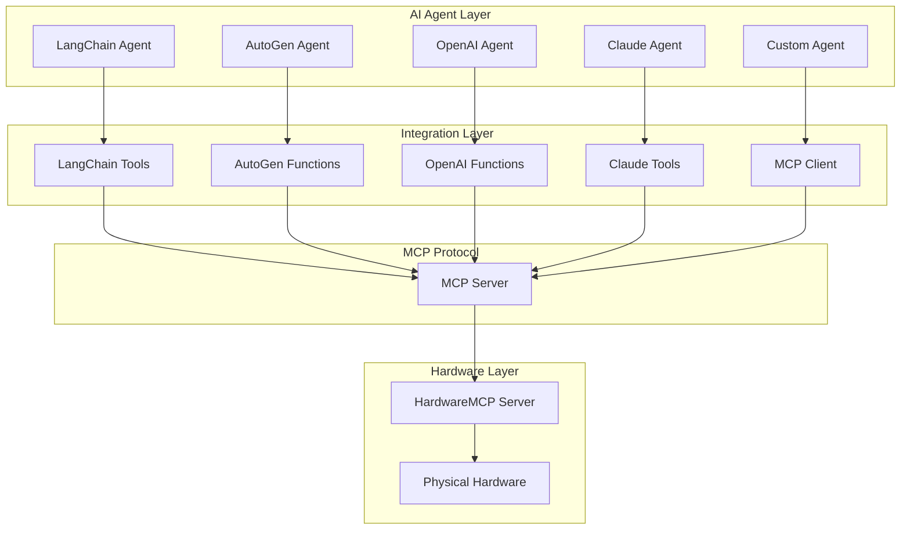

# HardwareMCP Agent Integrations

## Overview

HardwareMCP provides seamless integration with popular AI agent frameworks through the Model Context Protocol (MCP). This document outlines integration patterns, examples, and best practices for connecting AI agents to physical hardware.

## Supported Agent Frameworks

### 1. LangChain
- **Status**: Full support
- **Integration**: Custom tool wrapper
- **Features**: Chain composition, memory, callbacks

### 2. AutoGen (Microsoft)
- **Status**: Full support
- **Integration**: Function calling agent
- **Features**: Multi-agent collaboration, code execution

### 3. OpenAI Function Calling
- **Status**: Full support
- **Integration**: Direct API integration
- **Features**: Native function calling, streaming

### 4. Anthropic Claude
- **Status**: Full support
- **Integration**: Tool use API
- **Features**: Extended context, tool chaining

### 5. Custom Agents
- **Status**: Full support
- **Integration**: MCP protocol
- **Features**: Framework-agnostic, standardized interface

## Integration Architecture



## LangChain Integration

### Basic Setup

```python
from langchain.agents import initialize_agent, AgentType
from langchain.chat_models import ChatOpenAI
from langchain.tools import Tool
from mcp import ClientSession, StdioServerParameters
from mcp.client.stdio import stdio_client

# Initialize MCP client
server_params = StdioServerParameters(
    command="hardwaremcp",
    args=["--config", "hardware.yaml"]
)

async def create_hardware_agent():
    async with stdio_client(server_params) as (read, write):
        async with ClientSession(read, write) as session:
            # Initialize session
            await session.initialize()
            
            # List available tools
            tools_result = await session.list_tools()
            
            # Create LangChain tools from MCP tools
            langchain_tools = []
            for tool in tools_result.tools:
                langchain_tools.append(
                    Tool(
                        name=tool.name,
                        description=tool.description,
                        func=lambda args, t=tool: call_mcp_tool(session, t.name, args)
                    )
                )
            
            # Create agent
            llm = ChatOpenAI(temperature=0)
            agent = initialize_agent(
                langchain_tools,
                llm,
                agent=AgentType.OPENAI_FUNCTIONS,
                verbose=True
            )
            
            return agent, session

async def call_mcp_tool(session, tool_name, arguments):
    """Call MCP tool and return result"""
    result = await session.call_tool(tool_name, arguments)
    return result.content[0].text
```

### Advanced Example: Sensor Monitoring Chain

```python
from langchain.chains import LLMChain
from langchain.prompts import PromptTemplate
from langchain.memory import ConversationBufferMemory

async def create_sensor_monitoring_chain():
    # Create hardware tools
    agent, session = await create_hardware_agent()
    
    # Create monitoring chain
    template = """
    You are a hardware monitoring assistant. Analyze sensor data and provide insights.
    
    Current sensor readings:
    {sensor_data}
    
    Historical context:
    {history}
    
    User question: {question}
    
    Provide analysis and recommendations:
    """
    
    prompt = PromptTemplate(
        input_variables=["sensor_data", "history", "question"],
        template=template
    )
    
    memory = ConversationBufferMemory(memory_key="history")
    
    chain = LLMChain(
        llm=ChatOpenAI(temperature=0.7),
        prompt=prompt,
        memory=memory
    )
    
    return chain, session

# Usage
async def monitor_temperature():
    chain, session = await create_sensor_monitoring_chain()
    
    # Read sensor
    temp_result = await session.call_tool(
        "read_sensor",
        {"protocol": "i2c", "device_id": "temp_sensor_1"}
    )
    
    # Analyze with LLM
    response = await chain.arun(
        sensor_data=temp_result.content[0].text,
        question="Is the temperature within normal range?"
    )
    
    print(response)
```

## AutoGen Integration

### Multi-Agent Setup

```python
import autogen
from mcp import ClientSession, StdioServerParameters
from mcp.client.stdio import stdio_client

# Configure AutoGen
config_list = [
    {
        "model": "gpt-4",
        "api_key": "your-api-key"
    }
]

async def create_hardware_autogen_agents():
    # Initialize MCP client
    server_params = StdioServerParameters(
        command="hardwaremcp",
        args=["--config", "hardware.yaml"]
    )
    
    async with stdio_client(server_params) as (read, write):
        async with ClientSession(read, write) as session:
            await session.initialize()
            
            # Get available tools
            tools_result = await session.list_tools()
            
            # Create function definitions for AutoGen
            functions = []
            for tool in tools_result.tools:
                functions.append({
                    "name": tool.name,
                    "description": tool.description,
                    "parameters": tool.inputSchema
                })
            
            # Create hardware control agent
            hardware_agent = autogen.AssistantAgent(
                name="HardwareController",
                llm_config={
                    "config_list": config_list,
                    "functions": functions
                },
                system_message="""You are a hardware control specialist.
                You can read sensors, control actuators, and monitor hardware status.
                Always verify operations completed successfully."""
            )
            
            # Create analysis agent
            analyst_agent = autogen.AssistantAgent(
                name="DataAnalyst",
                llm_config={"config_list": config_list},
                system_message="""You are a data analysis expert.
                Analyze hardware data and provide insights."""
            )
            
            # Create user proxy
            user_proxy = autogen.UserProxyAgent(
                name="User",
                human_input_mode="NEVER",
                max_consecutive_auto_reply=10,
                code_execution_config={"work_dir": "coding"},
                function_map={
                    tool.name: lambda args, t=tool: call_mcp_tool_sync(session, t.name, args)
                    for tool in tools_result.tools
                }
            )
            
            return hardware_agent, analyst_agent, user_proxy, session

# Usage
async def run_hardware_task():
    hw_agent, analyst, user, session = await create_hardware_autogen_agents()
    
    # Create group chat
    groupchat = autogen.GroupChat(
        agents=[user, hw_agent, analyst],
        messages=[],
        max_round=10
    )
    
    manager = autogen.GroupChatManager(groupchat=groupchat)
    
    # Start conversation
    await user.initiate_chat(
        manager,
        message="Read temperature from I2C sensor and analyze if it's normal"
    )
```

### Collaborative Hardware Testing

```python
async def create_testing_team():
    """Create multi-agent team for hardware testing"""
    
    # Test executor agent
    executor = autogen.AssistantAgent(
        name="TestExecutor",
        system_message="""Execute hardware tests systematically.
        Follow test plans and report results accurately."""
    )
    
    # Test validator agent
    validator = autogen.AssistantAgent(
        name="TestValidator",
        system_message="""Validate test results against specifications.
        Identify anomalies and suggest retests if needed."""
    )
    
    # Report generator agent
    reporter = autogen.AssistantAgent(
        name="ReportGenerator",
        system_message="""Generate comprehensive test reports.
        Include pass/fail status, measurements, and recommendations."""
    )
    
    return executor, validator, reporter
```

## OpenAI Function Calling Integration

### Direct Integration

```python
import openai
from mcp import ClientSession, StdioServerParameters
from mcp.client.stdio import stdio_client
import json

async def create_openai_hardware_assistant():
    # Initialize MCP client
    server_params = StdioServerParameters(
        command="hardwaremcp",
        args=["--config", "hardware.yaml"]
    )
    
    async with stdio_client(server_params) as (read, write):
        async with ClientSession(read, write) as session:
            await session.initialize()
            
            # Get available tools
            tools_result = await session.list_tools()
            
            # Convert to OpenAI function format
            functions = []
            for tool in tools_result.tools:
                functions.append({
                    "name": tool.name,
                    "description": tool.description,
                    "parameters": tool.inputSchema
                })
            
            return session, functions

async def chat_with_hardware(user_message):
    session, functions = await create_openai_hardware_assistant()
    
    messages = [
        {"role": "system", "content": "You are a hardware control assistant."},
        {"role": "user", "content": user_message}
    ]
    
    # First API call
    response = openai.ChatCompletion.create(
        model="gpt-4",
        messages=messages,
        functions=functions,
        function_call="auto"
    )
    
    message = response.choices[0].message
    
    # Handle function calls
    while message.get("function_call"):
        function_name = message["function_call"]["name"]
        function_args = json.loads(message["function_call"]["arguments"])
        
        # Call MCP tool
        result = await session.call_tool(function_name, function_args)
        function_response = result.content[0].text
        
        # Add to messages
        messages.append(message)
        messages.append({
            "role": "function",
            "name": function_name,
            "content": function_response
        })
        
        # Get next response
        response = openai.ChatCompletion.create(
            model="gpt-4",
            messages=messages,
            functions=functions,
            function_call="auto"
        )
        
        message = response.choices[0].message
    
    return message["content"]
```

### Streaming Response

```python
async def stream_hardware_interaction(user_message):
    session, functions = await create_openai_hardware_assistant()
    
    messages = [
        {"role": "system", "content": "You are a hardware control assistant."},
        {"role": "user", "content": user_message}
    ]
    
    # Stream response
    async for chunk in openai.ChatCompletion.acreate(
        model="gpt-4",
        messages=messages,
        functions=functions,
        stream=True
    ):
        delta = chunk.choices[0].delta
        
        if delta.get("function_call"):
            # Handle function call
            function_name = delta["function_call"]["name"]
            function_args = json.loads(delta["function_call"]["arguments"])
            
            result = await session.call_tool(function_name, function_args)
            yield f"Executed: {function_name}\nResult: {result.content[0].text}\n"
        
        elif delta.get("content"):
            yield delta["content"]
```

## Anthropic Claude Integration

### Tool Use Setup

```python
import anthropic
from mcp import ClientSession, StdioServerParameters
from mcp.client.stdio import stdio_client

async def create_claude_hardware_assistant():
    # Initialize MCP client
    server_params = StdioServerParameters(
        command="hardwaremcp",
        args=["--config", "hardware.yaml"]
    )
    
    async with stdio_client(server_params) as (read, write):
        async with ClientSession(read, write) as session:
            await session.initialize()
            
            # Get available tools
            tools_result = await session.list_tools()
            
            # Convert to Claude tool format
            tools = []
            for tool in tools_result.tools:
                tools.append({
                    "name": tool.name,
                    "description": tool.description,
                    "input_schema": tool.inputSchema
                })
            
            return session, tools

async def chat_with_claude(user_message):
    session, tools = await create_claude_hardware_assistant()
    
    client = anthropic.Anthropic()
    
    messages = [{"role": "user", "content": user_message}]
    
    # First API call
    response = client.messages.create(
        model="claude-3-opus-20240229",
        max_tokens=4096,
        tools=tools,
        messages=messages
    )
    
    # Handle tool use
    while response.stop_reason == "tool_use":
        tool_use = next(
            block for block in response.content 
            if block.type == "tool_use"
        )
        
        # Call MCP tool
        result = await session.call_tool(
            tool_use.name,
            tool_use.input
        )
        
        # Add tool result to messages
        messages.append({"role": "assistant", "content": response.content})
        messages.append({
            "role": "user",
            "content": [{
                "type": "tool_result",
                "tool_use_id": tool_use.id,
                "content": result.content[0].text
            }]
        })
        
        # Get next response
        response = client.messages.create(
            model="claude-3-opus-20240229",
            max_tokens=4096,
            tools=tools,
            messages=messages
        )
    
    return response.content[0].text
```

## Custom Agent Integration

### Generic MCP Client

```python
from mcp import ClientSession, StdioServerParameters
from mcp.client.stdio import stdio_client
import asyncio

class HardwareAgent:
    """Generic hardware control agent using MCP"""
    
    def __init__(self, config_path="hardware.yaml"):
        self.config_path = config_path
        self.session = None
        self.tools = {}
    
    async def connect(self):
        """Connect to HardwareMCP server"""
        server_params = StdioServerParameters(
            command="hardwaremcp",
            args=["--config", self.config_path]
        )
        
        self.read, self.write = await stdio_client(server_params).__aenter__()
        self.session = await ClientSession(self.read, self.write).__aenter__()
        await self.session.initialize()
        
        # Load available tools
        tools_result = await self.session.list_tools()
        self.tools = {tool.name: tool for tool in tools_result.tools}
    
    async def execute(self, tool_name, **kwargs):
        """Execute a hardware tool"""
        if tool_name not in self.tools:
            raise ValueError(f"Tool {tool_name} not found")
        
        result = await self.session.call_tool(tool_name, kwargs)
        return result.content[0].text
    
    async def read_sensor(self, protocol, device_id):
        """High-level sensor reading"""
        return await self.execute(
            "read_sensor",
            protocol=protocol,
            device_id=device_id
        )
    
    async def control_actuator(self, protocol, device_id, value):
        """High-level actuator control"""
        return await self.execute(
            "write_actuator",
            protocol=protocol,
            device_id=device_id,
            value=value
        )
    
    async def disconnect(self):
        """Disconnect from server"""
        if self.session:
            await self.session.__aexit__(None, None, None)
        if hasattr(self, 'read'):
            await self.read.__aexit__(None, None, None)

# Usage
async def main():
    agent = HardwareAgent()
    await agent.connect()
    
    try:
        # Read temperature
        temp = await agent.read_sensor("i2c", "temp_sensor_1")
        print(f"Temperature: {temp}")
        
        # Control LED
        await agent.control_actuator("gpio", "led_1", "on")
        
    finally:
        await agent.disconnect()

asyncio.run(main())
```

## Best Practices

### 1. Error Handling

```python
async def safe_hardware_operation(session, tool_name, args):
    """Execute hardware operation with error handling"""
    try:
        result = await session.call_tool(tool_name, args)
        return {"success": True, "data": result.content[0].text}
    except Exception as e:
        return {
            "success": False,
            "error": str(e),
            "suggestion": "Check hardware connection or enable simulator mode"
        }
```

### 2. Retry Logic

```python
async def retry_hardware_operation(session, tool_name, args, max_retries=3):
    """Retry hardware operation on failure"""
    for attempt in range(max_retries):
        try:
            result = await session.call_tool(tool_name, args)
            return result
        except Exception as e:
            if attempt == max_retries - 1:
                raise
            await asyncio.sleep(2 ** attempt)  # Exponential backoff
```

### 3. Resource Management

```python
from contextlib import asynccontextmanager

@asynccontextmanager
async def hardware_session(config_path="hardware.yaml"):
    """Context manager for hardware session"""
    server_params = StdioServerParameters(
        command="hardwaremcp",
        args=["--config", config_path]
    )
    
    async with stdio_client(server_params) as (read, write):
        async with ClientSession(read, write) as session:
            await session.initialize()
            yield session

# Usage
async def use_hardware():
    async with hardware_session() as session:
        result = await session.call_tool("read_sensor", {...})
        # Session automatically closed
```

### 4. Logging and Monitoring

```python
import logging

logger = logging.getLogger("hardware_agent")

async def logged_tool_call(session, tool_name, args):
    """Execute tool with logging"""
    logger.info(f"Calling tool: {tool_name} with args: {args}")
    
    start_time = time.time()
    try:
        result = await session.call_tool(tool_name, args)
        duration = time.time() - start_time
        
        logger.info(f"Tool {tool_name} completed in {duration:.2f}s")
        return result
    except Exception as e:
        logger.error(f"Tool {tool_name} failed: {e}")
        raise
```

## Example Use Cases

### 1. Temperature Monitoring System

```python
async def temperature_monitoring_agent():
    """Monitor temperature and alert on anomalies"""
    async with hardware_session() as session:
        while True:
            # Read temperature
            temp = await session.call_tool(
                "read_sensor",
                {"protocol": "i2c", "device_id": "temp_sensor_1"}
            )
            
            # Analyze with LLM
            analysis = await analyze_temperature(temp)
            
            if analysis["alert"]:
                await send_alert(analysis["message"])
            
            await asyncio.sleep(60)  # Check every minute
```

### 2. Automated Testing System

```python
async def hardware_test_suite():
    """Run comprehensive hardware tests"""
    async with hardware_session() as session:
        tests = [
            ("gpio_test", test_gpio_pins),
            ("i2c_test", test_i2c_devices),
            ("spi_test", test_spi_devices),
        ]
        
        results = []
        for test_name, test_func in tests:
            result = await test_func(session)
            results.append({"test": test_name, "result": result})
        
        return generate_test_report(results)
```

### 3. Industrial Control System

```python
async def industrial_controller():
    """Control industrial equipment based on sensor feedback"""
    async with hardware_session() as session:
        # Read process variables
        pressure = await read_pressure(session)
        temperature = await read_temperature(session)
        flow_rate = await read_flow(session)
        
        # Make control decisions
        decisions = await llm_control_logic(pressure, temperature, flow_rate)
        
        # Execute control actions
        for action in decisions["actions"]:
            await execute_control_action(session, action)
```

## Performance Optimization

### 1. Batch Operations

```python
async def batch_sensor_read(session, sensors):
    """Read multiple sensors efficiently"""
    tasks = [
        session.call_tool("read_sensor", {"device_id": sensor})
        for sensor in sensors
    ]
    results = await asyncio.gather(*tasks)
    return results
```

### 2. Caching

```python
from functools import lru_cache
import time

class CachedHardwareAgent:
    def __init__(self):
        self.cache = {}
        self.cache_ttl = 5  # seconds
    
    async def read_sensor_cached(self, session, device_id):
        """Read sensor with caching"""
        cache_key = f"sensor_{device_id}"
        
        if cache_key in self.cache:
            cached_time, cached_value = self.cache[cache_key]
            if time.time() - cached_time < self.cache_ttl:
                return cached_value
        
        # Read from hardware
        result = await session.call_tool(
            "read_sensor",
            {"device_id": device_id}
        )
        
        self.cache[cache_key] = (time.time(), result)
        return result
```

## Security Considerations

### 1. Input Validation

```python
def validate_hardware_input(tool_name, args):
    """Validate inputs before hardware operation"""
    if tool_name == "gpio_write":
        assert 0 <= args["pin"] <= 40, "Invalid pin number"
        assert args["value"] in [0, 1, "high", "low"], "Invalid value"
    
    if tool_name == "i2c_write":
        assert 0x00 <= args["address"] <= 0x7F, "Invalid I2C address"
```

### 2. Rate Limiting

```python
from collections import defaultdict
import time

class RateLimiter:
    def __init__(self, max_calls=10, period=60):
        self.max_calls = max_calls
        self.period = period
        self.calls = defaultdict(list)
    
    def check_rate_limit(self, tool_name):
        """Check if rate limit exceeded"""
        now = time.time()
        self.calls[tool_name] = [
            t for t in self.calls[tool_name]
            if now - t < self.period
        ]
        
        if len(self.calls[tool_name]) >= self.max_calls:
            raise Exception(f"Rate limit exceeded for {tool_name}")
        
        self.calls[tool_name].append(now)
```

## Troubleshooting

### Common Issues

1. **Connection Failures**: Check MCP server is running
2. **Tool Not Found**: Verify tool name and availability
3. **Hardware Errors**: Enable simulator mode for testing
4. **Timeout Issues**: Increase timeout for slow operations
5. **Permission Errors**: Check user has hardware access rights

### Debug Mode

```python
async def debug_hardware_session():
    """Run session with debug logging"""
    logging.basicConfig(level=logging.DEBUG)
    
    async with hardware_session() as session:
        # List all available tools
        tools = await session.list_tools()
        print("Available tools:", [t.name for t in tools.tools])
        
        # Test each tool
        for tool in tools.tools:
            try:
                print(f"Testing {tool.name}...")
                # Add test logic
            except Exception as e:
                print(f"Failed: {e}")