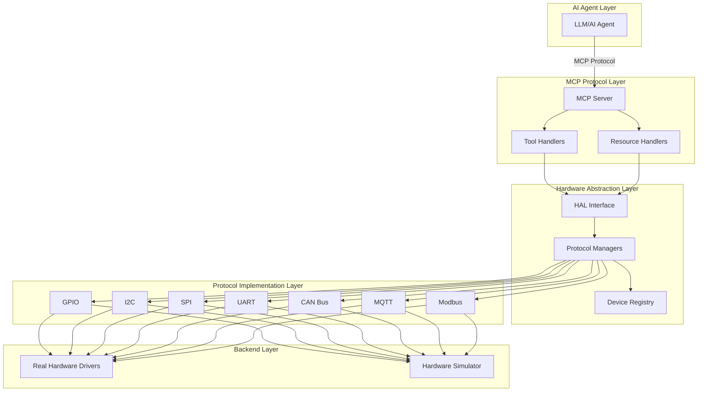
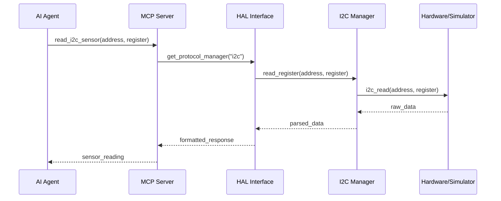
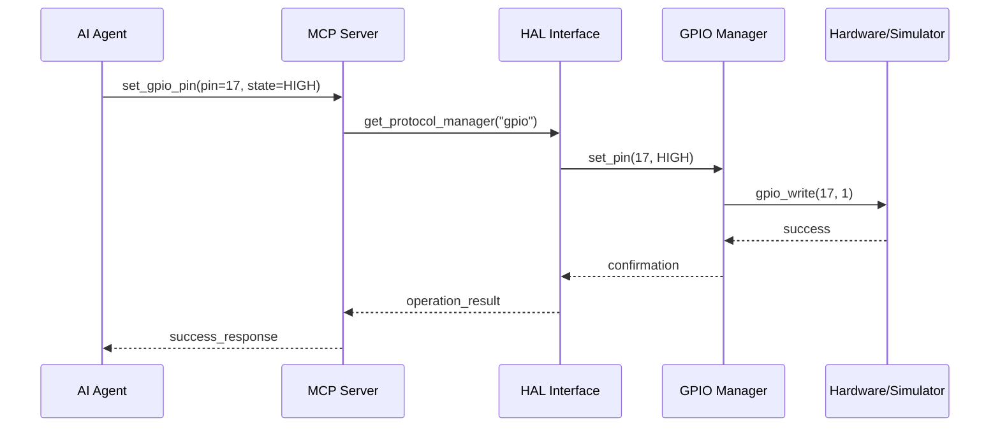
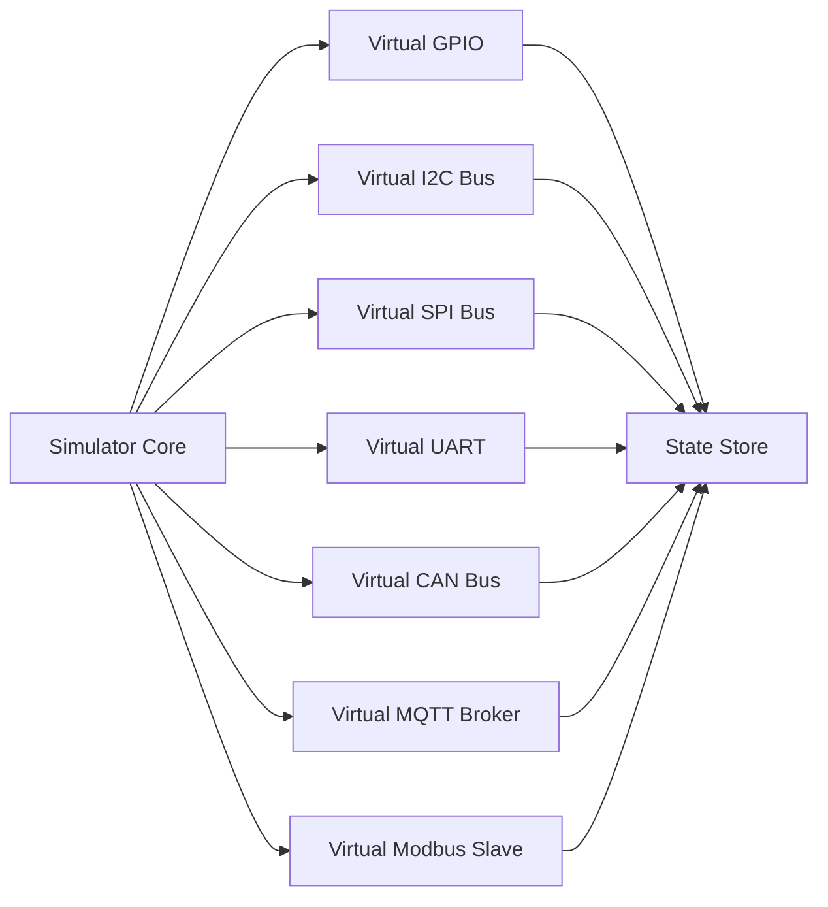

# HardwareMCP Architecture

## Overview

HardwareMCP is a universal MCP (Model Context Protocol) server that provides AI agents with a standardized interface to interact with physical hardware. It supports multiple protocols and includes a full hardware simulator for development and testing.

## Design Principles

1. **Protocol Agnostic**: Support multiple hardware protocols through a unified interface
2. **LLM Agnostic**: Compatible with any AI agent that supports MCP
3. **Graceful Degradation**: Auto-fallback to simulator when hardware is unavailable
4. **Layered API**: Both low-level and high-level abstractions
5. **Cross-Platform**: Support Raspberry Pi, ESP32, and generic Linux systems
6. **Developer Friendly**: Easy configuration, comprehensive examples, monitoring dashboard

## Architecture Layers



## Core Components

### 1. MCP Server Layer
- **Responsibility**: Implement MCP 2024-11-05 specification
- **Components**:
  - Server initialization and lifecycle management
  - Tool registration and execution
  - Resource management and streaming
  - Error handling and logging

### 2. Hardware Abstraction Layer (HAL)
- **Responsibility**: Provide unified interface to all hardware protocols
- **Components**:
  - Protocol manager factory
  - Device registry and discovery
  - Configuration loader
  - Mode selector (real hardware vs simulator)

### 3. Protocol Implementations
Each protocol has:
- **High-level API**: Semantic operations (read_sensor, send_message)
- **Low-level API**: Direct protocol access (read_register, write_bytes)
- **Real driver**: Platform-specific hardware access
- **Simulator**: Virtual hardware for testing

### 4. Configuration System
- **YAML-based**: Human-readable hardware definitions
- **Auto-discovery**: Detect connected devices automatically
- **Validation**: Schema validation for configurations
- **Hot-reload**: Update configuration without restart

### 5. Monitoring Dashboard
- **Real-time**: WebSocket-based live updates
- **Visualization**: Protocol activity, device status, data streams
- **Control**: Manual device testing and debugging
- **Logging**: Historical data and event logs

## Data Flow

### Read Operation Example


### Write Operation Example


## Protocol Specifications

### GPIO (General Purpose Input/Output)
- **Operations**: read, write, configure (input/output/pwm)
- **Features**: Interrupt handling, pull-up/down resistors
- **Platforms**: RPi.GPIO, gpiod, ESP32 GPIO

### I2C (Inter-Integrated Circuit)
- **Operations**: read, write, scan bus, read/write registers
- **Features**: Multi-master support, clock stretching
- **Platforms**: smbus2, i2c-tools, ESP32 I2C

### SPI (Serial Peripheral Interface)
- **Operations**: transfer, read, write, configure
- **Features**: Multiple chip selects, configurable modes
- **Platforms**: spidev, ESP32 SPI

### UART (Universal Asynchronous Receiver-Transmitter)
- **Operations**: read, write, configure baud rate
- **Features**: Flow control, parity checking
- **Platforms**: pyserial, ESP32 UART

### CAN Bus (Controller Area Network)
- **Operations**: send frame, receive frame, set filters
- **Features**: Standard/Extended IDs, error handling
- **Platforms**: python-can, socketcan

### MQTT (Message Queuing Telemetry Transport)
- **Operations**: publish, subscribe, connect, disconnect
- **Features**: QoS levels, retained messages, will messages
- **Platforms**: paho-mqtt

### Modbus (Industrial Protocol)
- **Operations**: read coils, read registers, write coils, write registers
- **Features**: RTU and TCP modes, function codes
- **Platforms**: pymodbus

## Hardware Simulator

The simulator provides virtual hardware for all protocols:

### Features
- **State Management**: Maintains virtual device states
- **Realistic Behavior**: Simulates timing, errors, and edge cases
- **Configurable**: Define virtual devices in YAML
- **Deterministic**: Reproducible for testing
- **Interactive**: Dashboard integration for manual testing

### Simulator Architecture


## Configuration System

### YAML Configuration Structure
```yaml
hardware:
  mode: auto  # auto, real, simulator
  platform: raspberry_pi  # raspberry_pi, esp32, linux
  
  gpio:
    enabled: true
    pins:
      - pin: 17
        mode: output
        initial: low
      - pin: 27
        mode: input
        pull: up
  
  i2c:
    enabled: true
    bus: 1
    devices:
      - address: 0x48
        type: temperature_sensor
        name: temp_sensor_1
  
  spi:
    enabled: true
    bus: 0
    device: 0
    max_speed: 1000000
  
  uart:
    enabled: true
    port: /dev/ttyUSB0
    baudrate: 9600
  
  can:
    enabled: true
    interface: can0
    bitrate: 500000
  
  mqtt:
    enabled: true
    broker: localhost
    port: 1883
  
  modbus:
    enabled: true
    port: /dev/ttyUSB1
    baudrate: 9600
    mode: rtu
```

## MCP Tool Definitions

### High-Level Tools
- `read_sensor(protocol, device_id, parameters)` - Read sensor data
- `write_actuator(protocol, device_id, value)` - Control actuator
- `send_message(protocol, destination, data)` - Send protocol message
- `configure_device(protocol, device_id, config)` - Configure device
- `scan_bus(protocol)` - Discover devices on bus

### Low-Level Tools
- `gpio_read(pin)` / `gpio_write(pin, value)`
- `i2c_read_register(address, register)` / `i2c_write_register(address, register, value)`
- `spi_transfer(data)` / `spi_read(length)`
- `uart_read(length)` / `uart_write(data)`
- `can_send_frame(id, data)` / `can_receive_frame()`
- `mqtt_publish(topic, message)` / `mqtt_subscribe(topic)`
- `modbus_read_coils(address, count)` / `modbus_write_coil(address, value)`

## MCP Resources

Resources provide streaming access to hardware data:

- `hardware://gpio/pins` - GPIO pin states
- `hardware://i2c/devices` - I2C device list
- `hardware://can/frames` - CAN bus frame stream
- `hardware://mqtt/messages/{topic}` - MQTT message stream
- `hardware://logs` - System logs and events

## Error Handling Strategy

### Error Categories
1. **Configuration Errors**: Invalid YAML, missing required fields
2. **Hardware Errors**: Device not found, communication failure
3. **Protocol Errors**: Invalid parameters, unsupported operation
4. **System Errors**: Permission denied, resource unavailable

### Error Response Format
```json
{
  "error": {
    "code": "HARDWARE_NOT_FOUND",
    "message": "I2C device at address 0x48 not responding",
    "protocol": "i2c",
    "device": "0x48",
    "suggestion": "Check device connection or enable simulator mode"
  }
}
```

## Security Considerations

### Current Scope (Trusted Environment)
- No authentication required
- Local network access only
- File system permissions for device access

### Future Enhancements
- Optional token-based authentication
- Role-based access control
- Audit logging
- Encrypted communication

## Performance Considerations

### Optimization Strategies
1. **Connection Pooling**: Reuse hardware connections
2. **Caching**: Cache device states and configurations
3. **Async Operations**: Non-blocking I/O for all protocols
4. **Batch Operations**: Group multiple operations when possible
5. **Resource Limits**: Configurable rate limiting and timeouts

### Expected Performance
- GPIO operations: <1ms latency
- I2C/SPI operations: 1-10ms latency
- UART operations: Depends on baud rate
- CAN operations: 1-5ms latency
- MQTT operations: Network dependent
- Modbus operations: 10-100ms latency

## Deployment Models

### 1. Pip Package Installation
```bash
pip install hardwaremcp
hardwaremcp --config hardware.yaml
```

### 2. Docker Container
```bash
docker run -d \
  --device=/dev/i2c-1 \
  --device=/dev/spidev0.0 \
  -v $(pwd)/config:/config \
  hardwaremcp/server
```

### 3. Systemd Service
```bash
sudo systemctl enable hardwaremcp
sudo systemctl start hardwaremcp
```

## Extension Points

### Custom Protocol Support
Developers can add new protocols by:
1. Implementing the `ProtocolManager` interface
2. Creating real and simulator drivers
3. Registering with the HAL
4. Defining MCP tools and resources

### Custom Device Types
Add device-specific logic:
1. Create device class inheriting from base
2. Implement device-specific operations
3. Register device type in configuration schema

## Testing Strategy

### Unit Tests
- Protocol manager logic
- Configuration parsing
- Simulator behavior
- Error handling

### Integration Tests
- MCP protocol compliance
- End-to-end tool execution
- Multi-protocol scenarios
- Hardware fallback behavior

### Hardware-in-Loop Tests
- Real device communication
- Platform-specific drivers
- Performance benchmarks
- Stress testing

## Monitoring and Observability

### Metrics
- Operation latency (p50, p95, p99)
- Error rates by protocol
- Active connections
- Device availability

### Logging
- Structured JSON logs
- Configurable log levels
- Protocol-specific debug logs
- Audit trail for operations

### Dashboard Features
- Real-time device status
- Protocol activity visualization
- Historical data charts
- Manual device control
- Configuration editor

## Future Roadmap

### Phase 1 (Current)
- Core MCP server implementation
- All protocol support
- Full simulator
- Basic dashboard

### Phase 2
- Advanced device types (sensors, motors, displays)
- Plugin system for custom protocols
- Enhanced dashboard with analytics
- Performance optimizations

### Phase 3
- Multi-server coordination
- Cloud integration
- Machine learning for anomaly detection
- Mobile app for monitoring

### Phase 4
- Hardware marketplace integration
- Community protocol library
- Enterprise features (auth, RBAC)
- Advanced debugging tools