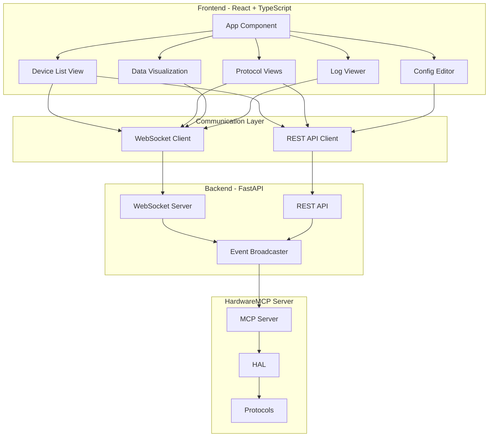

# HardwareMCP Dashboard

## Overview

The HardwareMCP Dashboard is a real-time web interface for monitoring and controlling hardware devices. Built with React and FastAPI, it provides visualization, debugging tools, and manual device control capabilities.

## Architecture



## Features

### 1. Real-Time Device Monitoring
- Live device status updates
- Protocol activity visualization
- Data stream monitoring
- Connection status indicators

### 2. Data Visualization
- Real-time charts for sensor data
- Historical data graphs
- Protocol-specific visualizations
- Custom dashboard layouts

### 3. Device Control
- Manual device testing
- Protocol command execution
- Configuration updates
- Batch operations

### 4. Debugging Tools
- Live log streaming
- Protocol packet inspection
- Error tracking
- Performance metrics

### 5. Configuration Management
- Visual configuration editor
- YAML syntax highlighting
- Validation and error checking
- Hot-reload support

## Technology Stack

### Frontend
- **Framework**: React 18 with TypeScript
- **UI Library**: Material-UI (MUI)
- **State Management**: Zustand
- **Charts**: Recharts
- **WebSocket**: Socket.IO Client
- **HTTP Client**: Axios
- **Build Tool**: Vite

### Backend
- **Framework**: FastAPI
- **WebSocket**: FastAPI WebSockets
- **CORS**: FastAPI CORS middleware
- **Async**: asyncio
- **Validation**: Pydantic

## Component Structure

### Frontend Components

#### 1. App Component (`App.tsx`)
```typescript
import React from 'react';
import { ThemeProvider, CssBaseline } from '@mui/material';
import { BrowserRouter, Routes, Route } from 'react-router-dom';
import { Layout } from './components/Layout';
import { Dashboard } from './pages/Dashboard';
import { DeviceList } from './pages/DeviceList';
import { ProtocolView } from './pages/ProtocolView';
import { LogViewer } from './pages/LogViewer';
import { ConfigEditor } from './pages/ConfigEditor';

export const App: React.FC = () => {
  return (
    <ThemeProvider theme={theme}>
      <CssBaseline />
      <BrowserRouter>
        <Layout>
          <Routes>
            <Route path="/" element={<Dashboard />} />
            <Route path="/devices" element={<DeviceList />} />
            <Route path="/protocol/:protocol" element={<ProtocolView />} />
            <Route path="/logs" element={<LogViewer />} />
            <Route path="/config" element={<ConfigEditor />} />
          </Routes>
        </Layout>
      </BrowserRouter>
    </ThemeProvider>
  );
};
```

#### 2. Device List Component (`DeviceList.tsx`)
```typescript
import React, { useEffect } from 'react';
import { Card, CardContent, Grid, Typography, Chip } from '@mui/material';
import { useHardwareStore } from '../store/hardwareStore';
import { DeviceCard } from '../components/DeviceCard';

export const DeviceList: React.FC = () => {
  const { devices, fetchDevices, subscribeToUpdates } = useHardwareStore();
  
  useEffect(() => {
    fetchDevices();
    const unsubscribe = subscribeToUpdates();
    return unsubscribe;
  }, []);
  
  return (
    <Grid container spacing={3}>
      {devices.map(device => (
        <Grid item xs={12} md={6} lg={4} key={device.id}>
          <DeviceCard device={device} />
        </Grid>
      ))}
    </Grid>
  );
};
```

#### 3. Protocol View Component (`ProtocolView.tsx`)
```typescript
import React from 'react';
import { useParams } from 'react-router-dom';
import { GPIOView } from '../components/protocols/GPIOView';
import { I2CView } from '../components/protocols/I2CView';
import { SPIView } from '../components/protocols/SPIView';
// ... other protocol views

export const ProtocolView: React.FC = () => {
  const { protocol } = useParams<{ protocol: string }>();
  
  const renderProtocolView = () => {
    switch (protocol) {
      case 'gpio':
        return <GPIOView />;
      case 'i2c':
        return <I2CView />;
      case 'spi':
        return <SPIView />;
      // ... other protocols
      default:
        return <div>Protocol not found</div>;
    }
  };
  
  return (
    <div>
      <Typography variant="h4">{protocol?.toUpperCase()} Protocol</Typography>
      {renderProtocolView()}
    </div>
  );
};
```

#### 4. Data Chart Component (`DataChart.tsx`)
```typescript
import React from 'react';
import { LineChart, Line, XAxis, YAxis, CartesianGrid, Tooltip, Legend } from 'recharts';
import { useHardwareData } from '../hooks/useHardwareData';

interface DataChartProps {
  deviceId: string;
  dataKey: string;
  timeWindow?: number; // seconds
}

export const DataChart: React.FC<DataChartProps> = ({ 
  deviceId, 
  dataKey, 
  timeWindow = 60 
}) => {
  const data = useHardwareData(deviceId, dataKey, timeWindow);
  
  return (
    <LineChart width={600} height={300} data={data}>
      <CartesianGrid strokeDasharray="3 3" />
      <XAxis dataKey="timestamp" />
      <YAxis />
      <Tooltip />
      <Legend />
      <Line type="monotone" dataKey={dataKey} stroke="#8884d8" />
    </LineChart>
  );
};
```

#### 5. Log Viewer Component (`LogViewer.tsx`)
```typescript
import React, { useEffect, useRef } from 'react';
import { Paper, Typography, Box } from '@mui/material';
import { useWebSocket } from '../hooks/useWebSocket';

export const LogViewer: React.FC = () => {
  const { logs, connected } = useWebSocket('/ws/logs');
  const logEndRef = useRef<HTMLDivElement>(null);
  
  useEffect(() => {
    logEndRef.current?.scrollIntoView({ behavior: 'smooth' });
  }, [logs]);
  
  return (
    <Paper sx={{ p: 2, height: '80vh', overflow: 'auto' }}>
      <Typography variant="h6">
        System Logs {connected ? '🟢' : '🔴'}
      </Typography>
      <Box sx={{ fontFamily: 'monospace', fontSize: '0.875rem' }}>
        {logs.map((log, index) => (
          <div key={index} style={{ color: getLogColor(log.level) }}>
            [{log.timestamp}] {log.level}: {log.message}
          </div>
        ))}
        <div ref={logEndRef} />
      </Box>
    </Paper>
  );
};
```

#### 6. Config Editor Component (`ConfigEditor.tsx`)
```typescript
import React, { useState } from 'react';
import { Paper, Button, Alert } from '@mui/material';
import Editor from '@monaco-editor/react';
import { useConfig } from '../hooks/useConfig';

export const ConfigEditor: React.FC = () => {
  const { config, updateConfig, validate } = useConfig();
  const [editorValue, setEditorValue] = useState(config);
  const [error, setError] = useState<string | null>(null);
  
  const handleSave = async () => {
    const validation = validate(editorValue);
    if (!validation.valid) {
      setError(validation.error);
      return;
    }
    
    try {
      await updateConfig(editorValue);
      setError(null);
    } catch (e) {
      setError(e.message);
    }
  };
  
  return (
    <Paper sx={{ p: 2 }}>
      {error && <Alert severity="error">{error}</Alert>}
      <Editor
        height="70vh"
        defaultLanguage="yaml"
        value={editorValue}
        onChange={(value) => setEditorValue(value || '')}
        theme="vs-dark"
      />
      <Button variant="contained" onClick={handleSave} sx={{ mt: 2 }}>
        Save Configuration
      </Button>
    </Paper>
  );
};
```

### Custom Hooks

#### 1. WebSocket Hook (`useWebSocket.ts`)
```typescript
import { useEffect, useState } from 'react';
import io, { Socket } from 'socket.io-client';

export const useWebSocket = (endpoint: string) => {
  const [socket, setSocket] = useState<Socket | null>(null);
  const [connected, setConnected] = useState(false);
  const [data, setData] = useState<any[]>([]);
  
  useEffect(() => {
    const newSocket = io(`ws://localhost:8000${endpoint}`);
    
    newSocket.on('connect', () => setConnected(true));
    newSocket.on('disconnect', () => setConnected(false));
    newSocket.on('data', (newData) => {
      setData(prev => [...prev, newData]);
    });
    
    setSocket(newSocket);
    
    return () => {
      newSocket.close();
    };
  }, [endpoint]);
  
  return { socket, connected, data };
};
```

#### 2. Hardware Data Hook (`useHardwareData.ts`)
```typescript
import { useState, useEffect } from 'react';
import { useWebSocket } from './useWebSocket';

export const useHardwareData = (
  deviceId: string,
  dataKey: string,
  timeWindow: number
) => {
  const [data, setData] = useState<any[]>([]);
  const { socket } = useWebSocket('/ws/devices');
  
  useEffect(() => {
    if (!socket) return;
    
    socket.emit('subscribe', { deviceId, dataKey });
    
    socket.on('device_data', (newData) => {
      if (newData.deviceId === deviceId) {
        setData(prev => {
          const updated = [...prev, {
            timestamp: new Date().toISOString(),
            [dataKey]: newData[dataKey]
          }];
          
          // Keep only data within time window
          const cutoff = Date.now() - timeWindow * 1000;
          return updated.filter(d => 
            new Date(d.timestamp).getTime() > cutoff
          );
        });
      }
    });
    
    return () => {
      socket.emit('unsubscribe', { deviceId, dataKey });
    };
  }, [socket, deviceId, dataKey, timeWindow]);
  
  return data;
};
```

#### 3. Hardware Store (`hardwareStore.ts`)
```typescript
import create from 'zustand';
import axios from 'axios';

interface Device {
  id: string;
  protocol: string;
  status: 'online' | 'offline';
  data: any;
}

interface HardwareStore {
  devices: Device[];
  fetchDevices: () => Promise<void>;
  updateDevice: (id: string, data: any) => void;
  subscribeToUpdates: () => () => void;
}

export const useHardwareStore = create<HardwareStore>((set, get) => ({
  devices: [],
  
  fetchDevices: async () => {
    const response = await axios.get('http://localhost:8000/api/devices');
    set({ devices: response.data });
  },
  
  updateDevice: (id, data) => {
    set(state => ({
      devices: state.devices.map(d => 
        d.id === id ? { ...d, ...data } : d
      )
    }));
  },
  
  subscribeToUpdates: () => {
    const socket = io('ws://localhost:8000/ws/devices');
    
    socket.on('device_update', (update) => {
      get().updateDevice(update.id, update.data);
    });
    
    return () => socket.close();
  }
}));
```

### Backend Implementation

#### 1. FastAPI Application (`app.py`)
```python
from fastapi import FastAPI, WebSocket, WebSocketDisconnect
from fastapi.middleware.cors import CORSMiddleware
from fastapi.staticfiles import StaticFiles
import asyncio
from typing import List
import json

app = FastAPI(title="HardwareMCP Dashboard")

# CORS configuration
app.add_middleware(
    CORSMiddleware,
    allow_origins=["http://localhost:5173"],  # Vite dev server
    allow_credentials=True,
    allow_methods=["*"],
    allow_headers=["*"],
)

# WebSocket connection manager
class ConnectionManager:
    def __init__(self):
        self.active_connections: List[WebSocket] = []
    
    async def connect(self, websocket: WebSocket):
        await websocket.accept()
        self.active_connections.append(websocket)
    
    def disconnect(self, websocket: WebSocket):
        self.active_connections.remove(websocket)
    
    async def broadcast(self, message: dict):
        for connection in self.active_connections:
            try:
                await connection.send_json(message)
            except:
                pass

manager = ConnectionManager()

# WebSocket endpoints
@app.websocket("/ws/devices")
async def websocket_devices(websocket: WebSocket):
    await manager.connect(websocket)
    try:
        while True:
            # Receive subscription requests
            data = await websocket.receive_json()
            # Handle subscription logic
            await handle_subscription(websocket, data)
    except WebSocketDisconnect:
        manager.disconnect(websocket)

@app.websocket("/ws/logs")
async def websocket_logs(websocket: WebSocket):
    await manager.connect(websocket)
    try:
        while True:
            # Stream logs
            log_entry = await get_next_log()
            await websocket.send_json(log_entry)
    except WebSocketDisconnect:
        manager.disconnect(websocket)

# REST API endpoints
@app.get("/api/devices")
async def get_devices():
    """Get list of all devices"""
    devices = await fetch_devices_from_mcp()
    return devices

@app.get("/api/devices/{device_id}")
async def get_device(device_id: str):
    """Get specific device details"""
    device = await fetch_device_from_mcp(device_id)
    return device

@app.post("/api/devices/{device_id}/control")
async def control_device(device_id: str, command: dict):
    """Send control command to device"""
    result = await send_command_to_mcp(device_id, command)
    return result

@app.get("/api/config")
async def get_config():
    """Get current configuration"""
    config = await load_config()
    return config

@app.put("/api/config")
async def update_config(config: dict):
    """Update configuration"""
    result = await save_config(config)
    return result

# Serve static files (production)
app.mount("/", StaticFiles(directory="frontend/dist", html=True), name="static")
```

#### 2. WebSocket Handler (`websocket.py`)
```python
from fastapi import WebSocket
import asyncio
from typing import Dict, Set
import json

class DeviceSubscriptionManager:
    def __init__(self):
        self.subscriptions: Dict[str, Set[WebSocket]] = {}
    
    async def subscribe(self, websocket: WebSocket, device_id: str):
        """Subscribe to device updates"""
        if device_id not in self.subscriptions:
            self.subscriptions[device_id] = set()
        self.subscriptions[device_id].add(websocket)
    
    async def unsubscribe(self, websocket: WebSocket, device_id: str):
        """Unsubscribe from device updates"""
        if device_id in self.subscriptions:
            self.subscriptions[device_id].discard(websocket)
    
    async def broadcast_device_update(self, device_id: str, data: dict):
        """Broadcast update to all subscribers"""
        if device_id in self.subscriptions:
            message = {
                "type": "device_update",
                "deviceId": device_id,
                "data": data,
                "timestamp": datetime.now().isoformat()
            }
            
            for websocket in self.subscriptions[device_id]:
                try:
                    await websocket.send_json(message)
                except:
                    # Remove dead connections
                    self.subscriptions[device_id].discard(websocket)

subscription_manager = DeviceSubscriptionManager()
```

#### 3. API Models (`models.py`)
```python
from pydantic import BaseModel
from typing import Optional, Dict, Any
from datetime import datetime

class Device(BaseModel):
    id: str
    protocol: str
    status: str
    name: Optional[str]
    data: Dict[str, Any]
    last_update: datetime

class DeviceCommand(BaseModel):
    command: str
    parameters: Dict[str, Any]

class LogEntry(BaseModel):
    timestamp: datetime
    level: str
    message: str
    protocol: Optional[str]
    device_id: Optional[str]

class ConfigUpdate(BaseModel):
    config: str  # YAML string
    validate_only: bool = False
```

## Protocol-Specific Views

### GPIO View
- Pin state visualization (grid layout)
- Input/output mode indicators
- PWM duty cycle sliders
- Interrupt event log

### I2C View
- Bus scanner with device addresses
- Register viewer/editor
- Transaction log
- Device tree visualization

### SPI View
- Transfer visualizer
- Chip select status
- Clock configuration
- Data packet inspector

### UART View
- Serial terminal
- Baud rate selector
- Data format configuration
- TX/RX statistics

### CAN View
- Frame viewer (standard/extended)
- Filter configuration
- Bus load graph
- Error counter

### MQTT View
- Topic tree
- Message inspector
- Publish interface
- Subscription manager

### Modbus View
- Register map
- Function code selector
- Slave device list
- Transaction history

## Deployment

### Development Mode
```bash
# Backend
cd dashboard/backend
uvicorn app:app --reload --port 8000

# Frontend
cd dashboard/frontend
npm run dev
```

### Production Build
```bash
# Build frontend
cd dashboard/frontend
npm run build

# Run backend (serves frontend)
cd dashboard/backend
uvicorn app:app --host 0.0.0.0 --port 8000
```

### Docker Deployment
```dockerfile
FROM node:18 AS frontend-build
WORKDIR /app/frontend
COPY dashboard/frontend/package*.json ./
RUN npm install
COPY dashboard/frontend/ ./
RUN npm run build

FROM python:3.11-slim
WORKDIR /app
COPY dashboard/backend/requirements.txt ./
RUN pip install -r requirements.txt
COPY dashboard/backend/ ./
COPY --from=frontend-build /app/frontend/dist ./frontend/dist
EXPOSE 8000
CMD ["uvicorn", "app:app", "--host", "0.0.0.0", "--port", "8000"]
```

## Configuration

### Frontend Configuration (`vite.config.ts`)
```typescript
import { defineConfig } from 'vite';
import react from '@vitejs/plugin-react';

export default defineConfig({
  plugins: [react()],
  server: {
    port: 5173,
    proxy: {
      '/api': 'http://localhost:8000',
      '/ws': {
        target: 'ws://localhost:8000',
        ws: true
      }
    }
  },
  build: {
    outDir: 'dist',
    sourcemap: true
  }
});
```

### Backend Configuration
```python
# config.py
from pydantic_settings import BaseSettings

class Settings(BaseSettings):
    mcp_server_host: str = "localhost"
    mcp_server_port: int = 3000
    websocket_ping_interval: int = 30
    max_log_entries: int = 1000
    cors_origins: list = ["http://localhost:5173"]
    
    class Config:
        env_file = ".env"

settings = Settings()
```

## Performance Optimization

### Frontend
- Code splitting by route
- Lazy loading of protocol views
- Virtual scrolling for large lists
- Debounced WebSocket messages
- Memoized chart components

### Backend
- Connection pooling
- Message batching
- Compression for WebSocket
- Caching of device states
- Rate limiting

## Security

### Authentication (Future)
- JWT token-based auth
- Role-based access control
- API key for programmatic access

### Current Security
- CORS configuration
- Input validation
- Rate limiting
- WebSocket origin checking

## Browser Support

- Chrome/Edge: Latest 2 versions
- Firefox: Latest 2 versions
- Safari: Latest 2 versions
- Mobile: iOS Safari, Chrome Android

## Accessibility

- WCAG 2.1 Level AA compliance
- Keyboard navigation
- Screen reader support
- High contrast mode
- Responsive design