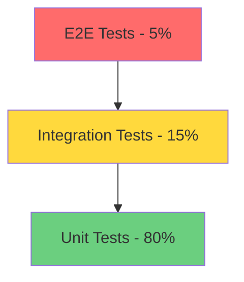

# HardwareMCP Testing & CI/CD Strategy

## Overview

Comprehensive testing strategy covering unit tests, integration tests, hardware-in-loop tests, and continuous integration/deployment pipelines.

## Testing Pyramid



## Test Categories

### 1. Unit Tests (80% coverage target)
- Individual function/method testing
- Mock external dependencies
- Fast execution (<1s per test)
- No hardware required

### 2. Integration Tests (15% coverage target)
- Component interaction testing
- MCP protocol compliance
- Simulator-based testing
- Medium execution time (1-10s per test)

### 3. Hardware-in-Loop Tests (5% coverage target)
- Real hardware testing
- Platform-specific tests
- Manual execution or dedicated CI runners
- Slow execution (10s-1min per test)

## Test Structure

### Directory Layout
```
tests/
├── unit/
│   ├── test_config.py
│   ├── test_hal.py
│   ├── test_protocols/
│   │   ├── test_gpio.py
│   │   ├── test_i2c.py
│   │   ├── test_spi.py
│   │   ├── test_uart.py
│   │   ├── test_can.py
│   │   ├── test_mqtt.py
│   │   └── test_modbus.py
│   ├── test_simulator.py
│   └── test_utils.py
│
├── integration/
│   ├── test_mcp_server.py
│   ├── test_tools.py
│   ├── test_resources.py
│   ├── test_multi_protocol.py
│   └── test_dashboard_api.py
│
├── hardware/
│   ├── test_real_gpio.py
│   ├── test_real_i2c.py
│   ├── test_real_spi.py
│   ├── test_real_uart.py
│   ├── test_real_can.py
│   └── README.md
│
├── fixtures/
│   ├── configs/
│   │   ├── test_config.yaml
│   │   ├── minimal_config.yaml
│   │   └── full_config.yaml
│   └── data/
│       ├── i2c_responses.json
│       └── can_frames.json
│
└── conftest.py
```

## Unit Test Examples

### Configuration Tests (`test_config.py`)
```python
import pytest
from server.config import ConfigLoader, ConfigValidator
from pathlib import Path

class TestConfigLoader:
    def test_load_valid_config(self, tmp_path):
        """Test loading valid YAML configuration"""
        config_file = tmp_path / "config.yaml"
        config_file.write_text("""
        hardware:
          mode: simulator
          gpio:
            enabled: true
        """)
        
        loader = ConfigLoader(config_file)
        config = loader.load()
        
        assert config["hardware"]["mode"] == "simulator"
        assert config["hardware"]["gpio"]["enabled"] is True
    
    def test_load_invalid_yaml(self, tmp_path):
        """Test handling of invalid YAML"""
        config_file = tmp_path / "config.yaml"
        config_file.write_text("invalid: yaml: content:")
        
        loader = ConfigLoader(config_file)
        with pytest.raises(ValueError):
            loader.load()
    
    def test_config_validation(self):
        """Test configuration validation"""
        validator = ConfigValidator()
        
        valid_config = {
            "hardware": {
                "mode": "simulator",
                "gpio": {"enabled": True}
            }
        }
        assert validator.validate(valid_config) is True
        
        invalid_config = {
            "hardware": {
                "mode": "invalid_mode"
            }
        }
        with pytest.raises(ValueError):
            validator.validate(invalid_config)
```

### HAL Tests (`test_hal.py`)
```python
import pytest
from server.hal.manager import ProtocolManagerFactory
from server.hal.registry import DeviceRegistry
from server.hal.exceptions import DeviceNotFoundError

class TestProtocolManagerFactory:
    def test_create_gpio_manager(self):
        """Test GPIO manager creation"""
        factory = ProtocolManagerFactory()
        manager = factory.create("gpio", mode="simulator")
        
        assert manager is not None
        assert manager.protocol_name == "gpio"
    
    def test_create_invalid_protocol(self):
        """Test invalid protocol handling"""
        factory = ProtocolManagerFactory()
        
        with pytest.raises(ValueError):
            factory.create("invalid_protocol")
    
    def test_manager_singleton(self):
        """Test manager singleton pattern"""
        factory = ProtocolManagerFactory()
        manager1 = factory.create("gpio", mode="simulator")
        manager2 = factory.create("gpio", mode="simulator")
        
        assert manager1 is manager2

class TestDeviceRegistry:
    def test_register_device(self):
        """Test device registration"""
        registry = DeviceRegistry()
        
        device_id = registry.register(
            protocol="gpio",
            device_type="led",
            config={"pin": 17}
        )
        
        assert device_id is not None
        assert registry.get(device_id) is not None
    
    def test_get_nonexistent_device(self):
        """Test getting non-existent device"""
        registry = DeviceRegistry()
        
        with pytest.raises(DeviceNotFoundError):
            registry.get("nonexistent_id")
    
    def test_list_devices_by_protocol(self):
        """Test listing devices by protocol"""
        registry = DeviceRegistry()
        
        registry.register("gpio", "led", {"pin": 17})
        registry.register("gpio", "button", {"pin": 27})
        registry.register("i2c", "sensor", {"address": 0x48})
        
        gpio_devices = registry.list_by_protocol("gpio")
        assert len(gpio_devices) == 2
```

### Protocol Tests (`test_protocols/test_gpio.py`)
```python
import pytest
from server.protocols.gpio.manager import GPIOManager
from server.protocols.gpio.simulator import GPIOSimulator

class TestGPIOManager:
    @pytest.fixture
    def gpio_manager(self):
        """Create GPIO manager with simulator"""
        return GPIOManager(mode="simulator")
    
    def test_set_pin_output(self, gpio_manager):
        """Test setting pin as output"""
        gpio_manager.setup_pin(17, mode="output")
        
        assert gpio_manager.get_pin_mode(17) == "output"
    
    def test_write_pin_high(self, gpio_manager):
        """Test writing high to pin"""
        gpio_manager.setup_pin(17, mode="output")
        gpio_manager.write_pin(17, 1)
        
        assert gpio_manager.read_pin(17) == 1
    
    def test_read_input_pin(self, gpio_manager):
        """Test reading input pin"""
        gpio_manager.setup_pin(27, mode="input", pull="up")
        
        value = gpio_manager.read_pin(27)
        assert value in [0, 1]
    
    def test_pwm_output(self, gpio_manager):
        """Test PWM output"""
        gpio_manager.setup_pin(18, mode="pwm")
        gpio_manager.set_pwm_duty_cycle(18, 50)
        
        duty = gpio_manager.get_pwm_duty_cycle(18)
        assert duty == 50
    
    def test_invalid_pin_number(self, gpio_manager):
        """Test invalid pin number handling"""
        with pytest.raises(ValueError):
            gpio_manager.setup_pin(999, mode="output")

class TestGPIOSimulator:
    def test_simulator_state_persistence(self):
        """Test simulator maintains state"""
        sim = GPIOSimulator()
        
        sim.set_pin_state(17, 1)
        assert sim.get_pin_state(17) == 1
        
        sim.set_pin_state(17, 0)
        assert sim.get_pin_state(17) == 0
    
    def test_pull_resistor_simulation(self):
        """Test pull resistor simulation"""
        sim = GPIOSimulator()
        
        sim.setup_pin(27, mode="input", pull="up")
        assert sim.get_pin_state(27) == 1
        
        sim.setup_pin(22, mode="input", pull="down")
        assert sim.get_pin_state(22) == 0
```

## Integration Test Examples

### MCP Server Tests (`test_mcp_server.py`)
```python
import pytest
from mcp import ClientSession, StdioServerParameters
from mcp.client.stdio import stdio_client

@pytest.mark.asyncio
class TestMCPServer:
    async def test_server_initialization(self):
        """Test MCP server starts and initializes"""
        server_params = StdioServerParameters(
            command="python",
            args=["-m", "server.main", "--config", "tests/fixtures/configs/test_config.yaml"]
        )
        
        async with stdio_client(server_params) as (read, write):
            async with ClientSession(read, write) as session:
                result = await session.initialize()
                assert result is not None
    
    async def test_list_tools(self):
        """Test listing available tools"""
        server_params = StdioServerParameters(
            command="python",
            args=["-m", "server.main", "--config", "tests/fixtures/configs/test_config.yaml"]
        )
        
        async with stdio_client(server_params) as (read, write):
            async with ClientSession(read, write) as session:
                await session.initialize()
                
                tools = await session.list_tools()
                assert len(tools.tools) > 0
                
                tool_names = [t.name for t in tools.tools]
                assert "gpio_read" in tool_names
                assert "gpio_write" in tool_names
    
    async def test_call_gpio_tool(self):
        """Test calling GPIO tool"""
        server_params = StdioServerParameters(
            command="python",
            args=["-m", "server.main", "--config", "tests/fixtures/configs/test_config.yaml"]
        )
        
        async with stdio_client(server_params) as (read, write):
            async with ClientSession(read, write) as session:
                await session.initialize()
                
                # Write to pin
                result = await session.call_tool(
                    "gpio_write",
                    {"pin": 17, "value": 1}
                )
                assert result.isError is False
                
                # Read from pin
                result = await session.call_tool(
                    "gpio_read",
                    {"pin": 17}
                )
                assert result.content[0].text == "1"
    
    async def test_list_resources(self):
        """Test listing available resources"""
        server_params = StdioServerParameters(
            command="python",
            args=["-m", "server.main", "--config", "tests/fixtures/configs/test_config.yaml"]
        )
        
        async with stdio_client(server_params) as (read, write):
            async with ClientSession(read, write) as session:
                await session.initialize()
                
                resources = await session.list_resources()
                assert len(resources.resources) > 0
                
                resource_uris = [r.uri for r in resources.resources]
                assert "hardware://gpio/pins" in resource_uris
```

### Multi-Protocol Tests (`test_multi_protocol.py`)
```python
import pytest
from server.hal.manager import ProtocolManagerFactory

@pytest.mark.asyncio
class TestMultiProtocol:
    async def test_gpio_and_i2c_interaction(self):
        """Test GPIO and I2C working together"""
        factory = ProtocolManagerFactory()
        
        gpio = factory.create("gpio", mode="simulator")
        i2c = factory.create("i2c", mode="simulator")
        
        # Setup GPIO pin for I2C device power
        gpio.setup_pin(17, mode="output")
        gpio.write_pin(17, 1)  # Power on
        
        # Read from I2C device
        data = await i2c.read_register(0x48, 0x00)
        assert data is not None
    
    async def test_can_and_mqtt_bridge(self):
        """Test CAN to MQTT bridge scenario"""
        factory = ProtocolManagerFactory()
        
        can = factory.create("can", mode="simulator")
        mqtt = factory.create("mqtt", mode="simulator")
        
        # Receive CAN frame
        can_frame = await can.receive_frame()
        
        # Publish to MQTT
        await mqtt.publish(
            topic=f"can/{can_frame.id}",
            message=can_frame.data
        )
        
        # Verify message received
        messages = await mqtt.get_messages("can/#")
        assert len(messages) > 0
```

## Hardware-in-Loop Tests

### Real GPIO Tests (`test_real_gpio.py`)
```python
import pytest
import os

# Skip if not on real hardware
pytestmark = pytest.mark.skipif(
    os.environ.get("HARDWARE_TESTS") != "1",
    reason="Hardware tests disabled"
)

class TestRealGPIO:
    def test_physical_led_blink(self):
        """Test blinking physical LED"""
        from server.protocols.gpio.manager import GPIOManager
        
        gpio = GPIOManager(mode="real")
        gpio.setup_pin(17, mode="output")
        
        # Blink LED
        for _ in range(5):
            gpio.write_pin(17, 1)
            time.sleep(0.5)
            gpio.write_pin(17, 0)
            time.sleep(0.5)
        
        # Cleanup
        gpio.cleanup()
    
    def test_button_input(self):
        """Test reading physical button"""
        from server.protocols.gpio.manager import GPIOManager
        
        gpio = GPIOManager(mode="real")
        gpio.setup_pin(27, mode="input", pull="up")
        
        print("Press button on GPIO 27...")
        initial_state = gpio.read_pin(27)
        
        # Wait for button press (with timeout)
        timeout = 10
        start = time.time()
        while time.time() - start < timeout:
            current_state = gpio.read_pin(27)
            if current_state != initial_state:
                break
            time.sleep(0.1)
        
        gpio.cleanup()
```

## Test Fixtures

### Pytest Configuration (`conftest.py`)
```python
import pytest
import asyncio
from pathlib import Path

@pytest.fixture(scope="session")
def event_loop():
    """Create event loop for async tests"""
    loop = asyncio.get_event_loop_policy().new_event_loop()
    yield loop
    loop.close()

@pytest.fixture
def test_config_path():
    """Path to test configuration"""
    return Path(__file__).parent / "fixtures" / "configs" / "test_config.yaml"

@pytest.fixture
def mock_hardware_config():
    """Mock hardware configuration"""
    return {
        "hardware": {
            "mode": "simulator",
            "platform": "test",
            "gpio": {
                "enabled": True,
                "pins": [
                    {"pin": 17, "mode": "output"},
                    {"pin": 27, "mode": "input", "pull": "up"}
                ]
            },
            "i2c": {
                "enabled": True,
                "bus": 1,
                "devices": [
                    {"address": 0x48, "type": "temperature_sensor"}
                ]
            }
        }
    }

@pytest.fixture
def gpio_simulator():
    """Create GPIO simulator instance"""
    from server.protocols.gpio.simulator import GPIOSimulator
    return GPIOSimulator()

@pytest.fixture
def i2c_simulator():
    """Create I2C simulator instance"""
    from server.protocols.i2c.simulator import I2CSimulator
    return I2CSimulator()
```

## CI/CD Pipeline

### GitHub Actions Workflow (`.github/workflows/ci.yml`)
```yaml
name: CI

on:
  push:
    branches: [ main, develop ]
  pull_request:
    branches: [ main, develop ]

jobs:
  lint:
    runs-on: ubuntu-latest
    steps:
      - uses: actions/checkout@v3
      
      - name: Set up Python
        uses: actions/setup-python@v4
        with:
          python-version: '3.11'
      
      - name: Install dependencies
        run: |
          pip install ruff black mypy
      
      - name: Run ruff
        run: ruff check .
      
      - name: Run black
        run: black --check .
      
      - name: Run mypy
        run: mypy server/

  test:
    runs-on: ${{ matrix.os }}
    strategy:
      matrix:
        os: [ubuntu-latest, windows-latest, macos-latest]
        python-version: ['3.10', '3.11', '3.12']
    
    steps:
      - uses: actions/checkout@v3
      
      - name: Set up Python ${{ matrix.python-version }}
        uses: actions/setup-python@v4
        with:
          python-version: ${{ matrix.python-version }}
      
      - name: Install dependencies
        run: |
          pip install -e ".[dev]"
      
      - name: Run unit tests
        run: |
          pytest tests/unit/ -v --cov=server --cov-report=xml
      
      - name: Run integration tests
        run: |
          pytest tests/integration/ -v
      
      - name: Upload coverage
        uses: codecov/codecov-action@v3
        with:
          file: ./coverage.xml

  test-dashboard:
    runs-on: ubuntu-latest
    steps:
      - uses: actions/checkout@v3
      
      - name: Set up Node.js
        uses: actions/setup-node@v3
        with:
          node-version: '18'
      
      - name: Install dependencies
        working-directory: dashboard/frontend
        run: npm ci
      
      - name: Run tests
        working-directory: dashboard/frontend
        run: npm test
      
      - name: Build
        working-directory: dashboard/frontend
        run: npm run build

  hardware-tests:
    runs-on: self-hosted
    if: github.event_name == 'push' && github.ref == 'refs/heads/main'
    steps:
      - uses: actions/checkout@v3
      
      - name: Set up Python
        uses: actions/setup-python@v4
        with:
          python-version: '3.11'
      
      - name: Install dependencies
        run: |
          pip install -e ".[dev]"
      
      - name: Run hardware tests
        env:
          HARDWARE_TESTS: "1"
        run: |
          pytest tests/hardware/ -v
```

### Release Workflow (`.github/workflows/release.yml`)
```yaml
name: Release

on:
  push:
    tags:
      - 'v*'

jobs:
  build-and-publish:
    runs-on: ubuntu-latest
    steps:
      - uses: actions/checkout@v3
      
      - name: Set up Python
        uses: actions/setup-python@v4
        with:
          python-version: '3.11'
      
      - name: Install build tools
        run: |
          pip install build twine
      
      - name: Build package
        run: |
          python -m build
      
      - name: Publish to PyPI
        env:
          TWINE_USERNAME: __token__
          TWINE_PASSWORD: ${{ secrets.PYPI_TOKEN }}
        run: |
          twine upload dist/*
      
      - name: Create GitHub Release
        uses: actions/create-release@v1
        env:
          GITHUB_TOKEN: ${{ secrets.GITHUB_TOKEN }}
        with:
          tag_name: ${{ github.ref }}
          release_name: Release ${{ github.ref }}
          draft: false
          prerelease: false
```

### Docker Build Workflow (`.github/workflows/docker.yml`)
```yaml
name: Docker

on:
  push:
    branches: [ main ]
    tags: [ 'v*' ]

jobs:
  build-and-push:
    runs-on: ubuntu-latest
    steps:
      - uses: actions/checkout@v3
      
      - name: Set up Docker Buildx
        uses: docker/setup-buildx-action@v2
      
      - name: Login to Docker Hub
        uses: docker/login-action@v2
        with:
          username: ${{ secrets.DOCKER_USERNAME }}
          password: ${{ secrets.DOCKER_PASSWORD }}
      
      - name: Extract metadata
        id: meta
        uses: docker/metadata-action@v4
        with:
          images: hardwaremcp/server
      
      - name: Build and push
        uses: docker/build-push-action@v4
        with:
          context: .
          push: true
          tags: ${{ steps.meta.outputs.tags }}
          labels: ${{ steps.meta.outputs.labels }}
          cache-from: type=gha
          cache-to: type=gha,mode=max
```

## Test Coverage Goals

### Overall Coverage
- **Target**: 85% code coverage
- **Minimum**: 75% code coverage
- **Critical paths**: 95% coverage

### Per-Module Coverage
- Core MCP server: 90%
- HAL layer: 85%
- Protocol implementations: 80%
- Simulator: 85%
- Utilities: 90%

## Performance Testing

### Load Testing
```python
import pytest
import asyncio
from locust import HttpUser, task, between

class HardwareMCPUser(HttpUser):
    wait_time = between(1, 3)
    
    @task
    def read_sensor(self):
        self.client.post("/api/tools/read_sensor", json={
            "protocol": "i2c",
            "device_id": "temp_sensor_1"
        })
    
    @task(2)
    def list_devices(self):
        self.client.get("/api/devices")
```

### Benchmark Tests
```python
import pytest
import time

def test_gpio_write_performance():
    """Benchmark GPIO write operations"""
    from server.protocols.gpio.manager import GPIOManager
    
    gpio = GPIOManager(mode="simulator")
    gpio.setup_pin(17, mode="output")
    
    iterations = 1000
    start = time.time()
    
    for _ in range(iterations):
        gpio.write_pin(17, 1)
        gpio.write_pin(17, 0)
    
    duration = time.time() - start
    ops_per_second = (iterations * 2) / duration
    
    assert ops_per_second > 10000  # Should handle 10k ops/sec
```

## Test Execution

### Local Testing
```bash
# Run all tests
pytest

# Run specific test category
pytest tests/unit/
pytest tests/integration/
pytest tests/hardware/

# Run with coverage
pytest --cov=server --cov-report=html

# Run specific test file
pytest tests/unit/test_gpio.py

# Run with markers
pytest -m "not slow"
pytest -m "hardware"
```

### CI Testing
```bash
# Lint check
ruff check .
black --check .
mypy server/

# Unit tests
pytest tests/unit/ -v --cov=server

# Integration tests
pytest tests/integration/ -v

# Hardware tests (on self-hosted runner)
HARDWARE_TESTS=1 pytest tests/hardware/ -v
```

## Quality Gates

### Pre-commit Checks
- Code formatting (black)
- Import sorting (isort)
- Linting (ruff)
- Type checking (mypy)
- Test execution (fast tests only)

### PR Requirements
- All tests pass
- Code coverage ≥ 75%
- No linting errors
- Type checking passes
- Documentation updated

### Release Requirements
- All tests pass (including hardware tests)
- Code coverage ≥ 85%
- Performance benchmarks pass
- Security scan clean
- Documentation complete

## Continuous Monitoring

### Metrics Tracked
- Test execution time
- Code coverage trends
- Failure rates
- Performance benchmarks
- Security vulnerabilities

### Alerts
- Test failures on main branch
- Coverage drops below threshold
- Performance regression
- Security vulnerabilities detected